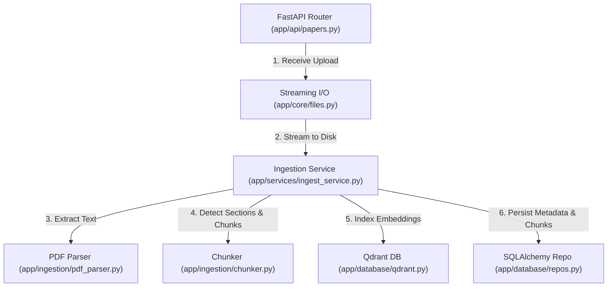

<div align="center">

# ⚙️ Nexus AI — Backend Implementation Specification
### *FastAPI Architecture, Service Layer Design, Database Models & Complete REST API Reference*

[](https://fastapi.tiangolo.com/)
[](https://www.python.org/)
[](https://docs.pydantic.dev/)
[](https://www.sqlalchemy.org/)
[](https://pytest.org/)

[← Back to README](./README.md) • [RAG Model Specification](./RAGMODEL.md) • [System Architecture](./SYSTEMARCHITECTURE.md)

</div>

---

## 📋 Table of Contents

- [1. Backend Overview & Philosophy](#1-backend-overview--philosophy)
- [2. Directory Tree & Codebase Layout](#2-directory-tree--codebase-layout)
- [3. Complete REST API Reference](#3-complete-rest-api-reference)
- [4. Request & Response Payload Specifications](#4-request--response-payload-specifications)
- [5. Layered Service Architecture](#5-layered-service-architecture)
- [6. Middleware & Request Lifecycle](#6-middleware--request-lifecycle)
- [7. Authentication & Rate Limiting](#7-authentication--rate-limiting)
- [8. Validation & Pydantic Schema Contracts](#8-validation--pydantic-schema-contracts)
- [9. Database Layer & SQLAlchemy ORM Models](#9-database-layer--sqlalchemy-orm-models)
- [10. File Processing & Streaming PDF Uploads](#10-file-processing--streaming-pdf-uploads)
- [11. Asynchronous Job Runner Subsystem](#11-asynchronous-job-runner-subsystem)
- [12. Error Handling & Standardized Envelopes](#12-error-handling--standardized-envelopes)
- [13. Logging, Telemetry & Tracing](#13-logging-telemetry--tracing)
- [14. Environment Configuration Reference](#14-environment-configuration-reference)
- [15. Test Suite & Verification Commands](#15-test-suite--verification-commands)

---

## 1. Backend Overview & Philosophy

The Nexus AI backend is engineered as an asynchronous, high-throughput literature intelligence service using **FastAPI** and **Python 3.11+**. The design enforces three architectural rules:

1. **No Business Logic in Routes**: Route handlers in `app/api/` are thin controllers responsible only for dependency injection, schema validation, and status mapping.
2. **No Database Dependencies in Algorithms**: Services (`ingest_service`, `search_service`, `research_service`) accept plain data models or query parameters, interacting with databases solely through repository abstractions in `app/database/repos.py`.
3. **Fail-Fast Configuration**: All environment configurations are validated at boot time via Pydantic-settings, preventing silent runtime failures.

---

## 2. Directory Tree & Codebase Layout

```
backend/
├── app/
│   ├── api/                    # Route controllers & dependency injection
│   │   ├── deps.py             # FastAPI dependency providers (DbDep, SettingsDep)
│   │   ├── errors.py           # Exception handlers & error responses
│   │   ├── health.py           # Health check & version endpoint
│   │   ├── jobs.py             # Asynchronous task polling routes
│   │   ├── papers.py           # Paper upload, catalog & PDF serving
│   │   ├── projects.py         # Project workspace CRUD
│   │   ├── research.py         # Gaps, contradictions, landscape & reports
│   │   └── search.py           # Semantic search & grounded Q&A
│   ├── core/                   # Shared cross-cutting primitives
│   │   ├── constants.py        # System constants & error codes
│   │   ├── errors.py           # Custom exception hierarchy
│   │   ├── files.py            # Streaming I/O, size limits & magic bytes
│   │   ├── ids.py              # Cryptographic ID generator (new_id)
│   │   ├── logging.py          # Structured logging & X-Request-ID context
│   │   └── text_normalize.py   # NFKC, ligature & quote verification
│   ├── database/               # Relational persistence & vector store
│   │   ├── models.py           # 11 SQLAlchemy 2.0 ORM models
│   │   ├── qdrant.py           # Qdrant vector client & collection init
│   │   ├── repos.py            # Encapsulated query repository functions
│   │   └── session.py          # Engine, sessionmaker & DB initialization
│   ├── embeddings/             # Dense vector generation
│   │   └── embedder.py         # BAAI/bge-m3 SentenceTransformer client
│   ├── ingestion/              # Document parsing & structural chunking
│   │   ├── chunker.py          # Sentence-aware chunker with overlap
│   │   ├── metadata_extractor.py # Title, authors & DOI regex extractors
│   │   ├── pdf_parser.py       # PyMuPDF 2-column layout parser
│   │   └── section_detector.py # Canonical discourse section mapping
│   ├── llm/                    # Generative inference abstraction
│   │   ├── client.py           # Provider-agnostic client with retries
│   │   └── providers/          # Vendor implementations (openai, fake)
│   ├── retrieval/              # Multi-stage hybrid search
│   │   ├── bm25.py             # In-memory Okapi BM25 index & cache
│   │   ├── evidence_selector.py# Token budgeter & context builder
│   │   ├── hybrid.py           # Reciprocal Rank Fusion (RRF k=60)
│   │   ├── intent.py           # Query classification rules
│   │   └── reranker.py         # Cross-Encoder (bge-reranker-v2-m3)
│   ├── schemas/                # Pydantic v2 validation contracts
│   │   ├── chunk.py            # Chunk & section schemas
│   │   ├── common.py           # Error, pagination & status schemas
│   │   ├── job.py              # Background job polling contracts
│   │   ├── llm_out.py          # Structured generative output schemas
│   │   ├── paper.py            # Paper response & analysis contracts
│   │   ├── project.py          # Workspace project schemas
│   │   └── retrieval.py        # Search query & source schemas
│   ├── services/               # Pure domain business logic
│   │   ├── analysis_service.py # Paper analysis extraction
│   │   ├── ingest_service.py   # Document parsing & indexing pipeline
│   │   ├── job_service.py      # In-process asyncio task runner
│   │   ├── research_service.py # Gaps, landscape & report synthesis
│   │   └── search_service.py   # Hybrid search & grounded answering
│   ├── config.py               # Pydantic-settings configuration
│   └── main.py                 # FastAPI application factory & lifespan
├── data/                       # Local runtime data (ignored in Git)
│   ├── qdrant/                 # Embedded vector database storage
│   ├── uploads/                # Saved PDF binary files
│   └── rgf.db                  # SQLite database file
├── tests/                      # Automated test suite
│   ├── unit/                   # Fast isolated unit tests (21 tests)
│   └── test_e2e_pipeline.py    # Complete integration pipeline test
├── Dockerfile                  # Production container definition
├── pyproject.toml              # Pytest, Ruff & MyPy configurations
├── requirements.txt            # Production runtime dependencies
└── requirements-dev.txt        # Development & testing dependencies
```

---

## 3. Complete REST API Reference

All routes are mounted under the `/api` prefix:

### 1. Projects Workspace Management

| Method | Route | Description | Status Code |
| :--- | :--- | :--- | :--- |
| `GET` | `/api/projects` | List all research projects with paper counts. | `200 OK` |
| `POST` | `/api/projects` | Create a new research project workspace. | `201 Created` |
| `GET` | `/api/projects/{id}` | Retrieve project details and summary statistics. | `200 OK` |
| `DELETE`| `/api/projects/{id}` | Cascade delete project, papers, chunks, and runs. | `200 OK` |

### 2. Paper Ingestion & Document Catalog

| Method | Route | Description | Status Code |
| :--- | :--- | :--- | :--- |
| `POST` | `/api/projects/{id}/papers/upload` | Upload PDF (multipart/form-data). Queues async ingest. | `202 Accepted` |
| `GET` | `/api/projects/{id}/papers` | List all papers in a project with processing status. | `200 OK` |
| `GET` | `/api/papers/{id}` | Retrieve structured paper analysis, problem, and limitations. | `200 OK` |
| `GET` | `/api/papers/{id}/file` | Stream raw PDF binary from disk for browser viewer. | `200 OK` |
| `DELETE`| `/api/papers/{id}` | Delete paper, vector points, and associated chunks. | `200 OK` |

### 3. Literature Search & Question Answering

| Method | Route | Description | Status Code |
| :--- | :--- | :--- | :--- |
| `POST` | `/api/projects/{id}/search` | Semantic hybrid search with grounded AI answer. | `200 OK` |

### 4. Cross-Paper Synthesis & Research Intelligence

| Method | Route | Description | Status Code |
| :--- | :--- | :--- | :--- |
| `GET` | `/api/projects/{id}/research/gaps` | List confidence-scored candidate research gaps. | `200 OK` |
| `GET` | `/api/gaps/{id}` | Retrieve detailed evidence breakdown for a single gap. | `200 OK` |
| `GET` | `/api/projects/{id}/research/contradictions` | List detected conflicting empirical claims. | `200 OK` |
| `GET` | `/api/projects/{id}/research/landscape` | Retrieve topic clusters, methodologies, and limitations. | `200 OK` |
| `POST` | `/api/projects/{id}/research/report` | Generate and compile literature synthesis report. | `201 Created` |

### 5. Jobs & System Operations

| Method | Route | Description | Status Code |
| :--- | :--- | :--- | :--- |
| `GET` | `/api/jobs/{id}` | Poll background task status and progress (0.0–1.0). | `200 OK` |
| `GET` | `/api/health` | Service health status and version. | `200 OK` |

---

## 4. Request & Response Payload Specifications

### 1. Upload Paper (`POST /api/projects/{id}/papers/upload`)
- **Headers**: `Content-Type: multipart/form-data`
- **Response**: `202 Accepted`
```json
{
  "job_id": "job_a7a8a053",
  "paper": {
    "paper_id": "pap_32ea8653",
    "project_id": "prj_2068cc4b",
    "title": "radiology_attention.pdf",
    "authors": [],
    "status": "UPLOADED",
    "created_at": "2026-10-02T20:19:00Z"
  }
}
```

### 2. Poll Ingestion Job (`GET /api/jobs/{job_id}`)
- **Response**: `200 OK`
```json
{
  "job_id": "job_a7a8a053",
  "job_type": "INGEST",
  "status": "SUCCEEDED",
  "stage": "INDEXING",
  "progress": 1.0,
  "project_id": "prj_2068cc4b",
  "paper_id": "pap_32ea8653",
  "result": {
    "chunks_created": 5,
    "has_analysis": true
  }
}
```

### 3. Semantic Search (`POST /api/projects/{id}/search`)
- **Request Body**:
```json
{
  "query": "What are the primary limitations in scanner calibration?",
  "include_answer": true
}
```
- **Response**: `200 OK`
```json
{
  "query": "What are the primary limitations in scanner calibration?",
  "intent": "LIMITATIONS",
  "insufficient_evidence": false,
  "answer": "Current transformer evaluations are constrained to single-hospital cohorts without cross-scanner calibration protocols [1].",
  "sources": [
    {
      "paper_id": "pap_32ea8653",
      "paper_title": "Attention Transformers for Chest X-ray Classification",
      "chunk_id": "chk_pap_32ea8653_0003",
      "section": "3. Limitations",
      "chunk_type": "LIMITATIONS",
      "page": 3,
      "text": "Our evaluation is restricted to a single hospital cohort and does not account for differences in scanner calibration...",
      "relevance_score": 0.887,
      "verified": true
    }
  ]
}
```

---

## 5. Layered Service Architecture



---

## 6. Middleware & Request Lifecycle

Configured in [app/main.py](file:///c:/Users/admin/Desktop/major%20project/ai-research-gap/backend/app/main.py):

1. **Request-ID Tracking**: Assigns or propagates the `X-Request-ID` header on every HTTP request and populates the `ctx_request_id` context variable for log correlation.
2. **CORS Middleware**: Manages allowed cross-origin requests (`CORS_ORIGINS`), supporting localhost dev servers (`5173`, `3000`) and regex previews.
3. **Lifespan Startup & Shutdown**:
   - Boots database schema (`init_db`).
   - Starts the background `asyncio` job runner.
   - Executes a startup sweep to mark abandoned running jobs as `FAILED`.
   - Flushes connection pools gracefully on shutdown.

---

## 7. Authentication & Rate Limiting

- **Project Boundary Scope**: All data access is strictly bounded by `project_id`.
- **API Key Protection**: Optional environment configuration (`API_KEY`). When set, incoming requests must provide the matching `X-API-Key` HTTP header.
- **Rate Limiting**: Integrated via `slowapi` decorators (`RATE_LIMIT_DEFAULT=120/minute`, `RATE_LIMIT_UPLOAD=10/minute`, `RATE_LIMIT_SEARCH=20/minute`).

---

## 8. Validation & Pydantic Schema Contracts

All request bodies and responses are validated using Pydantic v2 in `app/schemas/`:

| Schema Model | Location | Primary Invariants Enforced |
| :--- | :--- | :--- |
| `ProjectCreate` | `schemas/project.py` | Name length: 1–120 characters; whitespace trimmed. |
| `SearchRequest` | `schemas/retrieval.py` | Query: 2–1,000 characters; `include_answer` boolean flag. |
| `ResearchGap` | `schemas/llm_out.py` | Category and GapType enums; max field lengths. |
| `PaperResponse` | `schemas/paper.py` | Serializes status, analysis flags, and author lists. |

---

## 9. Database Layer & SQLAlchemy ORM Models

Defined in [app/database/models.py](file:///c:/Users/admin/Desktop/major%20project/ai-research-gap/backend/app/database/models.py) using SQLAlchemy 2.0:

```python
class Paper(Base):
    __tablename__ = "papers"
    __table_args__ = (
        UniqueConstraint("project_id", "sha256", name="uq_paper_project_sha256"),
        Index("ix_paper_project", "project_id"),
    )

    paper_id = Column(String, primary_key=True)
    project_id = Column(String, ForeignKey("projects.project_id", ondelete="CASCADE"), nullable=False)
    title = Column(String, nullable=False)
    authors = Column(JSON, default=list)
    year = Column(Integer, nullable=True)
    venue = Column(String, nullable=True)
    doi = Column(String, nullable=True, index=True)
    abstract = Column(Text, nullable=True)
    source_filename = Column(String, nullable=False)
    sha256 = Column(String(64), nullable=True, index=True)
    status = Column(String(20), nullable=False, default="UPLOADED")
```

---

## 10. File Processing & Streaming PDF Uploads

Implemented in [app/core/files.py](file:///c:/Users/admin/Desktop/major%20project/ai-research-gap/backend/app/core/files.py):

* **Streaming Buffer**: Processes incoming multipart files in 64 KB chunks (`CHUNK_SIZE = 65536`).
* **Magic-Byte Check**: Verifies that the file begins with the `%PDF-` binary signature (`b"%PDF-"`).
* **On-the-Fly SHA-256**: Hashes the binary stream simultaneously with disk writing to detect and reject duplicate uploads within a project before database insertion.
* **Size Enforcement**: Halts file streams exceeding `MAX_UPLOAD_MB` (default 25 MB) to protect against memory exhaustion.

---

## 11. Asynchronous Job Runner Subsystem

Implemented in [app/services/job_service.py](file:///c:/Users/admin/Desktop/major%20project/ai-research-gap/backend/app/services/job_service.py):

* **In-Memory Concurrency Cap**: Controls active background jobs with an `asyncio.Semaphore` (`ANALYSIS_MAX_CONCURRENCY=2`).
* **State Progression**: `QUEUED` $\rightarrow$ `RUNNING` (progress: 0.1–0.9) $\rightarrow$ `SUCCEEDED` / `FAILED`.
* **Crash Recovery (Startup Sweep)**: If the backend restarts while an ingestion job is running, the lifespan startup marks orphaned jobs as `FAILED` with error code `INTERRUPTED_BY_RESTART`.

---

## 12. Error Handling & Standardized Envelopes

Implemented in [app/api/errors.py](file:///c:/Users/admin/Desktop/major%20project/ai-research-gap/backend/app/api/errors.py):

All errors are returned in a predictable, standardized envelope:

```json
{
  "error": {
    "code": "PROJECT_NOT_FOUND",
    "message": "Project with id 'prj_invalid' was not found.",
    "details": {
      "project_id": "prj_invalid"
    }
  }
}
```

### Error Code Mapping

| Error Code | HTTP Status | Root Cause |
| :--- | :--- | :--- |
| `VALIDATION_ERROR` | `422 Unprocessable Entity` | Malformed request body or missing required field. |
| `UNSUPPORTED_MEDIA_TYPE` | `415 Unsupported Media Type` | Uploaded file lacks `.pdf` extension or `%PDF-` header. |
| `FILE_TOO_LARGE` | `413 Payload Too Large` | PDF file exceeds `MAX_UPLOAD_MB` setting. |
| `DUPLICATE_PAPER` | `409 Conflict` | Identical SHA-256 PDF hash already exists in project. |
| `PROJECT_PAPER_LIMIT` | `422 Unprocessable Entity` | Project reached maximum allowed papers (`MAX_PAPERS_PER_PROJECT`). |
| `EMPTY_PROJECT_ERROR` | `400 Bad Request` | Search requested on a project with zero indexed papers. |

---

## 13. Logging, Telemetry & Tracing

Implemented in [app/core/logging.py](file:///c:/Users/admin/Desktop/major%20project/ai-research-gap/backend/app/core/logging.py):

* **Contextual Request ID**: Automatically prefixes all application logs with the request's `X-Request-ID`.
* **Log Formats**: Supports human-readable `console` logging for local development and structured `json` logging for production log aggregators (e.g., Datadog, CloudWatch).

---

## 14. Environment Configuration Reference

All settings are managed via [app/config.py](file:///c:/Users/admin/Desktop/major%20project/ai-research-gap/backend/app/config.py) from `backend/.env`:

| Variable | Type | Default | Description |
| :--- | :--- | :--- | :--- |
| `ENVIRONMENT` | `str` | `development` | Environment tier: `development`, `test`, `production`. |
| `LOG_LEVEL` | `str` | `INFO` | Logging threshold: `DEBUG`, `INFO`, `WARNING`, `ERROR`. |
| `DATABASE_URL` | `str` | `sqlite:///./data/rgf.db` | SQLAlchemy connection string (SQLite or PostgreSQL). |
| `DATA_DIR` | `str` | `./data` | Directory for uploads, local Qdrant, and databases. |
| `CORS_ORIGINS` | `str` | `http://localhost:5173` | Comma-separated allowed CORS origins. |
| `MAX_UPLOAD_MB` | `int` | `25` | Maximum allowed upload size per PDF file. |
| `LLM_PROVIDER` | `str` | `openai_compatible` | Inference provider: `openai_compatible`, `anthropic`, `fake`. |
| `LLM_API_KEY` | `str` | `""` | API key for LLM calls (required if provider is not fake). |
| `LLM_MODEL` | `str` | `gpt-4o-mini` | Generative model name. |
| `EMBEDDING_MODEL` | `str` | `BAAI/bge-m3` | SentenceTransformers model for dense embeddings. |
| `QDRANT_LOCAL_PATH` | `str` | `./data/qdrant` | Path to local embedded Qdrant database directory. |

---

## 15. Test Suite & Verification Commands

### 1. Run Unit Tests (21 Tests)
```bash
cd backend
pytest -v tests/unit
```
```text
============================= 21 passed in 2.16s ==============================
```

### 2. Run Comprehensive End-to-End Pipeline Test
Tests project creation, PDF upload, job polling, structured extraction, semantic search, and gap discovery:
```bash
cd backend
python tests/test_e2e_pipeline.py
```
```text
============================================================
>>> ALL 11 END-TO-END RAG & PLATFORM TESTS PASSED SUCCESSFULLY! <<<
============================================================
```
