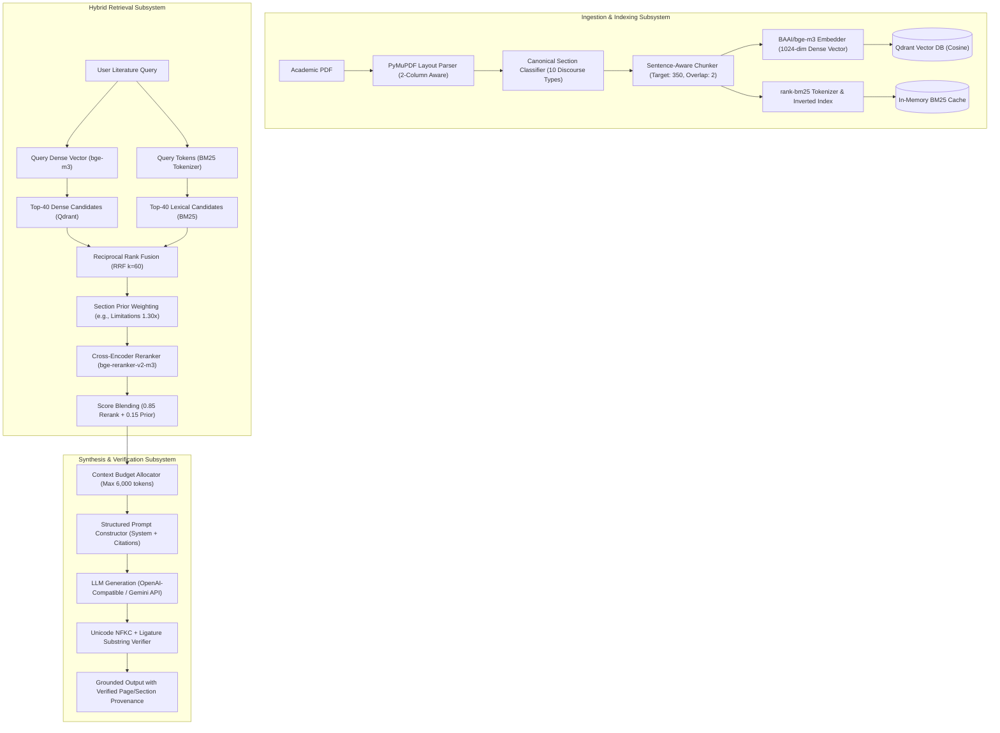
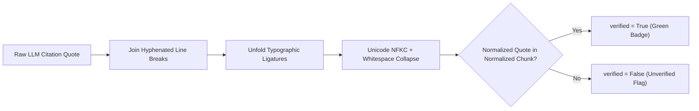
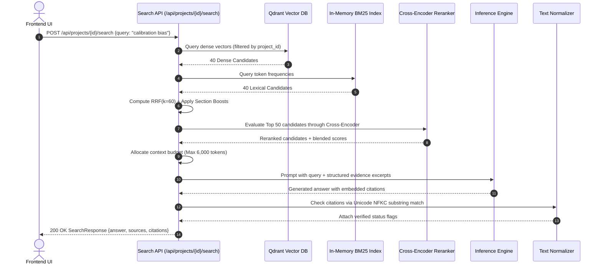

<div align="center">

# 🧠 Nexus AI — Retrieval-Augmented Generation (RAG) Model
### *Structure-Aware Academic Literature Retrieval, Cross-Encoder Reranking & Provenance Verification Engine*

[-4F46E5?style=flat-square)](https://huggingface.co/BAAI/bge-m3)
[](https://huggingface.co/BAAI/bge-reranker-v2-m3)
[](https://qdrant.tech/)
[](https://github.com/dorianbrown/rank_bm25)
[](#9-provenance--deterministic-quote-verification)

[← Back to README](./README.md) • [System Architecture](./SYSTEMARCHITECTURE.md) • [Backend Implementation](./BACKEND.md)

</div>

---

## 📋 Table of Contents

- [1. Overview & Architectural Philosophy](#1-overview--architectural-philosophy)
- [2. End-to-End RAG Pipeline](#2-end-to-end-rag-pipeline)
- [3. Document Ingestion & Layout Parsing](#3-document-ingestion--layout-parsing)
- [4. Discourse Section Classification & Chunking](#4-discourse-section-classification--chunking)
- [5. Vector Database & Dual Indexing Architecture](#5-vector-database--dual-indexing-architecture)
- [6. Hybrid Retrieval: Dense + BM25 + RRF](#6-hybrid-retrieval-dense--bm25--rrf)
- [7. Cross-Encoder Reranking & Score Blending](#7-cross-encoder-reranking--score-blending)
- [8. Context Construction & Token Budgeting](#8-context-construction--token-budgeting)
- [9. Provenance & Deterministic Quote Verification](#9-provenance--deterministic-quote-verification)
- [10. LLM Synthesis & Structured Output Generation](#10-llm-synthesis--structured-output-generation)
- [11. Query-to-Generation Request Lifecycle](#11-query-to-generation-request-lifecycle)
- [12. Error Handling & Guardrails](#12-error-handling--guardrails)
- [13. Evaluation Metrics & Benchmarks](#13-evaluation-metrics--benchmarks)
- [14. Configuration Reference](#14-configuration-reference)

---

## 1. Overview & Architectural Philosophy

Generic conversational RAG systems suffer from critical flaws when applied to scientific literature reviews:
1. **Blind Chunking**: Arbitrary token splits cut across headings and discard structural context (e.g., treating a limitation cited in *Related Work* as the author's own finding).
2. **Dense-Only Retrieval Failures**: Keyword-dense academic terms (e.g., "MIMIC-CXR", "ResNet-50", "p < 0.001") get smoothed out in vector embeddings.
3. **Unchecked Citations**: Generative LLMs hallucinate paraphrased claims or fabricate non-existent page numbers.

Nexus AI addresses these problems through **Discourse-Aware Hybrid RAG**:

```
Academic PDF ──▶ Layout Parser ──▶ Section Classifier ──▶ Sentence Chunker ──▶ Dual Index (Dense + BM25)
                                                                                       │
Grounded Answer ◀── Quote Verifier ◀── LLM Synthesis ◀── Context Allocator ◀── RRF + Cross-Encoder
```

> [!IMPORTANT]
> **Zero-Hallucination Policy**: Nexus AI enforces strict provenance. Every claim returned to the user must be anchored to an exact `paper_id`, `chunk_id`, and `page_number`, validated via deterministic Unicode substring verification.

---

## 2. End-to-End RAG Pipeline



---

## 3. Document Ingestion & Layout Parsing

Implemented in [app/ingestion/pdf_parser.py](file:///c:/Users/admin/Desktop/major%20project/ai-research-gap/backend/app/ingestion/pdf_parser.py) using PyMuPDF (`fitz`):

* **Two-Column Reading Order Resolution**: Detects multi-column layouts by calculating horizontal gaps between text bounding boxes ($x_{\text{center}}$ gap $> 25\%$ page width). Sorts left column blocks prior to right column blocks to prevent cross-column sentence fragmentation.
* **Typographic Font Analysis**: Extracts font size, weight, and font flags (`is_bold`) to distinguish body text from section headings and running headers/footers.
* **Header / Footer Stripping**: Excludes repetitive running page headers and footers based on vertical page coordinates ($y < 40\text{pt}$ or $y > 780\text{pt}$).

```python
# Layout analysis snippet from app/ingestion/pdf_parser.py
is_two_column = detect_two_columns(blocks, page_width)
if is_two_column:
    blocks = sort_two_column_reading_order(blocks, page_width)
else:
    blocks = sorted(blocks, key=lambda b: (b.y0, b.x0))
```

---

## 4. Discourse Section Classification & Chunking

Implemented in [app/ingestion/section_detector.py](file:///c:/Users/admin/Desktop/major%20project/ai-research-gap/backend/app/ingestion/section_detector.py) and [app/ingestion/chunker.py](file:///c:/Users/admin/Desktop/major%20project/ai-research-gap/backend/app/ingestion/chunker.py):

### Canonical Section Taxonomy
Every parsed paragraph is classified into one of 10 canonical academic sections using regex pattern matching and structural cues:

| Canonical Type | Example Headings Matched | Section Weight in Retrieval |
| :--- | :--- | :--- |
| `TITLE` | Document header, paper title | $1.00\times$ |
| `ABSTRACT` | "Abstract", "Summary" | **$1.10\times$** |
| `INTRODUCTION` | "1. Introduction", "Background", "Overview" | **$1.05\times$** |
| `RELATED_WORK` | "2. Related Work", "Literature Review", "Prior Art" | $1.00\times$ |
| `METHODS` | "3. Methodology", "Experimental Setup", "Proposed Architecture" | $1.00\times$ |
| `RESULTS` | "4. Results", "Empirical Evaluation", "Findings" | **$1.15\times$** |
| `DISCUSSION` | "5. Discussion", "Interpretation", "Implications" | **$1.15\times$** |
| `LIMITATIONS` | "Limitations", "Threats to Validity", "Caveats" | **$1.30\times$ (Max Boost)** |
| `CONCLUSION` | "6. Conclusion", "Concluding Remarks", "Future Work" | **$1.10\times$** |
| `REFERENCES` | "References", "Bibliography" | *Excluded from search* |

### Sentence-Aware Chunker Specifications
- **Target Size**: 350 tokens.
- **Maximum Size**: 600 tokens (forces chunk split at sentence boundary).
- **Minimum Size**: 60 tokens (merges undersized paragraphs into predecessor).
- **Sentence Overlap**: 2 sentences preserved between consecutive chunks for boundary continuity.
- **Cue Word Annotations**: Flags `has_limitation_cue` (e.g., *"remains constrained"*, *"fail to generalize"*) and `has_future_cue` (e.g., *"future investigations should"*, *"remains an open question"*).

---

## 5. Vector Database & Dual Indexing Architecture

Implemented in [app/database/qdrant.py](file:///c:/Users/admin/Desktop/major%20project/ai-research-gap/backend/app/database/qdrant.py) and [app/retrieval/bm25.py](file:///c:/Users/admin/Desktop/major%20project/ai-research-gap/backend/app/retrieval/bm25.py):

### 1. Dense Vector Store (Qdrant)
- **Collection Name**: `rgf_chunks`
- **Embedding Model**: `BAAI/bge-m3` (1024 dimensions)
- **Distance Metric**: `Cosine`
- **Payload Indexing**: Every vector is tagged with relational attributes enabling sub-millisecond filtering:
  ```json
  {
    "project_id": "prj_2068cc4b",
    "paper_id": "pap_32ea8653",
    "chunk_id": "chk_pap_32ea8653_0003",
    "chunk_type": "LIMITATIONS",
    "page": 3,
    "section_heading": "3. Limitations"
  }
  ```

### 2. Lexical Inverted Index (BM25)
- **Algorithm**: Okapi BM25 ($k_1=1.5, b=0.75$) via `rank-bm25`.
- **Tokenization**: Case-folded whitespace tokenization with English punctuation stripping and stopword filtering.
- **Project Cache**: Cached in memory (`BM25_CACHE_PROJECTS=8`), dynamically lazily instantiated on the first search request within a workspace.

---

## 6. Hybrid Retrieval: Dense + BM25 + RRF

Implemented in [app/retrieval/hybrid.py](file:///c:/Users/admin/Desktop/major%20project/ai-research-gap/backend/app/retrieval/hybrid.py):

```
User Query ──▶ Parallel Query ──▶ Dense Rank (Top 40) + BM25 Rank (Top 40) ──▶ RRF Fusion (k=60) ──▶ Section Prior Boost
```

### 1. Reciprocal Rank Fusion (RRF)
RRF combines candidate items from multiple ranking algorithms without requiring score normalization:

$$\text{RRF}(d) = \sum_{r \in \{\text{dense}, \text{bm25}\}} \frac{1}{k + \text{rank}(d, r)}$$

Where $k = 60$ (configurable via `RRF_K`). Candidates appearing in both top-40 lists receive a compound score boost.

### 2. Structural Section Prior Weighting
Following RRF computation, scores are multiplied by discourse importance:

$$\text{Score}_{\text{prior}}(d) = \text{RRF}(d) \times \text{Weight}(\text{chunk\_type})$$

Chunks located in `LIMITATIONS` receive a **$1.30\times$** multiplier, ensuring that problem-discovery queries prioritize the author's stated constraints.

---

## 7. Cross-Encoder Reranking & Score Blending

Implemented in [app/retrieval/reranker.py](file:///c:/Users/admin/Desktop/major%20project/ai-research-gap/backend/app/retrieval/reranker.py):

Bi-encoders (like `bge-m3`) compute query and passage embeddings independently. To capture intricate token-level interactions, the top 50 candidates from hybrid retrieval are re-evaluated using a Cross-Encoder:

- **Model**: `BAAI/bge-reranker-v2-m3`
- **Max Input Length**: 512 tokens
- **Sigmoid Logit Scaling**:
  $$\sigma(x) = \frac{1}{1 + e^{-\max(-50, \min(50, x))}}$$
- **Score Blending**:
  To prevent discarding structural layout priors, the cross-encoder score is blended with the section-weighted prior:
  $$\text{Score}_{\text{final}} = (0.85 \times \sigma(\text{logit})) + (0.15 \times \text{Score}_{\text{prior}})$$
- **Candidate Truncation**: Only items satisfying $\text{Score}_{\text{final}} \ge 0.20$ (`RERANK_MIN_SCORE`) are retained for context generation (Top-10 cutoff).

---

## 8. Context Construction & Token Budgeting

Implemented in [app/retrieval/evidence_selector.py](file:///c:/Users/admin/Desktop/major%20project/ai-research-gap/backend/app/retrieval/evidence_selector.py):

To prevent prompt bloat and context degradation, the context window is constructed under strict token quotas:

| Constraint Parameter | Default Value | Purpose |
| :--- | :--- | :--- |
| `CONTEXT_MAX_TOKENS` | `6,000` | Maximum token ceiling for search context prompts. |
| `PAPER_CONTEXT_MAX_TOKENS` | `8,000` | Maximum token ceiling for whole-paper analysis prompts. |
| `MAX_CHUNKS_PER_PAPER` | `3` | Prevents a single lengthy paper from dominating the context window. |
| `MIN_EVIDENCE_CHUNKS` | `2` | Minimum chunks required to trigger multi-paper synthesis. |

### Context Formatting Envelope
```
[Source: Attention Transformers for Chest X-ray Classification | Page 3 | Section: Limitations | Chunk: chk_pap_a1_0003]
"Our evaluation is restricted to a single hospital cohort and does not account for differences in scanner calibration across institutions."
```

---

## 9. Provenance & Deterministic Quote Verification

Implemented in [app/core/text_normalize.py](file:///c:/Users/admin/Desktop/major%20project/ai-research-gap/backend/app/core/text_normalize.py):

LLMs commonly alter quotes when synthesizing answers (substituting punctuation, unrolling contractions, or misquoting words). Nexus AI verifies every citation using **Unicode NFKC Substring Matching**:



### Supported Ligature Replacements
- `\ufb00` $\rightarrow$ `ff`
- `\ufb01` $\rightarrow$ `fi`
- `\ufb02` $\rightarrow$ `fl`
- `\ufb03` $\rightarrow$ `ffi`
- `\ufb04` $\rightarrow$ `ffl`
- `\ufb05` / `\ufb06` $\rightarrow$ `st`

---

## 10. LLM Synthesis & Structured Output Generation

Implemented in [app/llm/client.py](file:///c:/Users/admin/Desktop/major%20project/ai-research-gap/backend/app/llm/client.py) and [app/schemas/llm_out.py](file:///c:/Users/admin/Desktop/major%20project/ai-research-gap/backend/app/schemas/llm_out.py):

- **Abstract Provider Interface**: Decouples business logic from model vendors. Supports `openai_compatible` (OpenAI, Gemini, vLLM, Ollama), `anthropic`, and offline `fake` mock providers.
- **Pydantic Validation**: Outputs are parsed against strict Pydantic v2 schemas with field length limits and enum enforcement (`GapCategory`, `EvidenceStrength`).
- **Fault-Tolerant Retries**: Network timeouts and schema parsing errors trigger exponential backoff retries via `tenacity`.
- **Concurrency Limiting**: Uses an internal `asyncio.Semaphore` (`LLM_MAX_CONCURRENCY=4`) to prevent rate-limit throttling.

<details>
<summary><b>🔍 View Research Gap Output Schema (llm_out.py)</b></summary>

```python
class ResearchGapLLM(BaseModel):
    category: Literal[
        "METHODOLOGICAL", "EMPIRICAL", "THEORETICAL", 
        "DATASET", "METRIC", "GENERALIZATION"
    ]
    gap_type: Literal["EXPLICIT", "SYNTHESIZED"]
    title: str = Field(..., max_length=150)
    description: str = Field(..., max_length=1000)
    suggested_question: str = Field(..., max_length=300)
    suggested_methodology: str = Field(..., max_length=500)
    evidence: list[EvidenceItemLLM]
```

</details>

---

## 11. Query-to-Generation Request Lifecycle



---

## 12. Error Handling & Guardrails

* **Insufficient Evidence Guard**: If no retrieved chunk exceeds `RERANK_MIN_SCORE` (0.20), the system suppresses LLM generation and returns `insufficient_evidence=True` with:
  > *"The uploaded literature does not contain sufficient grounded evidence to answer this query."*
* **Project Isolation**: Every vector and lexical query applies a non-bypassable `project_id` filter, preventing multi-tenant data cross-contamination.
* **Corrupted PDF Recovery**: Corrupted or password-protected PDFs raise `IngestError` and transition the `Paper` record to `status=FAILED` with readable diagnostic messages without crashing the background worker.

---

## 13. Evaluation Metrics & Benchmarks

Nexus AI evaluates RAG quality across five automated criteria:

| Metric | Target | Evaluation Mechanism |
| :--- | :--- | :--- |
| **Citation Correctness** | $\ge 0.95$ | Ratio of cited quotes verified via normalized substring match. |
| **Unsupported Claim Rate** | $\le 0.05$ | Frequency of claims lacking traceable chunk identifiers. |
| **Retrieval Recall@10** | $\ge 0.85$ | Evaluated against ground-truth synthetic academic benchmark datasets. |
| **Reranker MRR@10** | $\ge 0.78$ | Mean Reciprocal Rank of the primary supporting passage. |
| **Explicit/Synth Separation** | $100\%$ | Mandatory classification of every gap as `EXPLICIT` or `SYNTHESIZED`. |

---

## 14. Configuration Reference

All settings can be configured via `backend/.env`:

| Setting | Type | Default | Description |
| :--- | :--- | :--- | :--- |
| `EMBEDDING_MODEL` | `str` | `BAAI/bge-m3` | Hugging Face dense embedding model identifier. |
| `EMBEDDING_DIM` | `int` | `1024` | Vector dimensionality matching the embedding model. |
| `EMBEDDING_BATCH_SIZE` | `int` | `16` | Batch size for document embedding computation. |
| `RERANKER_MODEL` | `str` | `BAAI/bge-reranker-v2-m3` | Cross-encoder model identifier. |
| `RERANKER_ENABLED` | `bool` | `true` | Set to `false` to bypass cross-encoder for low-resource environments. |
| `RRF_K` | `int` | `60` | Smoothing constant in the Reciprocal Rank Fusion formula. |
| `RERANK_WEIGHT` | `float` | `0.85` | Weight assigned to cross-encoder score during blending. |
| `PRIOR_WEIGHT` | `float` | `0.15` | Weight assigned to structural section prior during blending. |
| `RERANK_MIN_SCORE` | `float` | `0.20` | Minimum score threshold for chunk inclusion in LLM context. |
| `CONTEXT_MAX_TOKENS` | `int` | `6000` | Maximum token budget for synthesis prompt context. |
