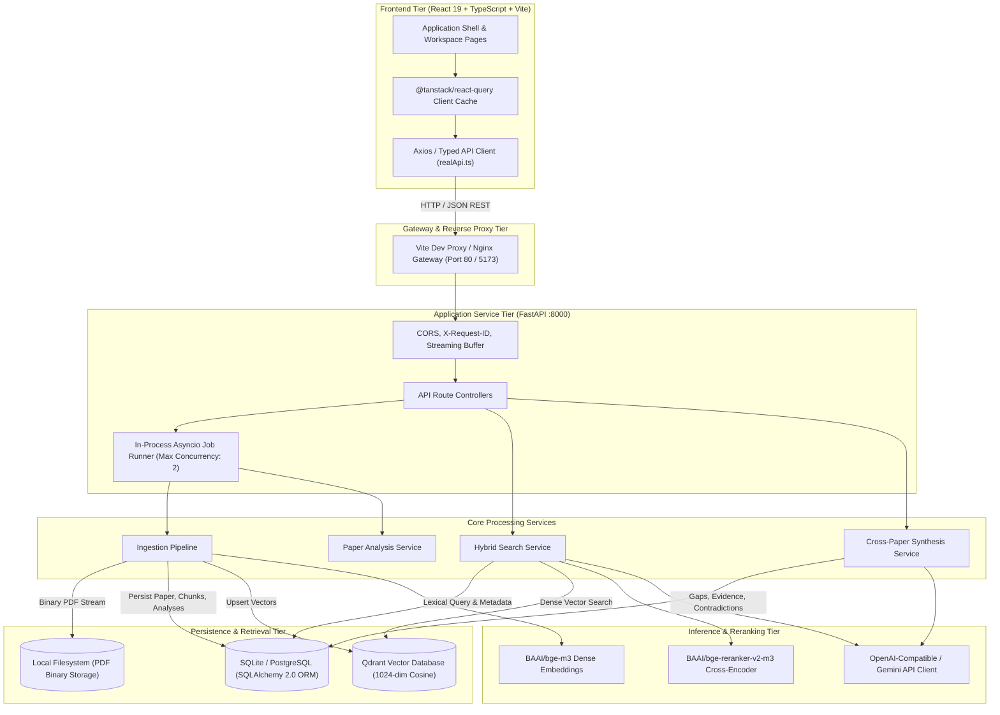
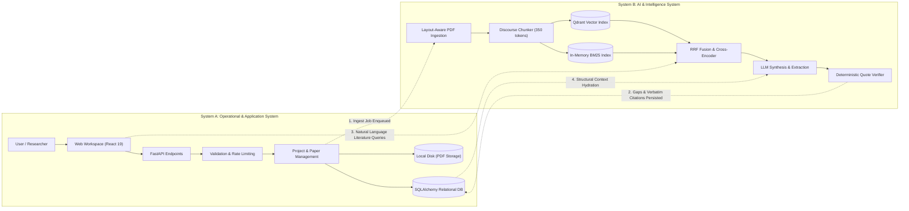
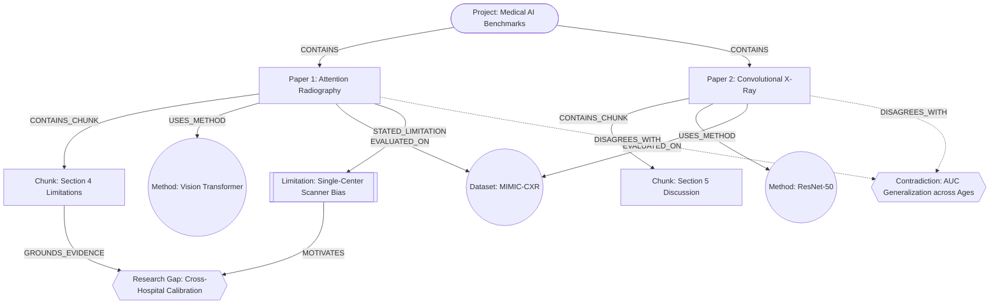
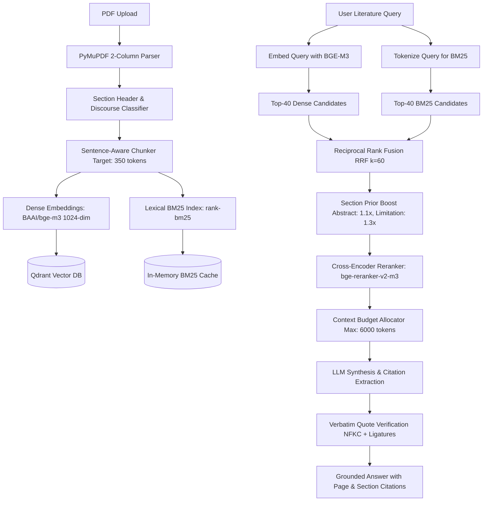

<div align="center">

# 🔬 Nexus AI — Research Gap Finder
### *Evidence-Grounded Literature Intelligence & Cross-Paper Synthesis Platform*

[](https://react.dev/)
[](https://fastapi.tiangolo.com/)
[](https://qdrant.tech/)
[-4F46E5?style=flat-square)](https://huggingface.co/BAAI/bge-m3)
[](https://huggingface.co/BAAI/bge-reranker-v2-m3)
[](https://tailwindcss.com/)
[](https://www.docker.com/)
[-brightgreen?style=flat-square&logo=pytest&logoColor=white)](https://pytest.org/)

<p align="center">
  <b>Transform unstructured academic PDF libraries into structured research intelligence.</b><br/>
  Nexus AI systematically extracts methodology matrices, identifies conflicting empirical findings, clusters recurrent limitations, and surfaces high-confidence, citation-grounded candidate research gaps.
</p>

[Key Features](#-key-features) • [System Architecture](#-system-architecture) • [Dual System Map](#-dual-system-map) • [Graph Model](#-graph-model) • [AI & Hybrid RAG](#-ai--hybrid-rag-engine) • [API Reference](#-api-specification) • [Local Setup](#-installation--setup) • [Docker](#-docker--containerized-deployment)

</div>

---

## 📋 Table of Contents

- [1. Executive Summary](#1-executive-summary)
- [2. Problem Statement](#2-problem-statement)
- [3. Key Features](#3-key-features)
- [4. System Architecture](#4-system-architecture)
- [5. Dual System Map](#5-dual-system-map)
- [6. Core Modules](#6-core-modules)
- [7. Backend Request & Data Flow](#7-backend-request--data-flow)
- [8. Database Architecture & Relational Schema](#8-database-architecture--relational-schema)
- [9. Graph Model & Knowledge Representation](#9-graph-model--knowledge-representation)
- [10. AI & Hybrid RAG Engine](#10-ai--hybrid-rag-engine)
- [11. Provenance & Deterministic Quote Verification](#11-provenance--deterministic-quote-verification)
- [12. API Specification](#12-api-specification)
- [13. Technology Stack](#13-technology-stack)
- [14. Installation & Setup](#14-installation--setup)
- [15. Configuration & Environment Variables](#15-configuration--environment-variables)
- [16. Running the System](#16-running-the-system)
- [17. Verification & Testing](#17-verification--testing)
- [18. Docker & Containerized Deployment](#18-docker--containerized-deployment)
- [19. Security Safeguards](#19-security-safeguards)
- [20. Known Limitations](#20-known-limitations)
- [21. Future Roadmap](#21-future-roadmap)

---

## 1. Executive Summary

**Nexus AI (Research Gap Finder)** is a literature intelligence platform engineered for academic researchers, graduate scholars, and R&D scoping teams. Unlike conventional conversational PDF tools that summarize papers in isolation or hallucinate citations, Nexus AI treats an entire repository of academic literature as an **interconnected semantic evidence graph**.

```
Academic PDFs ──▶ Layout Parser ──▶ Hybrid RAG (BM25 + BGE-M3) ──▶ Multi-Paper Matrix ──▶ Verified Gaps + Provenance
```

The system ingests multi-page academic publications, parses two-column layouts and section hierarchies, builds dense and lexical retrieval indices, performs multi-paper cross-synthesis, and produces:
* **Verified Candidate Research Gaps**: Confidence-scored hypotheses backed by verbatim citations and page/section numbers.
* **Empirical Contradictions**: Surfaced opposing claims across paper pairs.
* **Research Landscape Matrices**: Co-occurrence mappings of methods, datasets, recurring limitations, and thematic clusters.
* **Grounded Semantic Q&A**: Answers literature queries exclusively using retrieved and verified textual evidence.

---

## 2. Problem Statement

Literature reviews in scientific disciplines require manual tabulation of methodologies, models, evaluation benchmarks, and caveats across dozens of papers. Existing generative AI tools fail this workflow for four reasons:

| Challenge | Generic LLM Chat / Standard RAG | Nexus AI Architecture |
| :--- | :--- | :--- |
| **Citation Validity** | Fabricates titles, quotes, and author citations (hallucinations). | **Deterministic Quoting**: Quotes must pass Unicode NFKC substring match against indexed chunks. |
| **Discourse Structure** | Chunks documents blindly by character count, disregarding context. | **Section-Aware**: Differentiates Abstract, Method, Results, Discussion, Limitations. |
| **Cross-Paper Reasoning** | Operates over isolated chunks; cannot build comparison matrices. | **Bipartite Evidence Matrix**: Correlates methods, limitations, and findings across papers. |
| **Gap Grounding** | Guesses unexplored areas without verifying corpus absence. | **Absence Refutation**: Queries vector store to verify candidate gaps are truly unaddressed. |

---

## 3. Key Features

* **Project-Scoped Isolation**: Create distinct research workspaces where search, embeddings, and analyses are strictly isolated by `project_id`.
* **Two-Column Academic Ingestion**: PyMuPDF extraction engine with layout heuristics, reading-order resolution, and typographic font analysis.
* **Hybrid RAG (Dense + Lexical)**: Dual-stream retrieval fusing 1024-dimensional dense vectors (`BAAI/bge-m3`) with BM25 lexical token matching via Reciprocal Rank Fusion ($k=60$).
* **Cross-Encoder Reranking**: Re-scores top candidates using `BAAI/bge-reranker-v2-m3` blended with structural section priors.
* **Automated Contradiction Surfacing**: Identifies opposing experimental outcomes or conflicting claims between paper pairs.
* **Interactive Landscape Exploration**: Dynamic scatter plots and frequency distributions for topic clusters, shared datasets, and recurring limitations.
* **Asynchronous Pipeline Execution**: Ingestion, embedding generation, and cross-paper synthesis run as background tasks polled via structured status endpoints.

---

## 4. System Architecture

The application implements a decoupled, three-tier architecture:



---

## 5. Dual System Map

Nexus AI operates two unified systems that intersect through shared database entities and asynchronous event queues:



### System Intersection Points:
1. **The Ingestion Bridge**: System A streams the PDF to disk, creates a `Paper` record in `status=UPLOADED`, and enqueues an asynchronous task in System B. System B parses layout, chunks discourse, and generates vectors, updating System A's `Paper` to `INDEXED`.
2. **The Retrieval Bridge**: User queries in System A query System B's dual vector/lexical index, filtered strictly by `project_id`.
3. **The Evidence Matrix Bridge**: Cross-paper synthesis in System B evaluates structured metadata in System A, generates candidate gaps, and verifies verbatim quotes against System A's chunk store before persisting `ResearchGap` and `Evidence` entities.

---

## 6. Core Modules

| Module | Location | Primary Responsibilities | Key Technologies |
| :--- | :--- | :--- | :--- |
| **Web Frontend** | `src/` | Interactive project management, search UI, gap breakdown, landscape charts. | React 19, TypeScript, Tailwind CSS, TanStack Query |
| **API Layer** | `backend/app/api/` | REST route controllers, request validation, HTTP status codes, error serialization. | FastAPI, Pydantic v2 |
| **PDF Ingestion** | `backend/app/ingestion/` | 2-column layout detection, section heading classification, token-budgeted chunking. | PyMuPDF (`fitz`), Regex |
| **Hybrid Retrieval** | `backend/app/retrieval/` | Dense vector search, Okapi BM25 token search, RRF score fusion, cross-encoder reranking. | `sentence-transformers`, `rank-bm25`, Qdrant |
| **Synthesis Engine** | `backend/app/services/` | Structured paper analysis, cross-paper comparison, contradiction pairing, gap synthesis. | Tenacity, HTTPX, OpenAI-compatible APIs |
| **Persistence** | `backend/app/database/` | Relational ORM models, session factories, transaction scopes, repository functions. | SQLAlchemy 2.0, SQLite (WAL) / PostgreSQL |
| **Verification** | `backend/app/core/` | NFKC normalization, ligature unfolding, hyphenation cleanup, quote substring checking. | `unicodedata`, Python standard library |

---

## 7. Backend Request & Data Flow

```mermaid
sequenceDiagram
    autonumber
    actor User
    participant Router as FastAPI Router (/api/*)
    participant Dep as Dependency Injection
    participant Service as Domain Service
    participant Repo as DB Repositories
    participant Storage as SQLite / Qdrant
    participant LLM as AI Inference Engine

    User->>Router: POST /api/projects/{id}/papers/upload (multipart PDF)
    Router->>Dep: Validate project_id & upload size limits
    Router->>Service: Stream upload to disk (magic byte check)
    Service->>Repo: Create Paper record (status=UPLOADED)
    Service->>Repo: Enqueue Ingestion Job
    Router-->>User: 202 Accepted {job_id, paper_id}

    Note over Service,Storage: Async Background Worker Executes Ingestion
    Service->>Storage: Read PDF stream & parse layout (PyMuPDF)
    Service->>Service: Detect canonical sections & sentence chunks
    Service->>Storage: Batch upsert 1024-dim dense vectors to Qdrant
    Service->>Repo: Batch insert Chunk entities to SQLite
    Service->>Service: Extract structured analysis (problem, limitations)
    Service->>Repo: Save PaperAnalysis entity; update Paper status=ANALYZED
    Service->>Repo: Mark Job as SUCCEEDED (progress=1.0)

    User->>Router: GET /api/jobs/{job_id}
    Router->>Repo: Query job status
    Router-->>User: 200 OK {status: "SUCCEEDED", progress: 1.0}
```

---

## 8. Database Architecture & Relational Schema

All relational models are implemented in [app/database/models.py](file:///c:/Users/admin/Desktop/major%20project/ai-research-gap/backend/app/database/models.py) using SQLAlchemy 2.0:

| Table | Primary Key | Foreign Key | Indexes / Constraints | Purpose |
| :--- | :--- | :--- | :--- | :--- |
| `projects` | `project_id` | — | `pk_projects` | Workspace boundary container; cascades deletion to papers and runs. |
| `papers` | `paper_id` | `project_id` | `uq_paper_project_sha256`, `ix_paper_project` | Document metadata (title, authors, year, venue, DOI, status, SHA-256). |
| `chunks` | `chunk_id` | `paper_id` | `ix_chunk_paper`, `ix_chunk_project` | Text chunks with section type (`ABSTRACT`, `METHODS`, `LIMITATIONS`, etc.). |
| `paper_analyses` | `analysis_id` | `paper_id` | `uq_analysis_cache`, `ix_analysis_paper` | Extracted problem, methods, datasets, limitations, and future directions. |
| `evidence` | `evidence_id` | `owner_id` | `ix_evidence_owner` | Verbatim citation quotes linked to specific chunks with verification flags. |
| `research_runs` | `run_id` | `project_id` | `ix_run_project` | Execution metadata for cross-paper gap analyses and reports. |
| `research_gaps` | `gap_id` | `run_id` | `ix_gap_run`, `ix_gap_project` | Candidate research gaps with category, confidence (0–100%), and hypotheses. |
| `contradictions` | `contradiction_id` | `run_id` | `ix_contradiction_run` | Paired conflicting empirical claims between papers. |
| `future_directions` | `direction_id` | `run_id` | `ix_direction_run` | Aggregated, clustered prospective research recommendations. |
| `research_reports` | `report_id` | `run_id` | `ix_report_run` | Compiled multi-page literature synthesis reports with Markdown export. |
| `jobs` | `job_id` | — | `ix_job_status` | Asynchronous task queue tracking progress (0.0–1.0) and failure logs. |

<details>
<summary><b>🔍 View Relational Schema SQL DDL Preview</b></summary>

```sql
CREATE TABLE papers (
    paper_id VARCHAR PRIMARY KEY,
    project_id VARCHAR NOT NULL REFERENCES projects(project_id) ON DELETE CASCADE,
    title VARCHAR NOT NULL,
    authors JSON DEFAULT '[]',
    year INTEGER,
    venue VARCHAR,
    doi VARCHAR,
    abstract TEXT,
    source_filename VARCHAR NOT NULL,
    sha256 VARCHAR(64),
    status VARCHAR(20) NOT NULL DEFAULT 'UPLOADED',
    created_at TIMESTAMP WITH TIME ZONE DEFAULT CURRENT_TIMESTAMP,
    CONSTRAINT uq_paper_project_sha256 UNIQUE (project_id, sha256)
);

CREATE INDEX ix_paper_project ON papers(project_id);
```

</details>

---

## 9. Graph Model & Knowledge Representation

Nexus AI models academic literature as an **Entity-Relationship Knowledge & Evidence Graph**:



### Graph Entities & Topology
* **Nodes**:
  * `Project`: Root boundary.
  * `Paper`: Document node storing bibliographic attributes.
  * `Chunk`: Discourse text unit annotated by layout section.
  * `Methodology` / `Dataset`: Extracted experimental entities.
  * `Limitation`: Explicitly reported experimental boundaries.
  * `ResearchGap`: Synthesized candidate open problem.
  * `Contradiction`: Binary conflict edge between papers.
* **Edge Semantics**:
  * `CONTAINS`: Ownership hierarchy.
  * `USES_METHOD` / `EVALUATED_ON`: Empirical grounding.
  * `STATED_LIMITATION`: Caveat attribution.
  * `GROUNDS_EVIDENCE`: Verbatim chunk quote linking evidence to a gap.
  * `DISAGREES_WITH`: Cross-document conflicting empirical claim.

---

## 10. AI & Hybrid RAG Engine



### Retrieval & Ranking Algorithms

1. **Reciprocal Rank Fusion (RRF)**:
   $$\text{RRF}(d) = \sum_{r \in \{\text{dense}, \text{bm25}\}} \frac{1}{k + \text{rank}(d, r)}, \quad k = 60$$
2. **Structural Section Prior Boosting**:
   Candidate scores are weighted by document location:
   * `LIMITATIONS`: **$1.30\times$**
   * `RESULTS` / `DISCUSSION`: **$1.15\times$**
   * `ABSTRACT`: **$1.10\times$**
   * `INTRODUCTION`: **$1.05\times$**
   * `METHODS` / `RELATED_WORK`: **$1.00\times$**
3. **Cross-Encoder Reranking & Score Blending**:
   Candidates are scored with `BAAI/bge-reranker-v2-m3`, scaled via sigmoid, and blended:
   $$\text{Score}_{\text{final}} = 0.85 \cdot \sigma(\text{logit}) + 0.15 \cdot \text{Score}_{\text{prior}}$$

---

## 11. Provenance & Deterministic Quote Verification

To eliminate LLM hallucinations, every claim cited by the synthesis engine must pass deterministic substring verification implemented in [app/core/text_normalize.py](file:///c:/Users/admin/Desktop/major%20project/ai-research-gap/backend/app/core/text_normalize.py):

```
LLM Generated Quote ──▶ Dehyphenation ──▶ Ligature Folding ──▶ NFKC Normalization ──▶ Substring Check in Chunk
```

1. **Hyphenation Resolution**: Recombines line-break hyphens (`multi-\n  head` $\rightarrow$ `multihead`).
2. **Ligature Replacement**: Standardizes typographic ligatures:
   `fi` $\rightarrow$ `fi`, `fl` $\rightarrow$ `fl`, `ff` $\rightarrow$ `ff`, `ffi` $\rightarrow$ `ffi`, `ffl` $\rightarrow$ `ffl`, `ſt` $\rightarrow$ `st`.
3. **Unicode NFKC Collapse**: Converts characters to compatible forms and collapses multiple spaces.
4. **Verification Status**: If the normalized quote exists as a substring of the normalized chunk text, `verified = True`. If not, the UI flags the citation as unverified.

---

## 12. API Specification

All endpoints are hosted under `/api` and adhere to REST conventions:

| Method | Endpoint | Description | Status Code |
| :--- | :--- | :--- | :--- |
| `GET` | `/api/health` | Health check returning service operational status and version. | `200 OK` |
| `GET` | `/api/projects` | List all research projects with paper counts. | `200 OK` |
| `POST` | `/api/projects` | Create a new research project (`name`, `description`). | `201 Created` |
| `GET` | `/api/projects/{id}` | Retrieve project details and summary statistics. | `200 OK` |
| `DELETE`| `/api/projects/{id}` | Delete a project and cascade-delete all papers, chunks, and runs. | `200 OK` |
| `POST` | `/api/projects/{id}/papers/upload` | Multipart PDF upload. Initiates async ingestion pipeline. | `202 Accepted` |
| `GET` | `/api/projects/{id}/papers` | List all papers in a project with processing statuses. | `200 OK` |
| `GET` | `/api/papers/{id}` | Retrieve paper metadata and structured AI analysis. | `200 OK` |
| `GET` | `/api/papers/{id}/file` | Stream raw PDF binary from disk for in-browser viewing. | `200 OK` |
| `POST` | `/api/projects/{id}/search` | Semantic literature search with grounded AI answer. | `200 OK` |
| `GET` | `/api/projects/{id}/research/gaps` | List candidate research gaps with confidence scores. | `200 OK` |
| `GET` | `/api/gaps/{id}` | Retrieve detailed evidence breakdown for a single gap. | `200 OK` |
| `GET` | `/api/projects/{id}/research/contradictions` | List detected claim contradictions between papers. | `200 OK` |
| `GET` | `/api/projects/{id}/research/landscape` | Retrieve topic clusters, methodologies, and limitations. | `200 OK` |
| `POST` | `/api/projects/{id}/research/report` | Generate literature synthesis report with Markdown output. | `201 Created` |
| `GET` | `/api/jobs/{id}` | Poll background job status (`QUEUED`, `RUNNING`, `SUCCEEDED`, `FAILED`). | `200 OK` |

<details>
<summary><b>📦 View Error Envelope Specification</b></summary>

```json
{
  "error": {
    "code": "FILE_TOO_LARGE",
    "message": "File exceeds maximum upload size of 25 MB.",
    "details": {
      "max_mb": 25,
      "received_bytes": 31457280
    }
  }
}
```

</details>

---

## 13. Technology Stack

```
Frontend:  React 19 • TypeScript 5 • Tailwind CSS • TanStack Query • Lucide React • Recharts
Backend:   FastAPI • Python 3.11 • SQLAlchemy 2.0 • Pydantic v2 • PyMuPDF
AI / ML:   BAAI/bge-m3 • BAAI/bge-reranker-v2-m3 • Qdrant • rank-bm25 • PyTorch
DevOps:    Docker • Docker Compose • Nginx • Pytest • Oxlint
```

| Layer | Technology | Version | Purpose in Architecture |
| :--- | :--- | :--- | :--- |
| **Frontend Framework** | React | `^19.2.8` | Component-based reactive user interface. |
| **Language (Web)** | TypeScript | `~6.0.2` | End-to-end static type safety. |
| **Styling** | Tailwind CSS | `^3.4.19` | Design token system with instant dark mode switching. |
| **Data Fetching** | TanStack Query | `^5.102.8` | Client-side query caching and job polling invalidation. |
| **Visualizations** | Recharts | `^3.10.1` | Scatter cluster plots and methodology frequency charts. |
| **Backend Framework** | FastAPI | `0.115.12` | High-performance asynchronous REST API framework. |
| **Language (API)** | Python | `3.11+` | Core scientific and web service runtime. |
| **ORM** | SQLAlchemy | `2.0.41` | Relational database abstraction and transactions. |
| **Vector Store** | Qdrant Client | `1.14.2` | Vector index supporting payload-filtered cosine search. |
| **PDF Extraction** | PyMuPDF (`fitz`) | `1.25.5` | Layout-aware text and boundary box extraction. |
| **Embeddings** | `sentence-transformers` | `4.1.0` | Dense vector generation (`BAAI/bge-m3`). |
| **Lexical Search** | `rank-bm25` | `0.2.2` | Okapi BM25 index for keyword retrieval. |

---

## 14. Installation & Setup

### Prerequisites
* **Node.js**: v18.0.0 or higher (v20 LTS recommended)
* **Python**: v3.11 or v3.12 (Python 3.11 recommended)
* **Git**: Installed and configured
* **System Memory**: Minimum 8 GB RAM (16 GB recommended for local ML execution)

```bash
# 1. Clone the repository
git clone https://github.com/def-hrithik/AI_Research_Gap_Finder.git
cd AI_Research_Gap_Finder

# 2. Set up Python virtual environment
cd backend
python -m venv .venv

# Activate environment:
# Windows (PowerShell):
.\.venv\Scripts\Activate.ps1
# Linux / macOS:
source .venv/bin/activate

# Install backend dependencies:
pip install --upgrade pip
pip install -r requirements.txt
pip install -r requirements-dev.txt

# Configure environment file:
cp .env.example .env
cd ..

# 3. Set up Frontend dependencies
npm install
```

---

## 15. Configuration & Environment Variables

All backend configuration is managed through Pydantic-settings in [app/config.py](file:///c:/Users/admin/Desktop/major%20project/ai-research-gap/backend/app/config.py). Configure `backend/.env`:

```ini
# --- Application ---
ENVIRONMENT=development
LOG_LEVEL=INFO
DATA_DIR=./data
DATABASE_URL=sqlite:///./data/rgf.db

# --- Networking & CORS ---
CORS_ORIGINS=http://localhost:5173,http://localhost:3000

# --- Upload Limits ---
MAX_UPLOAD_MB=25
MAX_PDF_PAGES=80
MAX_PAPERS_PER_PROJECT=30

# --- LLM Inference ---
LLM_PROVIDER=openai_compatible
LLM_API_KEY=your-api-key-here
LLM_MODEL=gpt-4o-mini
LLM_BASE_URL=https://api.openai.com/v1

# --- Embeddings & Reranker ---
EMBEDDING_MODEL=BAAI/bge-m3
EMBEDDING_DEVICE=auto
RERANKER_MODEL=BAAI/bge-reranker-v2-m3
RERANKER_ENABLED=true

# --- Vector Store (Embedded Qdrant) ---
QDRANT_LOCAL_PATH=./data/qdrant
QDRANT_COLLECTION=rgf_chunks
```

---

## 16. Running the System

### Standard Dual-Terminal Execution

#### Terminal 1: Start Backend API
```bash
cd backend
# Ensure virtual environment is active
uvicorn app.main:app --reload --host 127.0.0.1 --port 8000
```
> [!NOTE]
> The database automatically creates tables in `./data/rgf.db` on startup.  
> Interactive OpenAPI documentation is accessible at `http://127.0.0.1:8000/docs`.

#### Terminal 2: Start Frontend Development Server
```bash
# In the root repository directory:
npm run dev
```
Open **`http://localhost:5173`** in your browser. The Vite dev proxy forwards all `/api/*` calls to the FastAPI backend.

---

## 17. Verification & Testing

### 1. Backend Unit Tests
Runs the test suite for ID generation, text normalization, section detectors, and synthetic PDF parsing:
```bash
cd backend
pytest -v tests/unit
```
```text
tests/unit/core/test_core.py::TestIds::test_new_id_has_prefix PASSED
tests/unit/core/test_core.py::TestTextNormalize::test_quote_in_chunk_basic PASSED
tests/unit/ingestion/test_ingestion.py::test_pdf_parsing_end_to_end PASSED
============================= 21 passed in 2.16s ==============================
```

### 2. End-to-End Pipeline Integration Test
Executes a test creating a project, generating a synthetic PDF in memory, uploading, ingesting, polling jobs, running semantic searches, extracting research gaps, synthesizing landscape data, and generating a literature report:
```bash
cd backend
python tests/test_e2e_pipeline.py
```
```text
>>> ALL 11 END-TO-END RAG & PLATFORM TESTS PASSED SUCCESSFULLY! <<<
```

### 3. Frontend Production Build & Type Checking
```bash
npm run build
```
```text
✓ built in 7.57s
dist/index.html                   1.25 kB
dist/assets/index-*.css          30.53 kB
dist/assets/index-*.js          988.82 kB
```

---

## 18. Docker & Containerized Deployment

Deploy the entire stack (Qdrant + FastAPI + Nginx Frontend) with a single command:

```bash
docker compose up --build -d
```

```
Container rgf-qdrant    Started (Port 6333)
Container rgf-backend   Started (Port 8000)
Container rgf-frontend  Started (Port 3000)
```

- **Frontend Application**: `http://localhost:3000`
- **Backend API & Swagger**: `http://localhost:8000/docs`
- **Qdrant Vector Dashboard**: `http://localhost:6333/dashboard`

---

## 19. Security Safeguards

* **Magic-Byte Upload Validation**: Uploads require both `.pdf` extensions and the `%PDF-` binary magic header checked while streaming.
* **Streaming Memory Bounds**: PDF files are streamed in 64 KB buffers with active byte counting, halting files that exceed `MAX_UPLOAD_MB` before memory allocation.
* **SQL Injection Immunity**: Database persistence uses SQLAlchemy 2.0 ORM with parameterized query bindings.
* **Tenant Isolation**: Every vector similarity query in Qdrant and lexical search in BM25 requires an explicit `project_id` filter.
* **Container Hardening**: Backend Docker containers drop root privileges and execute as `appuser` (UID 1000).

---

## 20. Known Limitations

* **In-Memory Job Concurrency**: The background job worker operates using in-process `asyncio` queues. For distributed horizontal scale across multiple server instances, Celery with a Redis broker is recommended.
* **SQLite Write Concurrency**: Development defaults to SQLite in WAL mode. For enterprise production deployments with multiple concurrent write transactions, point `DATABASE_URL` to a managed PostgreSQL cluster.
* **CPU Inference Latency**: Running `bge-m3` embeddings on CPU is optimized for development libraries. For production batch ingestion, GPU acceleration (CUDA) reduces embedding latency by over 80%.

---

## 21. Future Roadmap

- [ ] **Multi-Tenant RBAC**: Team workspaces with granular role-based permissions (Reader, Researcher, Admin).
- [ ] **Direct DOI / ArXiv Fetching**: Import publications directly from ArXiv, PubMed, and CrossRef without requiring manual PDF downloads.
- [ ] **Native Graph Database Integration**: Export relational citation and contradiction matrices directly to Neo4j.
- [ ] **Interactive Visual Citations**: Deep-link evidence directly to highlighted bounding boxes on the original PDF page in a split-screen viewer.
- [ ] **Automated Proposal Synthesis**: Export detected research gap hypotheses directly into compiled LaTeX project proposal templates.

---

## 📄 License

This project was developed as a final-year academic capstone in AI-Powered Literature Intelligence. Distributed for research and evaluation purposes.
