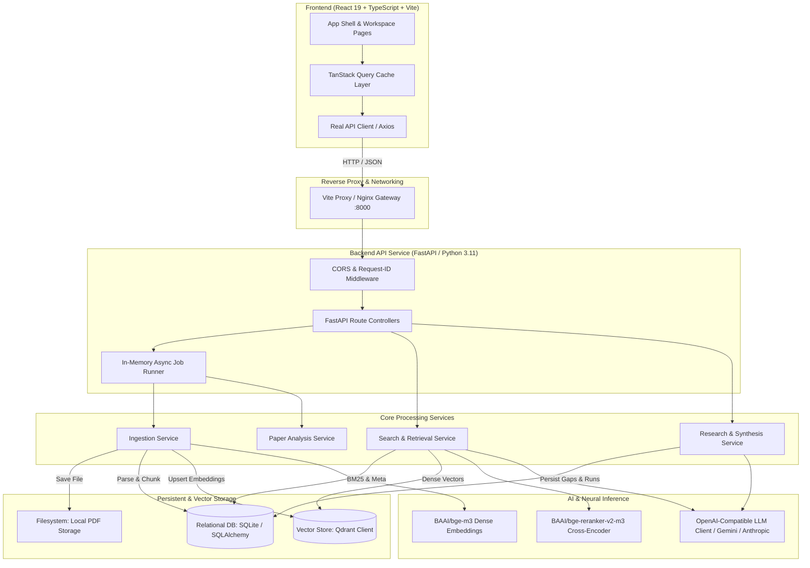
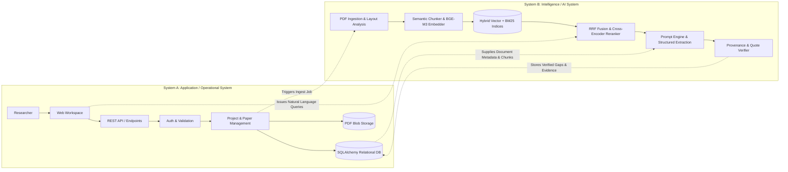
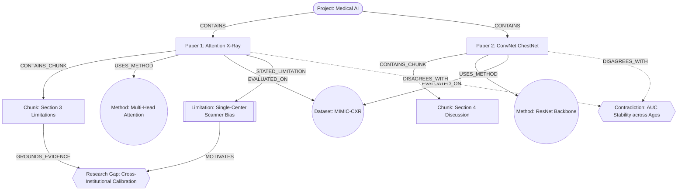
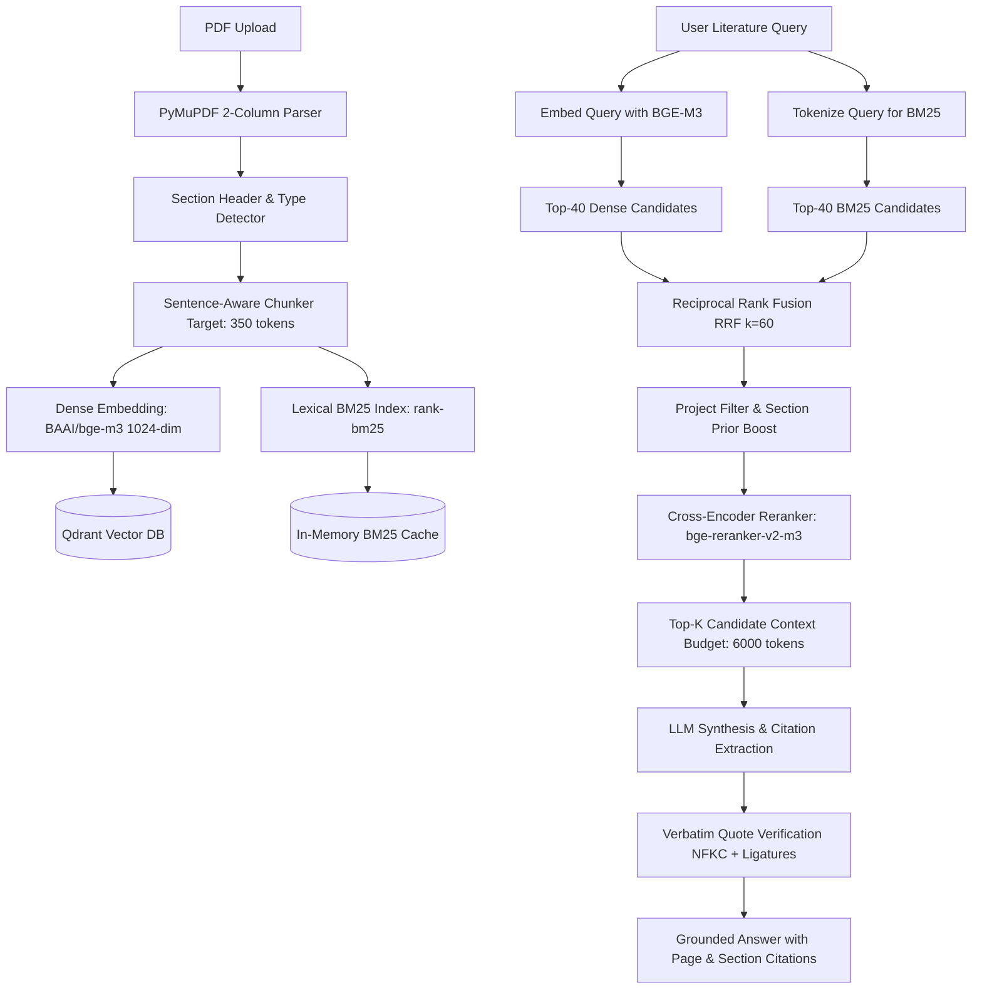

# Nexus AI — Research Gap Finder & Literature Intelligence Platform

> **Production Technical Documentation & System Specification**  
> An evidence-grounded literature analysis platform that transforms unstructured academic PDF libraries into structured research intelligence, identifying underexplored problem spaces, conflicting empirical findings, and high-confidence candidate research gaps.

---

## Table of Contents

1. [Project Overview](#1-project-overview)
2. [Problem Statement](#2-problem-statement)
3. [Key Features](#3-key-features)
4. [System Architecture](#4-system-architecture)
5. [Dual System Map (Operational vs. Intelligence)](#5-dual-system-map)
6. [Frontend Architecture](#6-frontend-architecture)
7. [Backend Architecture](#7-backend-architecture)
8. [Backend Request & Data Flow](#8-backend-request--data-flow)
9. [Database Architecture & Relational Schema](#9-database-architecture--relational-schema)
10. [Graph Model & Knowledge Representation](#10-graph-model--knowledge-representation)
11. [AI & Hybrid RAG Architecture](#11-ai--hybrid-rag-architecture)
12. [API Specification & Contract Overview](#12-api-specification--contract-overview)
13. [Local System Setup](#13-local-system-setup)
14. [Environment Configuration](#14-environment-configuration)
15. [Installation Guide](#15-installation-guide)
16. [Running the System](#16-running-the-system)
17. [Testing & Quality Assurance](#17-testing--quality-assurance)
18. [Docker & Containerized Deployment](#18-docker--containerized-deployment)
19. [Security & Validation Safeguards](#19-security--validation-safeguards)
20. [Known Limitations](#20-known-limitations)
21. [Future Roadmap](#21-future-roadmap)

---

## 1. Project Overview

**Nexus AI (AI Research Gap Finder)** is a literature intelligence workspace designed for academic researchers, PhD candidates, and R&D scoping teams. Unlike conversational PDF chatbots that hallucinate citations or summarize papers in isolation, Nexus AI treats a collection of academic papers as an interconnected **evidence graph**.

The platform ingests multi-page academic PDFs, detects hierarchical section structures, generates dense and lexical vector indices, runs structured per-paper heuristic extraction, cross-analyzes claims across documents, and outputs:
- **Verified Candidate Research Gaps** backed by direct verbatim citations with page/section provenance.
- **Empirical Contradictions** surfacing conflicting metrics or findings between papers.
- **Research Landscape Matrices** mapping method co-occurrence, recurring limitations, and thematic clusters.
- **Grounded Semantic Q&A** answering complex literature queries with exact source attributions.

---

## 2. Problem Statement

Modern scientific literature reviews require reading dozens or hundreds of papers, manually cataloging methodologies, mapping recurring constraints, and identifying novel research directions. Existing approaches suffer from four critical deficiencies:

1. **Unconstrained LLM Hallucinations**: Standard LLM chat tools invent paper citations, extrapolate findings beyond the text, and fail to provide traceable provenance.
2. **Loss of Discourse Structure**: Off-the-shelf chunkers split text by token length, ignoring that a claim in an *Abstract* or *Conclusion* carries vastly different epistemic weight than a citation in *Related Work*.
3. **Inability to Reason Across Multiple Documents**: Traditional RAG systems retrieve chunks for single queries but cannot perform holistic multi-paper matrix synthesis (e.g., *Paper A uses Method X on Dataset Y with limitation Z; Paper B uses Method W on Dataset Y*).
4. **Lack of Gap Verification**: Extrapolated research opportunities are rarely cross-checked against the corpus to confirm that no other paper has already addressed them.

Nexus AI solves these problems through structure-aware document parsing, a hybrid BM25 + dense retrieval engine with cross-encoder reranking, and deterministic quote verification.

---

## 3. Key Features

- **Project-Scoped Workspaces**: Isolate paper libraries into distinct research workspaces where retrieval and analysis are strictly bounded by project boundaries.
- **Structure-Aware Ingestion**: PyMuPDF extraction detecting two-column academic layouts, section headers (Abstract, Methods, Results, Discussion, Limitations), and font weights.
- **Deterministic Quoting & Grounding**: Every extracted claim, limitation, and gap requires normalized substring evidence checking against indexed source chunks.
- **Hybrid RAG (Dense + BM25 + RRF)**: Dual-stream retrieval combining dense vector embeddings (`BAAI/bge-m3`) with BM25 lexical keyword matching, fused via Reciprocal Rank Fusion (RRF, $k=60$).
- **Cross-Encoder Reranking**: Re-scores candidate chunks with `BAAI/bge-reranker-v2-m3` blended with structural section priors.
- **Contradiction Detection**: Pairs papers evaluating comparable phenomena and highlights conflicting empirical claims labeled as potential contradictions.
- **Landscape Synthesis**: Interactive scatter plots and frequency charts plotting topic distribution, method usage, and repeated limitations.
- **Asynchronous Pipeline Execution**: Long-running ingestion, embedding, and cross-paper synthesis run as background jobs polled via clean status endpoints.

---

## 4. System Architecture

The platform follows a decoupled, three-tier architecture:



---

## 5. Dual System Map

Nexus AI operates two complementary systems working in synchronization:



### Where Both Systems Connect:
1. **The Ingestion Bridge**: When System A uploads a PDF, it records a `Paper` record in `status=UPLOADED` and queues an async job in System B. System B parses, chunks, and indexes vectors into Qdrant, then writes the chunk records back into System A's relational database and transitions status to `INDEXED`.
2. **The Retrieval Bridge**: When a user queries in System A, the query routes through System B's hybrid retrieval (BM25 from System A's chunks + dense search from System B's Qdrant collection).
3. **The Evidence Matrix Bridge**: Cross-paper synthesis analyzes structured heuristic records in System A, generates candidate gaps via System B's LLM, and verifies quotes against System A's raw chunk text before persisting `ResearchGap` and `Evidence` entities.

---

## 6. Frontend Architecture

- **Framework**: React 19 SPA powered by Vite and TypeScript (strict mode enabled).
- **Routing**: `react-router-dom` v7 with nested project layout shells.
  - `/` — Public marketing landing page with interactive knowledge graph preview.
  - `/login`, `/signup` — Authentication views.
  - `/dashboard` — Cross-project statistics, recent activity feed, and topic distribution.
  - `/projects` — Project catalog and creation modal.
  - `/projects/:projectId/overview` — Project workspace entry.
  - `/projects/:projectId/upload` — Drag-and-drop PDF upload with per-file progress tracking.
  - `/projects/:projectId/papers` — Searchable, filterable paper repository table.
  - `/projects/:projectId/search` — Semantic natural-language literature search with citations.
  - `/projects/:projectId/landscape` — Topic scatter clusters, method usage, and repeated limitations.
  - `/projects/:projectId/compare` — Side-by-side paper comparison on shared criteria.
  - `/projects/:projectId/contradictions` — Conflicting claims between paper pairs.
  - `/projects/:projectId/gaps` — Confidence-scored candidate research gaps.
  - `/projects/:projectId/reports` — Synthesis reports with Markdown export.
  - `/papers/:paperId` — Paper deep-dive showing structured AI extraction and evidence.
  - `/gaps/:gapId` — Detailed breakdown of gap hypotheses and supporting excerpts.
- **State Management & Caching**: `@tanstack/react-query` v5 with centralized query keys and automated cache invalidation upon job completion.
- **Design System**: Tailwind CSS v3 with dynamic CSS custom properties for instant light/dark mode switching (`[data-theme='dark']`).
- **Icons & Data Visualizations**: `lucide-react` for iconography and `recharts` for scatter plots, bar charts, and area graphs.

---

## 7. Backend Architecture

- **Framework**: Python 3.11+ with FastAPI.
- **Design Pattern**: Layered Service Pattern:
  - `app/api/`: Thin controllers and route definitions. Enforces request validation, status codes, and HTTP headers (`X-Request-ID`).
  - `app/services/`: Pure business logic (`ingest_service`, `search_service`, `research_service`, `analysis_service`, `job_service`). No database connection management or HTTP dependencies inside core algorithms.
  - `app/database/`: SQLAlchemy ORM models, session factories, and encapsulated repository functions (`repos.py`).
  - `app/ingestion/`: Layout-aware PDF extraction (`pdf_parser.py`), canonical section mapping (`section_detector.py`), and sentence-aware chunking (`chunker.py`).
  - `app/retrieval/`: Hybrid search logic (`bm25.py`, `hybrid.py`, `reranker.py`, `evidence_selector.py`).
  - `app/llm/`: Abstract provider interface (`base.py`) with implementations for OpenAI-compatible APIs (`openai_compatible.py`) and a deterministic offline stub (`fake.py`).
  - `app/core/`: Text normalization (`text_normalize.py`), ID generation (`ids.py`), streaming file I/O (`files.py`), and custom error classes (`errors.py`).

---

## 8. Backend Request & Data Flow

```mermaid
sequenceDiagram
    autonumber
    actor User
    participant Route as FastAPI Router (/api/*)
    participant Middleware as Request-ID & CORS
    participant Service as Business Service
    participant Repo as DB Repositories
    participant Storage as SQLite / Qdrant
    participant LLM as Inference Engine

    User->>Route: POST /api/projects/{id}/papers/upload (PDF multipart)
    Route->>Middleware: Assign/Validate X-Request-ID
    Middleware->>Service: Stream upload to disk (magic byte check)
    Service->>Repo: Create Paper record (status=UPLOADED)
    Service->>Repo: Enqueue Ingest Job
    Service-->>User: 202 Accepted (job_id, paper_id)

    Note over Service,Storage: Async Background Worker Executes Ingestion
    Service->>Storage: Read PDF from disk with PyMuPDF
    Service->>Service: Section detection & paragraph chunking
    Service->>Storage: Batch upsert chunk embeddings to Qdrant
    Service->>Repo: Batch insert Chunk entities to SQLite
    Service->>Service: Extract structured analysis (problem, limitations)
    Service->>Repo: Save PaperAnalysis entity; update Paper status=ANALYZED
    Service->>Repo: Mark Job as SUCCEEDED (progress=1.0)

    User->>Route: GET /api/jobs/{job_id}
    Route->>Repo: Query job status
    Repo-->>User: 200 OK (status=SUCCEEDED)
```

---

## 9. Database Architecture & Relational Schema

All relational models are defined in `backend/app/database/models.py` using SQLAlchemy 2.0:

| Table Name | Primary Key | Foreign Keys | Key Attributes & Responsibilities |
| :--- | :--- | :--- | :--- |
| `projects` | `project_id` (str) | — | Research workspace container; stores name, description, timestamps. Cascades deletion to papers and research runs. |
| `papers` | `paper_id` (str) | `project_id` | Document metadata (title, authors, year, venue, DOI, abstract, SHA-256 hash, status, page count, upload filename). |
| `chunks` | `chunk_id` (str) | `paper_id` | Structural discourse chunks (index, section heading, chunk type, page range, text content, token count, cue flags). |
| `paper_analyses` | `analysis_id` (str) | `paper_id` | Structured extraction results (problem, methodology, models, datasets, findings, limitations, future work). |
| `evidence` | `evidence_id` (str) | `owner_id` | Grounded citation excerpts linking gaps or contradictions to specific papers, chunks, and page numbers with quote verification flags. |
| `research_runs` | `run_id` (str) | `project_id` | Snapshot of cross-paper analysis runs, tracking target, status, paper set hash, and summary statistics. |
| `research_gaps` | `gap_id` (str) | `run_id` | Candidate research gaps with category, gap type, confidence score (0–100%), evidence strength, and suggested questions. |
| `contradictions` | `contradiction_id` (str) | `run_id` | Detected opposing claims across paper pairs with supporting excerpts and explanation. |
| `future_directions` | `direction_id` (str) | `run_id` | Clustered future work directions aggregated across the paper library. |
| `research_reports` | `report_id` (str) | `run_id` | Generated literature synthesis reports with full structured payload and compiled Markdown document. |
| `jobs` | `job_id` (str) | — | Asynchronous processing queue tracking task status (`QUEUED`, `RUNNING`, `SUCCEEDED`, `FAILED`), stage, progress (0.0–1.0), and errors. |

---

## 10. Graph Model & Knowledge Representation

Nexus AI models academic libraries as an **Entity-Relationship Knowledge & Evidence Graph**.



### 1. Entity & Node Types
- **Project**: Root scope containing all associated entities.
- **Paper**: Bibliographic document node with metadata attributes.
- **Chunk**: Atomic structural text block annotated with layout type (Abstract, Introduction, Method, Limitation).
- **Methodology / Dataset**: Extracted concepts evaluated in empirical pipelines.
- **Limitation**: Stated boundary conditions extracted from discussion/limitation sections.
- **Research Gap**: Synthesized open problem or unexplored method-dataset pair.
- **Contradiction**: Pairwise conflict between findings.

### 2. Relationship / Edge Types
- `CONTAINS` / `CONTAINS_CHUNK`: Hierarchical ownership.
- `USES_METHOD` / `EVALUATED_ON`: Methodological grounding.
- `STATED_LIMITATION`: Caveat association.
- `GROUNDS_EVIDENCE`: Direct traceability from candidate gap to verbatim chunk quote with page number.
- `DISAGREES_WITH`: Cross-document conflicting claim.

### 3. Creation & Retrieval
- **Graph Construction**: Built dynamically during ingestion and analysis. Paper analyses extract entities (methods, datasets, limitations) which are mapped into relational and in-memory adjacency structures.
- **Graph Retrieval**: When searching for gaps, the system queries both dense vectors (for semantic relevance) and relational graph edges (finding co-occurring limitations across different papers sharing the same dataset or method).

---

## 11. AI & Hybrid RAG Architecture



### Models & Specifications
- **Dense Embedding Model**: `BAAI/bge-m3` (1024 dimensions, multi-lingual, dense retrieval).
- **Cross-Encoder Reranker**: `BAAI/bge-reranker-v2-m3` (sigmoid-scaled cross-attention scoring).
- **Vector Database**: Qdrant (`v1.14.2`), using cosine similarity and payload filtering on `project_id`.
- **Lexical Index**: `rank-bm25` (Okapi BM25 implementation with English stopword removal and tokenization).
- **Quote Verification**: Strict substring check with NFKC normalization, ligature unfolding (`fi` $\rightarrow$ `fi`), and hyphenation repair. If an LLM cites a quote not present in the chunk, the citation is flagged as unverified.

---

## 12. API Specification & Contract Overview

All endpoints are prefixed with `/api` and return standardized JSON responses:

### Core Endpoints

| Method | Endpoint | Description | Status Code |
| :--- | :--- | :--- | :--- |
| `GET` | `/api/health` | Health check returning service status and version | `200 OK` |
| `GET` | `/api/projects` | List all research projects | `200 OK` |
| `POST` | `/api/projects` | Create a new research project (`name`, `description`) | `201 Created` |
| `GET` | `/api/projects/{id}` | Retrieve project details and summary statistics | `200 OK` |
| `DELETE`| `/api/projects/{id}` | Delete project and cascade delete all associated data | `200 OK` |
| `POST` | `/api/projects/{id}/papers/upload` | Upload PDF file; initiates async ingestion pipeline | `202 Accepted` |
| `GET` | `/api/projects/{id}/papers` | List all papers in a project with processing status | `200 OK` |
| `GET` | `/api/papers/{id}` | Retrieve paper metadata and structured analysis | `200 OK` |
| `GET` | `/api/papers/{id}/file` | Stream raw PDF binary from disk for in-browser viewer | `200 OK` |
| `POST` | `/api/projects/{id}/search` | Semantic literature search with grounded AI answer | `200 OK` |
| `GET` | `/api/projects/{id}/research/gaps` | List candidate research gaps with confidence scores | `200 OK` |
| `GET` | `/api/gaps/{id}` | Retrieve detailed evidence breakdown for a single gap | `200 OK` |
| `GET` | `/api/projects/{id}/research/contradictions` | List detected claim contradictions between papers | `200 OK` |
| `GET` | `/api/projects/{id}/research/landscape` | Retrieve topic clusters, methodologies, and limitations | `200 OK` |
| `POST` | `/api/projects/{id}/research/report` | Generate structured literature synthesis report | `201 Created` |
| `GET` | `/api/jobs/{id}` | Poll background job status and progress percentage | `200 OK` |

### Error Envelope
```json
{
  "error": {
    "code": "FILE_TOO_LARGE",
    "message": "File exceeds maximum upload size of 25 MB.",
    "details": { "max_mb": 25 }
  }
}
```

---

## 13. Local System Setup

### Prerequisites
- **Operating System**: Windows 10/11, macOS (Apple Silicon or Intel), or Linux (Ubuntu 22.04+).
- **Node.js**: v18.0.0 or higher (v20+ recommended).
- **Python**: v3.11 or v3.12 (Python 3.11 recommended).
- **Git**: Installed and configured.
- **Hardware**: Minimum 8 GB RAM (16 GB recommended if running local ML models). CPU execution is supported out-of-the-box.

---

## 14. Environment Configuration

### Backend (`backend/.env`)
Copy `backend/.env.example` to `backend/.env`:

```ini
# --- App ---
ENVIRONMENT=development
LOG_LEVEL=INFO
LOG_FORMAT=console
DATA_DIR=./data
DATABASE_URL=sqlite:///./data/rgf.db

# --- CORS ---
CORS_ORIGINS=http://localhost:5173,http://localhost:3000

# --- Upload Limits ---
MAX_UPLOAD_MB=25
MAX_PDF_PAGES=80
MAX_PAPERS_PER_PROJECT=30

# --- LLM Provider ---
# Options: openai_compatible | anthropic | fake
LLM_PROVIDER=openai_compatible
LLM_API_KEY=your-api-key-here
LLM_MODEL=gpt-4o-mini
LLM_BASE_URL=https://api.openai.com/v1

# --- Embeddings & Reranker ---
EMBEDDING_MODEL=BAAI/bge-m3
EMBEDDING_DEVICE=auto
RERANKER_MODEL=BAAI/bge-reranker-v2-m3
RERANKER_ENABLED=true

# --- Vector Store (Qdrant) ---
# For local embedded storage without external Docker:
QDRANT_LOCAL_PATH=./data/qdrant
QDRANT_COLLECTION=rgf_chunks

# Or for external Qdrant server:
# QDRANT_URL=http://localhost:6333
# QDRANT_API_KEY=
```

### Frontend (`.env.local` optional)
By default, the Vite dev server proxies `/api` requests directly to `http://127.0.0.1:8000`.

---

## 15. Installation Guide

### Step 1: Clone Repository
```bash
git clone https://github.com/your-username/ai-research-gap.git
cd ai-research-gap
```

### Step 2: Set Up Backend Environment
```bash
cd backend
python -m venv .venv

# Activate virtual environment:
# On Windows (PowerShell):
.\.venv\Scripts\Activate.ps1
# On Linux/macOS:
source .venv/bin/activate

# Install dependencies:
pip install --upgrade pip
pip install -r requirements.txt
pip install -r requirements-dev.txt

# Create initial environment file:
cp .env.example .env
cd ..
```

### Step 3: Set Up Frontend Environment
```bash
# In the ai-research-gap root directory:
npm install
```

---

## 16. Running the System

### Terminal 1: Start FastAPI Backend
```bash
cd backend
# Ensure virtual environment is activated
uvicorn app.main:app --reload --host 127.0.0.1 --port 8000
```
*Backend will boot, initialize database tables in `./data/rgf.db`, and run on `http://127.0.0.1:8000`.*  
*Interactive OpenAPI documentation available at `http://127.0.0.1:8000/docs`.*

### Terminal 2: Start Vite Frontend
```bash
# In the ai-research-gap root directory:
npm run dev
```
*Frontend will launch at `http://localhost:5173`.*

---

## 17. Testing & Quality Assurance

### 1. Run Backend Unit Tests
Executes unit tests for ID generation, text normalization, section detectors, and synthetic PDF parsing:
```bash
cd backend
pytest -v tests/unit
```

### 2. Run Comprehensive End-to-End Pipeline Integration Test
Executes an end-to-end integration test creating a project, generating a synthetic PDF in memory, uploading, ingesting, polling jobs, running semantic searches, extracting research gaps, synthesizing landscape data, and generating a literature report:
```bash
cd backend
python tests/test_e2e_pipeline.py
```

### 3. Frontend Type Check & Production Bundle
```bash
npm run build
```

### 4. Frontend Code Linting
```bash
npm run lint
```

---

## 18. Docker & Containerized Deployment

Nexus AI includes a production `docker-compose.yml` to orchestrate Qdrant, the FastAPI backend, and an Nginx-served frontend SPA:

```bash
# In the ai-research-gap root directory:
docker compose up --build -d
```

- **Frontend Application**: `http://localhost:3000`
- **Backend API**: `http://localhost:8000`
- **Qdrant Vector Database**: `http://localhost:6333/dashboard`

---

## 19. Security & Validation Safeguards

- **Streaming Upload Security**: Uploads enforce magic byte validation (`%PDF-`), streaming size bounds, and calculate SHA-256 hashes on the fly to prevent duplicate files and denial-of-service memory exhaustion.
- **SQL Injection Prevention**: All database interactions use parameterized queries via SQLAlchemy 2.0 ORM.
- **Project Boundary Isolation**: Every vector search and lexical query requires a strict `project_id` filter to prevent cross-tenant data leakage.
- **Fail-Fast Startup Configuration**: `config.py` validates all environment settings at boot and halts execution with clear diagnostics if required variables are missing or misconfigured.
- **Container Hardening**: Backend Docker container runs under a non-root `appuser` (UID 1000).

---

## 20. Known Limitations

- **Single-Node Async Jobs**: Background jobs run using an in-process asyncio task runner. For large-scale distributed deployments, Celery with Redis or RabbitMQ is recommended.
- **SQLite Concurrency**: Development default uses SQLite in WAL mode. For enterprise multi-user write concurrency, point `DATABASE_URL` to a PostgreSQL instance.
- **Local ML Compute**: Running dense embedding models and cross-encoders on low-end CPUs will increase ingestion time. For production throughput, GPU acceleration (CUDA) or hosted embedding APIs should be configured.

---

## 21. Future Roadmap

- [ ] **Multi-Tenant RBAC**: Team workspaces with granular role-based access control (Viewer, Researcher, Admin).
- [ ] **ArXiv / CrossRef Direct Ingest**: Import papers directly via DOI or ArXiv URL without downloading PDFs locally.
- [ ] **Native Graph Database Integration**: Sync relational entity graphs directly to Neo4j for Cypher-based graph traversals.
- [ ] **Interactive Visual Citations**: Clickable evidence anchors highlighting the exact bounding box on the original PDF page in a split-screen reader.
- [ ] **Automated Literature Gap Proposals**: Export formatted research proposals directly into LaTeX templates based on detected gap evidence.

---

## License

This project was developed as a final-year academic project in AI-Powered Literature Intelligence.
