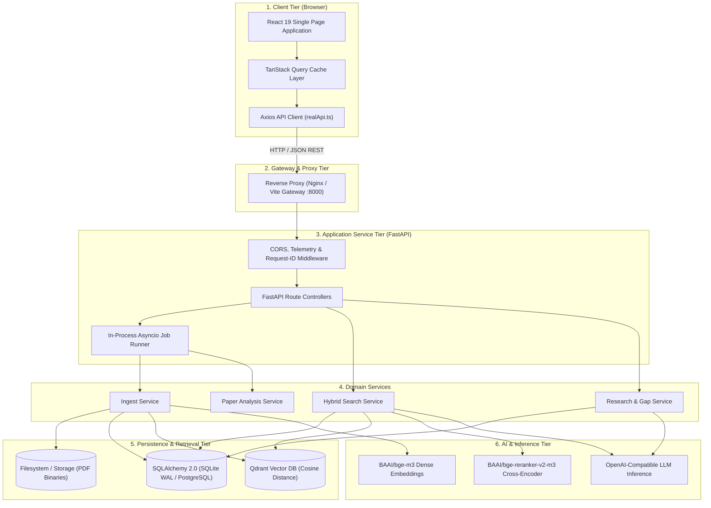
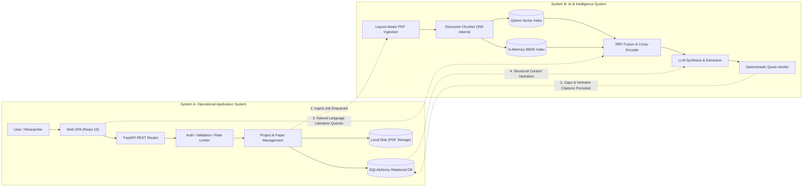
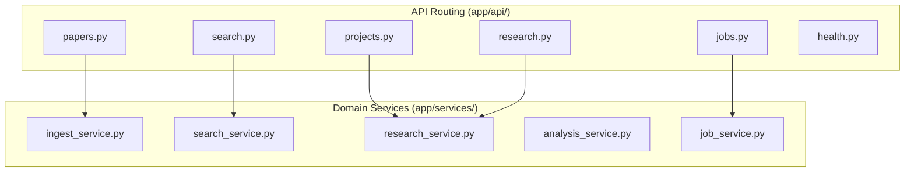
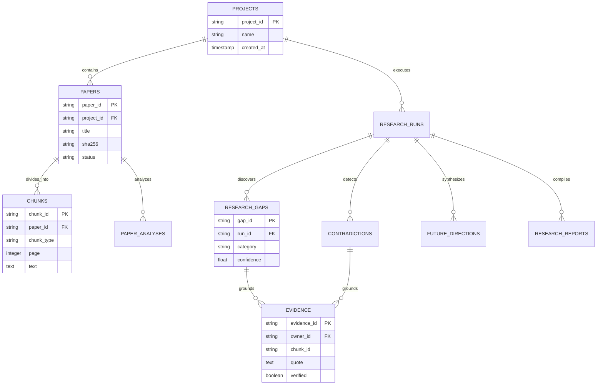
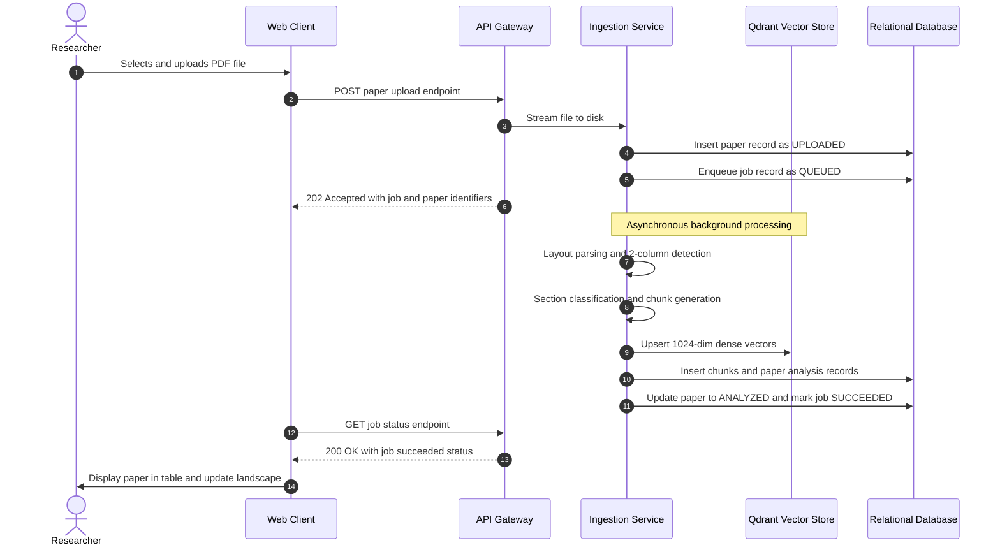
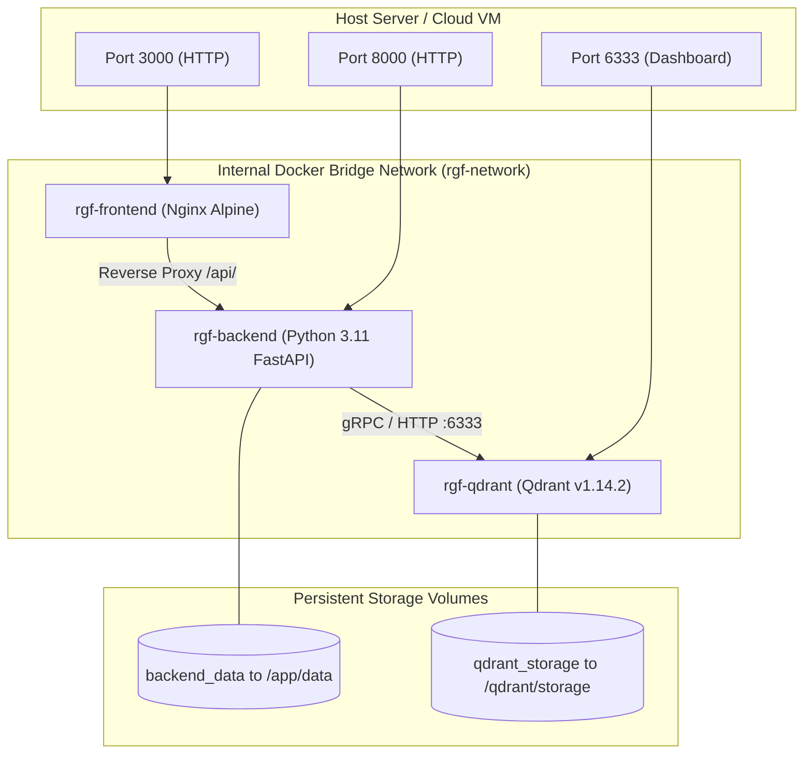

<div align="center">

# 🏛️ Nexus AI — System Architecture Specification
### *Three-Tier Production Architecture, Dual System Topology & Enterprise Deployment Specification*

[](https://react.dev/)
[](https://fastapi.tiangolo.com/)
[](https://www.sqlalchemy.org/)
[](https://qdrant.tech/)
[](https://www.docker.com/)

[← Back to README](./README.md) • [RAG Model Specification](./RAGMODEL.md) • [Backend Implementation](./BACKEND.md)

</div>

---

## 📋 Table of Contents

- [1. Architectural Overview](#1-architectural-overview)
- [2. Three-Tier System Topology](#2-three-tier-system-topology)
- [3. Dual System Map (Operational vs. Intelligence)](#3-dual-system-map)
- [4. Frontend Tier Architecture](#4-frontend-tier-architecture)
- [5. API Gateway & Reverse Proxy Tier](#5-api-gateway--reverse-proxy-tier)
- [6. Application Service Tier](#6-application-service-tier)
- [7. Persistence & Vector Storage Architecture](#7-persistence--vector-storage-architecture)
- [8. AI & Inference Integration](#8-ai--inference-integration)
- [9. End-to-End User Request & Data Flows](#9-end-to-end-user-request--data-flows)
- [10. Containerized Deployment Architecture](#10-containerized-deployment-architecture)
- [11. Configuration & Startup Lifecycle](#11-configuration--startup-lifecycle)
- [12. Scalability, Concurrency & Fault Tolerance](#12-scalability-concurrency--fault-tolerance)
- [13. Security & Multi-Tenant Isolation](#13-security--multi-tenant-isolation)

---

## 1. Architectural Overview

Nexus AI is engineered as an enterprise-grade, evidence-grounded scientific intelligence system. The architecture is guided by four principles:

1. **Strict Decoupling**: The user interface (React 19 SPA) interacts with the backend strictly via standardized REST contracts, isolating frontend rendering logic from AI pipelines.
2. **Project Boundary Isolation**: Multi-tenant workspace partitioning is enforced across both relational tables (foreign keys) and vector indexes (payload filters).
3. **Asynchronous Task Offloading**: Heavy computational workloads (PDF ingestion, embedding batch generation, cross-paper matrix synthesis) run in background workers polled through decoupled job identifiers.
4. **Deterministic Auditability**: AI outputs are strictly grounded against relational entities with traceable page and section provenance.

---

## 2. Three-Tier System Topology



---

## 3. Dual System Map

Nexus AI operates two complementary systems working in synchronization:



### System Intersection Bridges:
1. **The Ingestion Bridge**: System A streams uploaded PDF binaries to disk, creates an initial `Paper` record (`status=UPLOADED`), and creates a task in System B. System B parses reading order, chunks text into canonical sections, calculates dense embeddings, indexes vectors into Qdrant, and updates System A's `Paper` to `INDEXED`.
2. **The Retrieval Bridge**: When a user queries in System A, the query routes through System B's hybrid fusion layer (`bge-m3` vectors in Qdrant + BM25 tokens from relational chunk records).
3. **The Evidence Matrix Bridge**: Cross-paper synthesis analyzes structured records in System A, formulates gap hypotheses in System B, and validates all quotes with NFKC-normalized substring checks before committing `ResearchGap`, `Contradiction`, and `Evidence` entities to System A.

---

## 4. Frontend Tier Architecture

Implemented in `src/`:

```
src/
├── components/         # Reusable UI components by feature domain
│   ├── common/         # Primitives (Button, Card, Modal, Badge, states)
│   ├── layout/         # AppShell, Header, Sidebar, ThemeToggle
│   ├── landing/        # Interactive Graph, Hero, FeatureGrid, FAQ
│   ├── dashboard/      # StatCards, ActivityChart, TopicDistribution
│   ├── papers/         # UploadDropzone, PaperTable, StatusBadge
│   ├── search/         # SearchInput, AiAnswerBlock, SourceCard
│   ├── gaps/           # GapCard, EvidenceList, ConfidenceBreakdown
│   ├── comparison/     # ComparisonTable, PaperMultiSelect
│   ├── contradictions/ # ContradictionCard
│   ├── landscape/      # TopicClusterChart, MethodUsageChart
│   └── projects/       # ProjectCard, CreateProjectModal
├── context/            # AuthContext, ThemeContext, ToastContext
├── hooks/              # Domain-specific React Query hooks
├── pages/              # 17 route-level view components
├── services/           # Centralized API service layer (realApi.ts)
├── types/              # TypeScript interfaces for all domain models
└── utils/              # Formatting and styling utilities
```

- **State Management**: `@tanstack/react-query` v5 provides asynchronous state management, request deduplication, and automatic query cache invalidation upon background job completion.
- **Styling Architecture**: Vanilla Tailwind CSS v3 configured with CSS variable tokens (`--background`, `--surface`, `--accent`, `--border`), enabling instantaneous dark/light mode switching via the `[data-theme='dark']` DOM attribute.

---

## 5. API Gateway & Reverse Proxy Tier

The gateway routes incoming traffic and enforces security boundaries:

- **Development Mode**: Vite development server proxies all `/api/*` traffic to `http://127.0.0.1:8000` via [vite.config.ts](file:///c:/Users/admin/Desktop/major%20project/ai-research-gap/vite.config.ts), avoiding local browser CORS restrictions.
- **Production Mode**: Nginx Alpine container terminates web traffic, serves the optimized static SPA bundle, and reverse-proxies `/api/*` to the backend container over internal Docker networking.
- **Header Propagation**: Enforces bidirectional `X-Request-ID` tracing across client, proxy, and backend log streams.

---

## 6. Application Service Tier

Implemented in Python 3.11+ using FastAPI:



### Layered Separation of Concerns
1. **Route Handlers (`app/api/`)**: Accept HTTP payloads, perform initial Pydantic schema validation, inject dependencies (`SettingsDep`, `DbDep`), and translate service results into status codes.
2. **Domain Services (`app/services/`)**: Implement pure business workflows (ingestion pipelines, search algorithms, multi-paper matrix construction). Services remain decoupled from HTTP session objects.
3. **Repository Functions (`app/database/repos.py`)**: Abstract all database queries into parameterized functions, isolating SQL logic from application rules.

---

## 7. Persistence & Vector Storage Architecture

### 1. Relational Database (SQLAlchemy 2.0)
The relational schema manages 11 core tables with referential integrity:



### 2. Vector Database (Qdrant)
- **Deployment**: Runs as an embedded local instance (`./data/qdrant`) or as an independent container service.
- **Collection**: `rgf_chunks` (1024 dimensions, Cosine distance).
- **Index Optimization**: Payload indexed on `project_id` and `paper_id` for hardware-accelerated filtered searches.

---

## 8. AI & Inference Integration

Nexus AI integrates specialized neural models for each stage of the comprehension pipeline:

| Pipeline Stage | Model Identifier | Architecture | Hardware Spec |
| :--- | :--- | :--- | :--- |
| **Dense Embeddings** | `BAAI/bge-m3` | 1024-dim Dense Transformer | CPU / CUDA (`torch`) |
| **Cross-Encoder Reranker** | `BAAI/bge-reranker-v2-m3` | Cross-Attention Transformer | CPU / CUDA (`sentence-transformers`) |
| **Generative Synthesis** | OpenAI / Gemini / Ollama | Transformer LLM | Hosted API / Self-Hosted |
| **Offline Stub** | `FakeLLMClient` | Deterministic Mock Provider | Zero Compute (Local Testing) |

---

## 9. End-to-End User Request & Data Flows

### Ingestion & Indexing Flow



---

## 10. Containerized Deployment Architecture

The complete system deploys via [docker-compose.yml](file:///c:/Users/admin/Desktop/major%20project/ai-research-gap/docker-compose.yml):



---

## 11. Configuration & Startup Lifecycle

Implemented in [app/main.py](file:///c:/Users/admin/Desktop/major%20project/ai-research-gap/backend/app/main.py) and [app/config.py](file:///c:/Users/admin/Desktop/major%20project/ai-research-gap/backend/app/config.py):

```
FastAPI Lifespan Startup:
1. Validate settings (Fail-Fast Rule)
2. Setup structured logging
3. Ensure runtime directories (data/, data/uploads/, data/qdrant/)
4. Initialize SQLAlchemy database schema (create tables if missing)
5. Initialize in-process async Job Runner (concurrency cap: 2)
6. Startup sweep: Mark previously interrupted jobs as FAILED
7. Ready to serve requests
```

> [!NOTE]
> **Startup Sweep**: If the server process crashes while a long-running PDF ingestion job is in `RUNNING` status, the startup sweep detects unfinalized jobs and transitions them to `FAILED` with an actionable error code, preventing permanent UI loading spinners.

---

## 12. Scalability, Concurrency & Fault Tolerance

* **Asynchronous Concurrency**: Ingestion and synthesis jobs are limited by an internal semaphore (`ANALYSIS_MAX_CONCURRENCY=2`) to prevent CPU exhaustion during batch PDF processing.
* **Database WAL Mode**: SQLite runs in Write-Ahead Logging (`PRAGMA journal_mode=WAL`), allowing concurrent readers without blocking writes.
* **LLM Throttling Protection**: External inference requests are throttled using an `asyncio.Semaphore` (`LLM_MAX_CONCURRENCY=4`) and retried using exponential backoff with jitter via `tenacity`.
* **Scale-Out Strategy**: For horizontal multi-instance scaling, SQLite can be replaced with managed PostgreSQL, and the in-process job runner can be swapped for Celery workers consuming from Redis.

---

## 13. Security & Multi-Tenant Isolation

* **Strict Boundary Isolation**: Every database repository query and Qdrant vector retrieval requires an explicit `project_id` filter, guaranteeing tenant isolation.
* **Streaming Upload Verification**: Uploads stream in 64 KB buffers, validating both `.pdf` filename extensions and the `%PDF-` binary magic header while actively calculating SHA-256 hashes to reject duplicates and files exceeding `MAX_UPLOAD_MB` (25 MB).
* **SQL Injection Immunity**: Database persistence uses SQLAlchemy 2.0 ORM with parameterized query bindings.
* **Least-Privilege Containers**: The backend Docker container drops root access and executes under a restricted user (`appuser`, UID 1000).
