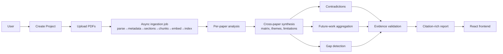

# 01 — Project Overview

> Status: authoritative. Read with `CLAUDE.md`.

## 1. Purpose

AI Research Gap Finder turns a collection of academic papers (PDFs) into **structured, evidence-grounded research intelligence**: what has been done, how, on what data, what was found, what limitations recur, where papers disagree, what future work is proposed, and — centrally — **which research gaps are supported by the literature provided**.

## 2. Problem statement

Researchers reviewing literature must manually read dozens of papers, tabulate methods/datasets/limitations, spot contradictions, and infer gaps. Generic LLM chat over PDFs is unsuitable because it (a) hallucinates claims and citations, (b) cannot distinguish what a paper *states* from what the model *infers*, (c) ignores paper structure (a "limitation" in the Conclusion is not the same as one in Related Work), and (d) cannot reason across papers with traceable provenance.

## 3. Goals

| # | Goal | Measured by (see 09) |
|---|---|---|
| G1 | Evidence-grounded outputs: every claim → paper/page/section/chunk | Citation correctness ≥ 0.95 |
| G2 | High-quality retrieval over academic structure | Recall@10, MRR, NDCG |
| G3 | Multi-paper reasoning (evidence matrix → gaps) | Gap evidence validity |
| G4 | Hallucination prevention via verification | Faithfulness, unsupported-claim rate |
| G5 | Explicit vs synthesized gaps clearly separated | 100% of gaps labeled |
| G6 | Clean REST contracts for the existing frontend | Frontend runs with `VITE_USE_MOCK=false` |
| G7 | Explainability (why a gap exists, how confident, what evidence) | Every gap has `why_gap_exists`, computed confidence |

## 4. Target users

- Graduate students / PhD candidates writing literature reviews and proposals
- Researchers scoping a new problem
- Supervisors/reviewers checking novelty claims against a paper set
- (Academic final-year project evaluators — the system must be explainable and demonstrable)

## 5. Core features (MVP)

| Area | Feature |
|---|---|
| Projects | Create/list projects; papers belong to a project |
| Ingestion | PDF upload → text/page extraction → bibliographic metadata → section detection → structure-aware chunks → BGE-M3 embeddings → Qdrant |
| Retrieval | Dense + BM25 → RRF → section-aware prior → cross-encoder rerank |
| Search | NL query → ranked evidence + optional grounded answer with citations |
| Paper analysis | Per-paper structured JSON (problem, objectives, method, dataset, setup, contributions, findings, limitations, future work, unresolved questions) |
| Synthesis | Evidence matrix, themes, methodology/dataset landscape, ranked limitations |
| Contradictions | Potential contradictions with conditions and possible reasons (no verdict on who is right) |
| Future work | Per-paper extraction, aggregation: repeated / unique / underexplored |
| Gap detection | 10 gap categories, EXPLICIT vs SYNTHESIZED, computed confidence & evidence strength |
| Validation | Quote/page/chunk verification, support check, confidence downgrade, removal of unsupported claims |
| Reports | Citation-rich research report (JSON + Markdown) |
| Frontend | Existing React/Vite SPA switches from mock → real API via `realApi.ts` |

## 6. Non-goals (MVP)

Custom embedding/LLM training or fine-tuning; OCR for scanned PDFs (rejected with clear error); Neo4j/knowledge graph; Kubernetes/Kafka/microservices; agent swarms; complex auth (placeholder only); recommender systems; external paper search (arXiv/Semantic Scholar); multi-user collaboration; PDF report rendering on server. See `13_ROADMAP.md`.

## 7. Expected workflow

Per-query (search/ask) workflow: `query → intent+rewrite → dense ∥ BM25 → RRF → section prior → rerank → evidence selection → (optional) grounded answer → citation validation`.

## 8. Terminology

| Term | Meaning |
|---|---|
| **Project** | A user's collection of papers; the unit of analysis and retrieval isolation |
| **Paper** | One ingested PDF with metadata |
| **Chunk** | Section-bounded text unit with page provenance; the unit of retrieval and citation |
| **Section / chunk_type** | Canonical academic section (e.g. METHODOLOGY); see 05 |
| **Evidence** | A verified link from a claim to `chunk_id` + page + verbatim quote |
| **Source** | Response-level numbered citation `[n]` pointing to a chunk |
| **Explicit gap** | A paper directly states the limitation/future work |
| **Synthesized gap** | Gap inferred by comparing ≥2 papers; never attributed to a paper as its statement |
| **Evidence matrix** | Papers × {method, dataset, problem, finding, limitation, future work} table |
| **Insufficient evidence** | Retrieved evidence below thresholds; system declines to answer |
| **RRF** | Reciprocal Rank Fusion of dense and BM25 rankings |
| **Job** | Async unit of work (ingest, analyze) polled by id |

## 9. Success criteria

**Functional (MVP demo):**
1. Upload ≥5 PDFs in one project; all reach `INDEXED`; analyses reach `ANALYZED`.
2. Search returns reranked chunks with page + section; section-aware queries visibly prefer the right sections.
3. Gap finder returns ≥3 gaps with both EXPLICIT and SYNTHESIZED examples, each with verified evidence.
4. Unrelated query returns `insufficient_evidence: true` — no answer from general knowledge.
5. Frontend runs end-to-end with `VITE_USE_MOCK=false`.

**Quality targets (calibrate on benchmark, see 09):** citation correctness ≥ 0.95; unsupported-claim rate in final output ≤ 0.05; Recall@10 ≥ 0.80 on answerable questions; insufficient-evidence recall ≥ 0.85 on unanswerable questions; p95 search latency ≤ 3 s (GPU/warm) / ≤ 8 s (CPU).

## 10. Design decisions that deviate from the original brief

| Brief said | Repo reality / decision | Reason |
|---|---|---|
| Frontend is Next.js | Frontend is **React + Vite SPA** | Verified from repo README/structure. Integration is unaffected (REST). CORS must allow the Vercel origin. |
| Endpoints un-scoped (`/api/papers/upload`) | Endpoints **project-scoped** where the frontend is (`/api/projects/{id}/papers/...`); un-scoped aliases kept where natural | Frontend routes/domain are project-based |
| Entities: Paper, Chunk, … | Adds **Project** and **Job** | Required by frontend + async processing |
| Vector DB only | Adds **SQLite** relational store | Papers, analyses, gaps, reports, jobs need relational persistence; Qdrant is not a document store for these. Postgres-ready via SQLAlchemy. |
