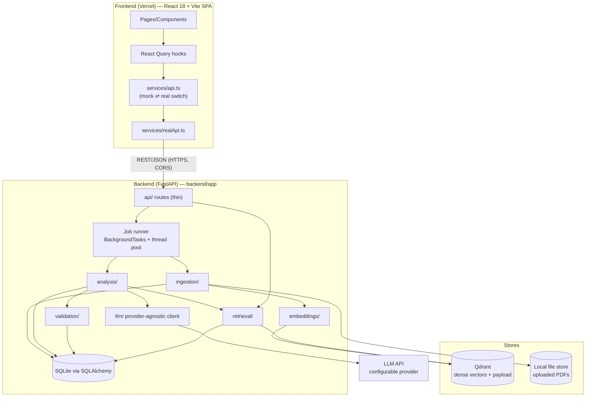
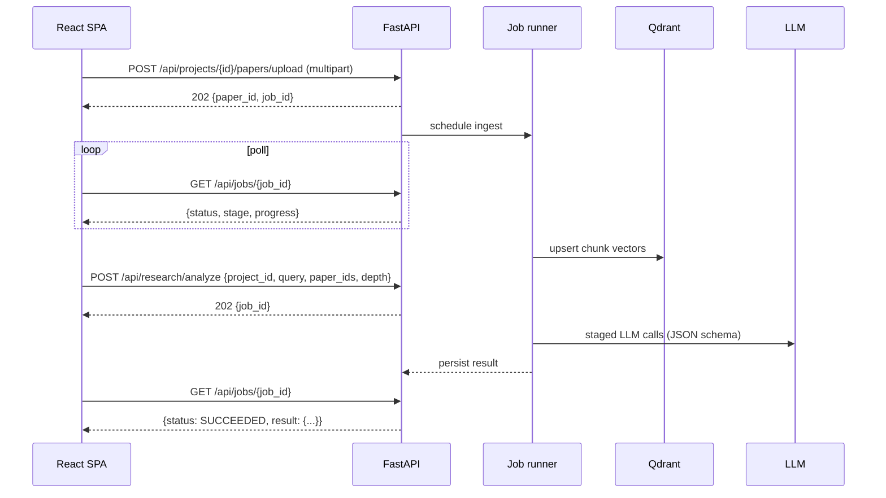
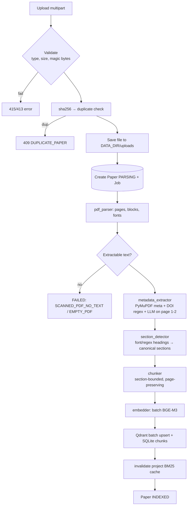
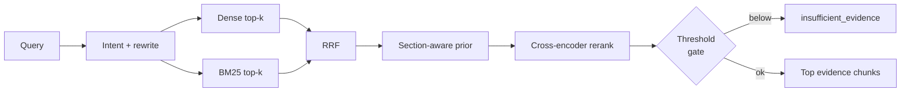
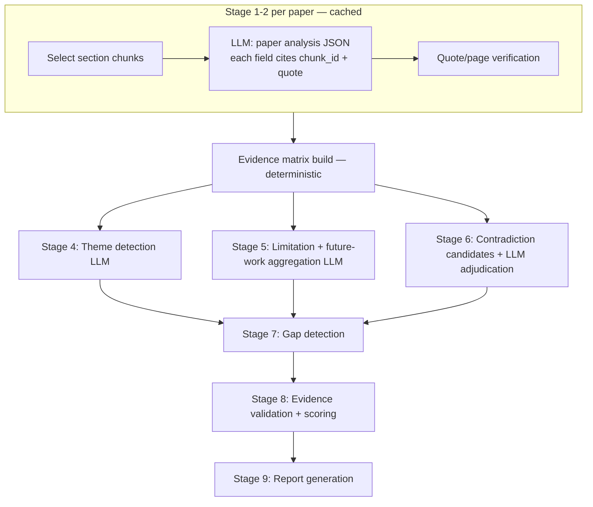
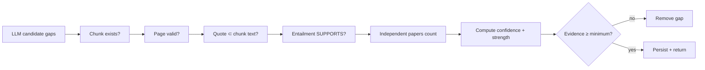
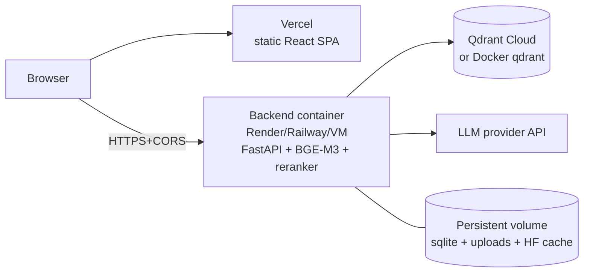

# 02 — System Architecture

## 1. High-level architecture



### 1.1 Responsibilities

| Layer | Responsibility | Must NOT |
|---|---|---|
| `api/` | Parse/validate request, call service, map to response schema, map exceptions → structured errors | Contain business logic |
| `ingestion/` | PDF → pages → metadata → sections → chunks | Call LLM except metadata extractor (via `llm/`) |
| `embeddings/` | Load model once, batch-encode (documents/queries) | Know about Qdrant |
| `retrieval/` | Dense, BM25, RRF, section prior, rerank, evidence selection | Call the LLM for answering |
| `analysis/` | Paper analysis, synthesis, contradictions, future work, gaps | Fetch vectors directly (use `retrieval/`) |
| `validation/` | Verify quotes/pages/chunks/support; compute confidence | Generate new claims |
| `llm/` | Provider abstraction, JSON-schema output, retries, token accounting, versioned prompts | Contain pipeline logic |
| `database/` | SQLAlchemy models/repos, Qdrant client wrapper | Contain business rules |

### 1.2 Backend directory layout (adapted; repo root also holds the frontend)

```
<repo root>
├── src/ public/ package.json vite.config.ts …     # EXISTING frontend — do not restructure
├── docs/                                           # these files
├── CLAUDE.md
└── backend/
    ├── app/
    │   ├── main.py                  # app factory, CORS, lifespan (model warmup), routers
    │   ├── config.py                # pydantic-settings, startup validation
    │   ├── api/
    │   │   ├── projects.py papers.py search.py analysis.py gaps.py reports.py jobs.py
    │   │   ├── research.py          # POST /api/research/analyze orchestration
    │   │   └── deps.py errors.py    # DI + exception handlers
    │   ├── services/                # orchestration glue (ingest_service, research_service, report_service)
    │   ├── ingestion/ pdf_parser.py section_detector.py metadata_extractor.py chunker.py
    │   ├── embeddings/ embedder.py
    │   ├── retrieval/ vector_search.py bm25.py hybrid.py reranker.py intent.py evidence_selector.py
    │   ├── analysis/ paper_analyzer.py synthesizer.py contradiction.py future_work.py gap_detector.py
    │   ├── validation/ evidence_validator.py citation_validator.py scoring.py
    │   ├── llm/ client.py providers/ prompts.py schemas_json.py
    │   ├── database/ models.py session.py repos.py qdrant.py
    │   ├── schemas/ project.py paper.py chunk.py evidence.py analysis.py gap.py contradiction.py future.py report.py job.py common.py
    │   └── core/ logging.py ids.py errors.py
    ├── scripts/ evaluate.py
    ├── eval/ benchmark.jsonl
    ├── tests/ (unit/, e2e/, fixtures/pdfs/)
    ├── requirements.txt  Dockerfile  .env.example
    └── data/ (gitignored: sqlite db, uploads, qdrant local)
```

**Conflict note:** repo root already contains Vite files, so the backend is isolated in `backend/`. Vercel must build only the frontend; add `backend/` to `.vercelignore` if Vercel scans it.

## 2. Frontend ⇄ backend interaction

- All HTTP from the SPA goes through `src/services/realApi.ts` (Axios). `VITE_USE_MOCK=false` activates it.
- Base URL from an env var (**VERIFY** the existing name in `src/services/`; if none, add `VITE_API_BASE_URL`).
- Backend JSON is the **canonical contract** (docs/05, 06). Where existing `src/types` differ, add mapper functions in `realApi.ts` (preferred) rather than bending backend schemas. Only add *optional* fields to `src/types`.
- Long operations: frontend polls `GET /api/jobs/{job_id}` (React Query `refetchInterval` while `RUNNING`).
- CORS: backend allows `CORS_ORIGINS` (localhost:5173 + the Vercel domain).
- Source viewing: `sources[]`/`evidence[]` carry `paper_id`, `page`, `section`, `chunk_id`, text → frontend can open Paper Details at the page.



## 3. Ingestion pipeline



Each stage updates `Paper.status` and `Job.stage/progress`. Failure at any stage sets `FAILED` + `error{code,message}`; partial artifacts (Qdrant points, chunk rows) are rolled back (delete by `paper_id`).

## 4. Retrieval pipeline

Detailed in `03_RAG_ARCHITECTURE.md`. Summary:



## 5. Analysis pipeline



Stage numbering vs. brief: Stage 2 (evidence extraction) is **implemented inside Stage 1's output contract + deterministic verification** (no separate LLM call) to limit LLM calls; query-focused evidence extraction for `/api/search` is the retrieval pipeline. See 04 for details.

### LLM call budget (N papers, `standard` depth)

| Stage | Calls | Cached |
|---|---|---|
| Metadata (ingest) | N | with paper |
| Paper analysis | N | per paper+prompt_version |
| Theme detection | 1 | per paper-set hash |
| Limitation/future aggregation | 1 | per paper-set hash |
| Contradiction | 1–2 | per paper-set hash |
| Gap detection | 1–3 (per category group) | per paper-set hash |
| Entailment validation | 1–3 (batched) | — |
| Report | 1 | — |
| **Total new analysis** | ≈ **N + 10** | |

`quick`: skip contradiction + validation LLM pass (deterministic checks only). `deep`: also per-gap targeted re-retrieval for absence claims.

## 6. Gap-detection pipeline & validation (summary)

Full logic in `04_RESEARCH_GAP_ENGINE.md`. Order: collect explicit limitations/future work → build matrix + facets → LLM proposes candidate gaps citing `chunk_id`+quote → **code verifies every evidence item** → entailment check (LLM batch) → drop/downgrade → **code computes confidence/evidence_strength** → persist.



## 7. Async processing model (MVP)

- FastAPI `BackgroundTasks` + a bounded `ThreadPoolExecutor` (`ANALYSIS_MAX_CONCURRENCY`) — CPU-bound parsing/embedding runs in threads; LLM calls use async client with semaphore.
- Job state persisted in SQLite (`jobs` table); on startup, jobs left `RUNNING` are marked `FAILED(INTERRUPTED)`.
- Embedding model and reranker are loaded **once** (lifespan) and guarded by a lock/semaphore.
- Upgrade path (documented, not built): Redis + RQ/Celery.

## 8. Deployment architecture



| Concern | Decision |
|---|---|
| Frontend | Vercel; env `VITE_USE_MOCK=false`, API base URL env |
| Backend | Single Docker container, `uvicorn` 1 worker (models are in-process; multi-worker multiplies RAM) |
| **Memory** | BGE-M3 (~2.3 GB weights) + reranker (~2.3 GB) → plan **≥ 8 GB RAM** on CPU hosts. Free tiers (≤ 512 MB–2 GB) **will not work**. Mitigations: `RERANKER_ENABLED=false`, hosted embedding provider behind the same `Embedder` interface, or a GPU/VM host. |
| Model download | Bake HF models into image or mount persistent HF cache (`HF_HOME`) to avoid cold-start downloads |
| Qdrant | Local dev: `docker run -p 6333:6333 qdrant/qdrant` (or embedded `QDRANT_LOCAL_PATH`); prod: Qdrant Cloud URL + API key |
| Persistence | Volume for `data/` (SQLite + PDFs). Ephemeral disks lose data — use Postgres via `DATABASE_URL` if the host is ephemeral |
| Secrets | Host env vars only; `.env` never committed |
| Health | `GET /api/health` (liveness), `GET /api/health/ready` (Qdrant + models + DB) |

## 9. Architecture decision records (ADRs)

| ID | Decision | Rationale | Alternative (deferred) |
|---|---|---|---|
| ADR-1 | Backend in `backend/`, frontend untouched | Repo root is a Vite app | Monorepo tooling |
| ADR-2 | SQLite + SQLAlchemy for relational data | Zero-ops MVP; Postgres via URL swap | Postgres from day 1 |
| ADR-3 | Qdrant dense-only; BM25 via `rank_bm25` in-process | Brief requires separate lexical stage; fits ≤ ~10⁵ chunks | Qdrant sparse vectors / BGE-M3 sparse |
| ADR-4 | Single Qdrant collection, `project_id` payload filter | Simpler ops than collection-per-project | Collection per project |
| ADR-5 | Confidence/strength computed in code | LLM self-confidence is unreliable | LLM-calibrated scores |
| ADR-6 | LLM cites `chunk_id` + verbatim quote; code verifies | Cheapest strong anti-hallucination guard | Generic NLI model |
| ADR-7 | Background tasks + persisted jobs | Meets async requirement without a broker | Celery/RQ |
| ADR-8 | Backend JSON is canonical; adapt in `realApi.ts` | Keeps frontend components unchanged | Backend mimics mock shapes |
| ADR-9 | Scanned PDFs rejected (no OCR) | Time-box; clear error | Tesseract/Docling OCR |
