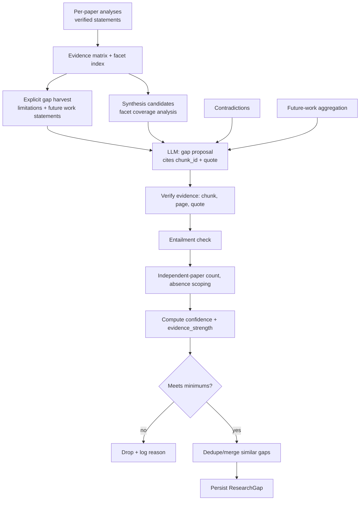

# 04 — Research Gap Engine

The core feature. This document defines *how gaps are found, justified, scored and validated*. Schemas live in `05_DATA_MODEL.md`; prompts in `07_LLM_PROMPTS.md`.

## 1. Principles

1. **Evidence first.** A gap exists only if verified evidence supports it.
2. **Two kinds, never confused:** `EXPLICIT` (paper says it) vs `SYNTHESIZED` (system infers by comparing papers).
3. **Scoped claims.** Every claim is scoped to the analyzed collection: *"Among the N analyzed papers…"*. Never "no one has…".
4. **Code decides trust.** The LLM *proposes*; deterministic code *verifies and scores*.
5. **Preserve uncertainty.** Low evidence ⇒ low confidence or removal; never inflate.
6. **No general-knowledge evidence.** Model background knowledge may help phrase, never justify.

## 2. Pipeline



## 3. Inputs and derived structures

### 3.1 Evidence matrix (deterministic from PaperAnalysis)

One row per paper; each cell holds normalized text **and** `evidence_ids`.

| paper_id | method | dataset | research_problem | key_finding | limitation | future_work |
|---|---|---|---|---|---|---|
| pap_A | CNN | Dataset X | … | … | Small dataset | Evaluate on larger datasets |
| pap_B | Transformer | Dataset Y | … | … | High compute cost | Cross-domain generalization |
| pap_C | Hybrid | Dataset X | … | … | Poor cross-domain eval | Explainability |

Cells with `"Not explicitly stated in the provided paper."` are kept as-is and **excluded** from counts (never treated as evidence of absence — *not stated* ≠ *absent*).

### 3.2 Facet index (deterministic + LLM normalization)

For each facet (`method`, `dataset`, `metric`, `evaluation_setting`, `domain`, `application`, `limitation_type`, `future_direction`) build `normalized_value → {paper_ids, evidence_ids}`. Normalization: lowercase, strip punctuation, alias map from the theme-detection stage (e.g. "CNN", "convolutional neural network" ⇒ `cnn`). The LLM theme stage (Stage 4) outputs the alias clusters; code applies them.

Derived signals used for synthesized gaps:
- **Concentration:** one value used by ≥ 60% of papers (e.g., all use Dataset X) ⇒ possible dataset/generalization gap.
- **Absence in set:** a plausible facet value *named by other papers' limitations/future work* but with zero papers using/evaluating it.
- **Disagreement:** same (method, dataset) with opposing findings ⇒ contradiction gap.
- **Temporal skew:** distribution of `year`; gap if latest paper years lag a topic trend cited in the set (needs ≥ 5 papers with years; otherwise skipped).

## 4. Gap categories

| # | Category | Definition | Typical evidence | Typical type |
|---|---|---|---|---|
| 1 | METHODOLOGICAL | Methods untried, narrow, or flawed across papers | Methods facet concentration; limitations on method | both |
| 2 | DATASET | Datasets small, single-domain, synthetic, unavailable, or unrepresentative | Dataset facet; limitation statements | both |
| 3 | EVALUATION | Missing/weak metrics, baselines, statistical tests, human evaluation | Metric facet; setup sections | SYNTHESIZED mostly |
| 4 | APPLICATION | Problem domains/real-world settings not addressed | Domain/application facet; future work | both |
| 5 | THEORETICAL | Missing theoretical analysis/explanation/guarantees | Discussion/limitation statements | EXPLICIT mostly |
| 6 | TEMPORAL | Outdated data/methods; no longitudinal study | Year distribution; dataset years | SYNTHESIZED |
| 7 | CONTRADICTION | Unresolved disagreement between papers | Contradiction records | SYNTHESIZED |
| 8 | REPRODUCIBILITY | Code/data/hyperparameters unavailable; no variance reporting | Setup/limitation statements | both |
| 9 | GENERALIZATION | Cross-domain/language/population/scale generalization untested | Limitations; single-domain evaluation | both |
| 10 | INTERDISCIPLINARY | Combination with other fields unexplored | Related-work/future-work statements | SYNTHESIZED |

`category` ∈ enum above. `gap_type` ∈ {`EXPLICIT`, `SYNTHESIZED`}. (The brief lists both a *category* and a *gap_type*; they are orthogonal.)

## 5. Explicit vs synthesized

| | EXPLICIT | SYNTHESIZED |
|---|---|---|
| Definition | At least one paper directly states the limitation / future-work / open problem | System infers by comparing ≥ 2 papers' verified statements/matrix |
| Min. evidence | ≥ 1 verified evidence item whose quote *states* the gap (type LIMITATION/FUTURE_WORK/DISCUSSION/CONCLUSION) | ≥ 2 verified evidence items from **≥ 2 distinct papers** (presence-pattern) or a **coverage statement** (absence-pattern, ≥ 3 papers analyzed) |
| Attribution | "Paper A states that…" | "Across papers A, B, C … ; this is an inference by the system, not stated by the authors." |
| `why_gap_exists` | Quoted/paraphrased from paper rationale, or `"Not explicitly stated in the provided paper."` | System's reasoning chain referencing matrix cells |
| Confidence cap | 0.90 (single paper capped at 0.60) | 0.85 presence-pattern / 0.65 absence-pattern |
| UI label | "Stated by authors" | "Synthesized from literature" |

An EXPLICIT gap raised independently by several papers is still `EXPLICIT`, and `affected_papers` lists them all. A gap that combines an explicit statement with cross-paper inference is `SYNTHESIZED` and must list the explicit statement among `supporting_claims` **with** its source paper.

**Never** rewrite a synthesized inference in a paper's voice. Validator checks that EXPLICIT gaps have quotes containing a limitation/future cue or semantic match (entailment `SUPPORTS` on "paper states this is a limitation/future work").

## 6. Evidence requirements

Each gap's `evidence[]` items must satisfy (checked in code, `validation/evidence_validator.py`):

| Check | Rule | On failure |
|---|---|---|
| Chunk exists | `chunk_id` ∈ DB and belongs to `project_id` and an analyzed paper | Remove evidence item |
| Chunk in run set | chunk was supplied to the LLM in this run | Remove (anti-fabrication) |
| Page valid | `1 ≤ page ≤ paper.page_count` and equals chunk's `page`..`page_end` | Remove |
| Quote verbatim | normalized(quote) ⊂ normalized(chunk.text) (NFKC, whitespace-collapse, case-insensitive, dehyphenation tolerant); quote ≤ 60 words; ≥ 5 words | Remove (try fuzzy ≥ 0.92 ratio on trimmed span → keep with `quote_fuzzy=true`, else remove) |
| Entailment | LLM judge: does this quote support the *specific claim it is attached to*? `SUPPORTS`/`PARTIAL`/`NOT_SUPPORTED` | NOT_SUPPORTED ⇒ remove item |
| Independence | Count **distinct paper_ids** among surviving evidence | Used in scoring |

After pruning, **minimums:**
- EXPLICIT: ≥ 1 surviving evidence item with `SUPPORTS`.
- SYNTHESIZED presence-pattern: ≥ 2 surviving items from ≥ 2 papers.
- SYNTHESIZED absence-pattern: ≥ 3 papers analyzed in scope **and** a populated `scope.papers_checked` **and** ≥ 1 surviving item evidencing the *context* (e.g. papers' single-domain evaluation) — **plus** the "no counter-evidence" check (§7).
Below minimum ⇒ gap **dropped** (logged with reason `INSUFFICIENT_EVIDENCE_AFTER_VALIDATION`).

## 7. Cross-paper reasoning rules

1. Compare **normalized facet values** across papers, not free text.
2. Prefer ≥ 2–3 independent papers; a single paper's claim is reported as that paper's statement only.
3. **Absence claims** are the highest hallucination risk. Procedure:
   - State scope: `scope = {papers_checked: [ids], n_papers: N, basis: "analysis fields + retrieval check"}`.
   - Code runs targeted retrieval (`HybridRetriever`) for the claimed-missing concept, top-10 across the scope, using 2–3 phrasings generated by the LLM.
   - If any retrieved chunk has `rerank_score ≥ 0.5` and the entailment judge says it **addresses** the concept ⇒ the absence claim is **refuted** → gap dropped or rewritten as "limited evidence" (downgraded).
   - Otherwise keep with wording: *"None of the N analyzed papers report…"*; confidence cap 0.65, `evidence_strength` max `MODERATE`.
4. **"Not explicitly stated"** fields never count as absence evidence.
5. Different populations/datasets are not contradictions unless the claims are about the same construct; the contradiction module handles this.
6. Gaps from a **single** paper's limitation are `EXPLICIT`, `evidence_strength=WEAK`, never promoted to a field-level claim.
7. Output language rules enforced by prompt + a regex post-check rejecting absolutes: `\b(no one|nobody|never|no researcher|completely unexplored|all researchers)\b` ⇒ gap text flagged `overclaim` and rewritten (one LLM repair) or dropped.

## 8. Confidence and evidence strength (computed in code — `validation/scoring.py`)

LLM-reported confidence is **stored as `llm_confidence_raw` for debugging only** and never shown or used.

**Inputs (after validation):**
- `n_papers` = distinct papers with surviving evidence
- `verified_ratio` = surviving evidence / originally proposed evidence
- `entail_score` = mean over surviving items (`SUPPORTS`=1.0, `PARTIAL`=0.5)
- `retrieval_strength` = mean `rerank_score` of surviving evidence chunks, if available (else 0.5)
- `type_factor` = 1.0 EXPLICIT; 0.6 SYNTHESIZED presence; 0.4 SYNTHESIZED absence

**Formula:**
```
paper_support = min(1, n_papers / 3)
raw = 0.35*paper_support + 0.25*entail_score + 0.10*verified_ratio
    + 0.15*retrieval_strength + 0.15*type_factor
confidence = min(raw, cap)           # caps from §5; n_papers == 1 ⇒ cap 0.60
confidence = round(confidence, 2)
```
**Labels:** `confidence ≥ 0.75` high · `0.50–0.74` medium · `< 0.50` low.

**evidence_strength (enum):**

| Value | Rule |
|---|---|
| STRONG | `n_papers ≥ 3` AND all surviving evidence `SUPPORTS` AND `verified_ratio ≥ 0.8` |
| MODERATE | `n_papers ≥ 2` with ≥ 1 `SUPPORTS` (or `n_papers ≥ 3` with some `PARTIAL`); absence-pattern max |
| WEAK | `n_papers == 1`, or only `PARTIAL` support |
| INSUFFICIENT | Below minimums ⇒ dropped, never returned |

Constants are config (`GAP_*` env) and must be re-calibrated against the benchmark (09).

## 9. Contradiction detection (`analysis/contradiction.py`)

**Goal:** find *potential* conflicts between claims from different papers and explain plausible reasons — **without declaring a winner**.

Steps:
1. **Candidate pairing (deterministic):** from per-paper `key_findings` (each verified, with normalized `method`, `dataset`, `metric` where extractable), group by `(method_alias | topic)`. Candidate pair = two papers in the same group with findings of **opposite polarity** (improves vs no/negative effect) *or* numeric results on the same metric/dataset differing by > relative 10%. Polarity detection: LLM labels each finding `{claim, polarity: POSITIVE|NEGATIVE|NEUTRAL|MIXED, subject, metric, dataset}` inside the paper-analysis stage; code pairs them.
2. **Evidence fetch:** retrieve (by `chunk_id`, not search) the chunks for both claims.
3. **LLM adjudication** (one batched call, max `CONTRADICTION_MAX_PAIRS=8`): output per pair `is_potential_contradiction`, `reason_type[]`, explanations, comparability assessment.
4. **Validation:** both claims' evidence verified (§6). Missing either ⇒ drop.
5. **Labeling:** every record carries `label: "POTENTIAL_CONTRADICTION"` (matches frontend wording: potential, not proven). `resolved=false` always in MVP.

Possible reasons (enum `reason_type`): `DIFFERENT_DATASET`, `DIFFERENT_METRIC`, `DIFFERENT_SETUP`, `DIFFERENT_SAMPLE_SIZE`, `DIFFERENT_PREPROCESSING`, `DIFFERENT_BASELINE`, `DIFFERENT_DOMAIN`, `DIFFERENT_DEFINITION`, `UNKNOWN`. A reason may only be asserted if **both** papers' evidence reveals the difference; otherwise the reason is listed under `possible_reasons` flagged `hypothesis`. If the papers are not comparable (different construct), emit `comparable=false` and *do not* output a contradiction (it may become a `CONTRADICTION` gap only when `comparable=true`).

Contradiction → gap: a `CONTRADICTION` gap is generated only if the contradiction validated, `comparable=true`, and evidence strength ≥ MODERATE. Title phrasing: *"Conflicting findings on …"*.

## 10. Future-work aggregation (`analysis/future_work.py`)

1. Harvest `future_work[]` statements from verified analyses **plus** chunks with `has_future_cue` in FUTURE_WORK/CONCLUSION (dedupe vs. analysis statements).
2. **Cluster:** embed statements (BGE-M3) → agglomerative clustering (cosine distance threshold `FUTURE_CLUSTER_DISTANCE=0.25`); LLM names each cluster and writes a one-line neutral description (single batched call). Cluster membership is code-determined; the LLM may not move statements between clusters.
3. **Classify each cluster:**
   - `REPEATED`: ≥ 2 distinct papers
   - `UNIQUE`: 1 paper
   - `frequency` = number of papers; `trend_rank` by frequency desc.
4. **UNDEREXPLORED flag** (set only on `UNIQUE` or `REPEATED` clusters): no analyzed paper's methodology/key-finding statement matches the direction (embedding similarity ≥ 0.6 against `methodology` & `key_findings` statements, then entailment check) ⇒ `underexplored=true` with the caveat *"within the analyzed papers"*.
5. Each direction links to supporting `evidence[]` and `paper_ids`. Output feeds both the report and gap detection (as candidate EXPLICIT gaps).

## 11. Limitation analysis

- Harvest limitation statements (verified) → cluster like §10 → label `limitation_type` ∈ {SMALL_DATASET, SINGLE_DOMAIN, COMPUTE_COST, BASELINE_COVERAGE, GENERALIZATION, INTERPRETABILITY, REPRODUCIBILITY, DATA_QUALITY, METRIC_VALIDITY, OTHER}.
- Ranked limitations: rank by number of distinct papers, then mean evidence entailment. Feeds the frontend *Landscape → ranked limitations* chart.

## 12. Gap proposal step (LLM Stage 7) — contract

Input to the LLM (JSON): evidence matrix, facet index summaries, clustered limitations, future-work clusters, validated contradictions, and **the allowed chunk pool** (chunk_id, paper_id, page, section, text — truncated) containing every chunk referenced upstream. Output (schema in 07): list of candidate gaps, each with `category`, `gap_type`, `title`, `description`, `why_gap_exists`, `potential_research_direction`, `suggested_research_questions[]`, `evidence[] = {chunk_id, quote, role: "SUPPORTS_GAP"|"CONTEXT"}`, `affected_papers`, `supporting_claims[] = {claim, evidence_chunk_ids[]}`, `absence_scope` (for absence-pattern), `llm_confidence_raw`.

The LLM may reference **only** chunk_ids in the pool. Any unknown id ⇒ item removed and logged as `FABRICATED_CHUNK_ID` (tracked as a metric).

Limits: ≤ `GAP_MAX_PER_CATEGORY=3`, ≤ `GAP_MAX_TOTAL=15` after ranking by (confidence, evidence_strength, n_papers).

## 13. Post-processing

- **Dedupe/merge:** gaps with title/description embedding cosine > 0.85 and overlapping `affected_papers` ⇒ merge (union evidence, keep higher-ranked wording).
- **Ranking:** `(confidence desc, n_papers desc, EXPLICIT first)`.
- **Report-ready fields:** `suggested_research_questions` and `methodology_suggestion` (frontend shows them) are marked as *system suggestions* (`generated_suggestion=true`) and **not** evidence-backed claims.
- Each gap stores `validation{status: VALIDATED|DOWNGRADED, removed_evidence_count, issues[]}`.

## 14. Gap object (summary; full JSON in 05)

```json
{
  "gap_id": "gap_7f3a1c",
  "title": "Cross-domain generalization is not evaluated",
  "category": "GENERALIZATION",
  "gap_type": "SYNTHESIZED",
  "description": "Among the 4 analyzed papers, 3 evaluate on a single domain and none report cross-domain results.",
  "evidence": [ {"paper_id":"pap_A","page":6,"section":"RESULTS","chunk_id":"chk_pap_A_0031","quote":"…verbatim…","relevance_score":0.81,"verified":true} ],
  "affected_papers": ["pap_A","pap_B","pap_C"],
  "supporting_claims": [ {"claim":"Paper A evaluates only on Dataset X","evidence_ids":["evd_01"]} ],
  "why_gap_exists": "System inference: evaluation sections of A, B, C all use one dataset domain; no cross-domain experiment found in targeted retrieval over the 4 papers.",
  "potential_research_direction": "Evaluate the methods on datasets from a different domain with a shared protocol.",
  "confidence": 0.68,
  "confidence_label": "medium",
  "evidence_strength": "MODERATE",
  "scope": {"n_papers": 4, "papers_checked": ["pap_A","pap_B","pap_C","pap_D"], "basis": "analysis fields + retrieval check"}
}
```

## 15. Failure and degradation behavior

| Situation | Behavior |
|---|---|
| < 2 papers analyzed | Only EXPLICIT gaps; synthesized/contradiction skipped; response `warnings:["SYNTHESIS_REQUIRES_MULTIPLE_PAPERS"]` |
| Paper analysis failed for some papers | Proceed with the rest; list `papers_failed`; lower scope `n_papers` |
| LLM returns invalid JSON | One repair attempt; else stage marked failed, partial results returned with `warnings` |
| All candidate gaps dropped | Return `research_gaps: []` + `insufficient_evidence=true` with reason — never fill with ungrounded gaps |
| Entailment stage unavailable (`quick` depth) | Deterministic checks only; all `evidence_strength` capped at MODERATE and `validation.status=DOWNGRADED` |

## 16. Test hooks (see 09/10)

Golden fixtures: 3–5 tiny synthetic "papers" (text-only PDFs) with planted explicit limitations, a planted contradiction, and a planted absence. Tests assert: planted items found; planted *non*-gaps not produced; fabricated chunk_id removed; overclaim phrasing rejected; confidence formula outputs for table-driven inputs.
