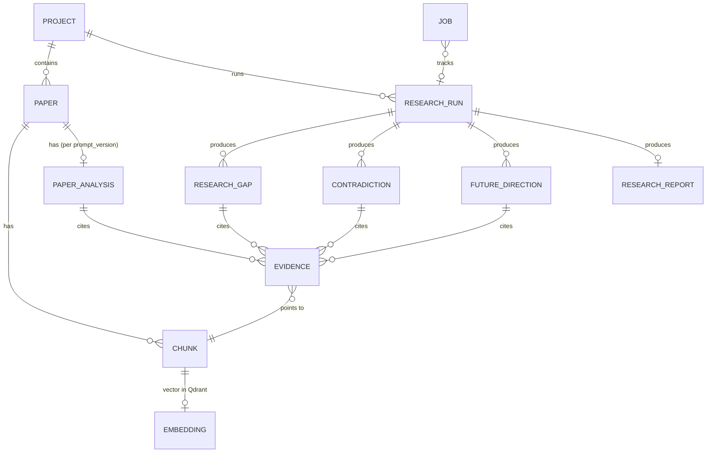

# 05 — Data Model

**This file is the single source of truth for schemas, enums and IDs.** API (06), prompts (07) and code (`backend/app/schemas/`) must match it. Pydantic v2 models mirror these shapes; JSON uses `snake_case`; timestamps are ISO-8601 UTC strings.

## 1. Conventions

| Item | Rule |
|---|---|
| IDs | Prefixed, URL-safe: `prj_<8hex>`, `pap_<8hex>`, `chk_<paper_id>_<index:04d>`, `ana_<8hex>`, `evd_<8hex>`, `gap_<8hex>`, `ctr_<8hex>`, `fut_<8hex>`, `rep_<8hex>`, `job_<8hex>`, `run_<8hex>` |
| Page numbers | **1-indexed**, as printed order of PDF pages (not printed page labels) |
| Missing text field | Exactly the string `"Not explicitly stated in the provided paper."` (constant `NOT_STATED`) |
| Scores | floats in [0,1], rounded to 2 decimals in API |
| Nullable | Use `null`, never empty string, except `NOT_STATED` for analysis fields |

## 2. Enums

```text
ChunkType      = ABSTRACT | INTRODUCTION | RELATED_WORK | METHODOLOGY | DATASET | RESULTS
               | DISCUSSION | LIMITATION | CONCLUSION | FUTURE_WORK | REFERENCES | OTHER
                 (REFERENCES is stored but never embedded/retrieved)
PaperStatus    = UPLOADED | PARSING | CHUNKING | EMBEDDING | INDEXED | ANALYZING | ANALYZED | FAILED
JobStatus      = QUEUED | RUNNING | SUCCEEDED | FAILED | CANCELLED
JobType        = INGEST_PAPER | ANALYZE_PAPER | RESEARCH_ANALYSIS | GENERATE_REPORT
GapCategory    = METHODOLOGICAL | DATASET | EVALUATION | APPLICATION | THEORETICAL | TEMPORAL
               | CONTRADICTION | REPRODUCIBILITY | GENERALIZATION | INTERDISCIPLINARY
GapType        = EXPLICIT | SYNTHESIZED
EvidenceStrength = STRONG | MODERATE | WEAK | INSUFFICIENT   (INSUFFICIENT is never returned)
ConfidenceLabel  = high | medium | low
Entailment     = SUPPORTS | PARTIAL | NOT_SUPPORTED | NOT_CHECKED
AnalysisDepth  = quick | standard | deep
Polarity       = POSITIVE | NEGATIVE | NEUTRAL | MIXED
ReasonType     = DIFFERENT_DATASET | DIFFERENT_METRIC | DIFFERENT_SETUP | DIFFERENT_SAMPLE_SIZE
               | DIFFERENT_PREPROCESSING | DIFFERENT_BASELINE | DIFFERENT_DOMAIN | DIFFERENT_DEFINITION | UNKNOWN
FutureClass    = REPEATED | UNIQUE
LimitationType = SMALL_DATASET | SINGLE_DOMAIN | COMPUTE_COST | BASELINE_COVERAGE | GENERALIZATION
               | INTERPRETABILITY | REPRODUCIBILITY | DATA_QUALITY | METRIC_VALIDITY | OTHER
```

## 3. Entity-relationship overview



`RESEARCH_RUN` = one execution of the orchestration pipeline (`run_id`); it scopes gaps/contradictions/directions so reruns don't overwrite history.

## 4. Relational schema (SQLite via SQLAlchemy; Postgres-compatible)

| Table | Columns (type) | Notes |
|---|---|---|
| `projects` | `project_id` PK, `name`, `description`, `created_at`, `updated_at` | |
| `papers` | `paper_id` PK, `project_id` FK idx, `title`, `authors` JSON, `year` int?, `venue`, `doi` idx?, `abstract`, `source_filename`, `sha256` idx, `size_bytes`, `page_count`, `status`, `error_code`, `error_message`, `metadata_confidence` float, `section_detection_quality` (high/low), `domain`, `created_at`, `updated_at` | UNIQUE(`project_id`,`sha256`) |
| `chunks` | `chunk_id` PK, `paper_id` FK idx, `project_id` idx, `chunk_index`, `section_heading`, `chunk_type`, `page`, `page_end`, `text`, `token_count`, `is_table`, `has_future_cue`, `has_limitation_cue`, `embedding_model`, `created_at` | embedding vector lives in Qdrant, not here |
| `paper_analyses` | `analysis_id` PK, `paper_id` FK idx, `prompt_version`, `llm_model`, `payload` JSON (PaperAnalysis), `status`, `llm_calls`, `tokens_in`, `tokens_out`, `created_at` | UNIQUE(`paper_id`,`prompt_version`,`llm_model`) = cache key |
| `evidence` | `evidence_id` PK, `owner_type` (ANALYSIS/GAP/CONTRADICTION/FUTURE/REPORT/ANSWER), `owner_id` idx, `paper_id`, `chunk_id`, `page`, `section`, `chunk_type`, `quote`, `relevance_score`, `verified` bool, `quote_fuzzy` bool, `entailment`, `role` | |
| `research_runs` | `run_id` PK, `project_id` idx, `query`, `paper_ids` JSON, `analysis_depth`, `status`, `result` JSON (cached full response), `paper_set_hash`, `prompt_versions` JSON, `stats` JSON, `warnings` JSON, `created_at`, `finished_at` | |
| `research_gaps` | `gap_id` PK, `run_id` FK idx, `project_id` idx, `payload` JSON (ResearchGap), `category`, `gap_type`, `confidence`, `evidence_strength`, `created_at` | denormalized columns for filtering/sorting |
| `contradictions` | `contradiction_id` PK, `run_id`, `project_id`, `payload` JSON, `created_at` | |
| `future_directions` | `direction_id` PK, `run_id`, `project_id`, `payload` JSON, `frequency`, `created_at` | |
| `research_reports` | `report_id` PK, `run_id`, `project_id`, `title`, `payload` JSON, `markdown` TEXT, `created_at` | |
| `jobs` | `job_id` PK, `job_type`, `status`, `stage`, `progress` float, `project_id`, `paper_id`?, `run_id`?, `error_code`, `error_message`, `created_at`, `started_at`, `finished_at` | |
| `embedding_cache` | `key` PK (sha256), `model`, `vector` BLOB | optional (P2) |
| `llm_cache` | `key` PK (sha256 of provider+model+prompt_version+input), `response` JSON, `created_at` | optional (P2) |

Large structured outputs are stored as JSON payloads (validated by Pydantic on read/write); promoted columns exist only for filtering/sorting. Deleting a paper cascades: chunks, analyses, evidence owned by those, Qdrant points (`delete_by_paper`), BM25 cache invalidation.

## 5. Core entity schemas

### 5.1 Project
```json
{
  "project_id": "prj_3a9f01bc",
  "name": "Transformers for Medical Imaging",
  "description": "Literature review for thesis chapter 2",
  "paper_count": 6,
  "indexed_paper_count": 6,
  "analyzed_paper_count": 5,
  "created_at": "2026-10-01T09:30:00Z",
  "updated_at": "2026-10-01T10:02:11Z"
}
```

### 5.2 Paper
```json
{
  "paper_id": "pap_91ac27de",
  "project_id": "prj_3a9f01bc",
  "title": "Attention-Based Segmentation of Chest X-rays",
  "authors": ["A. Rao", "L. Chen"],
  "year": 2023,
  "venue": "MICCAI",
  "doi": "10.1000/xyz123",
  "abstract": "…",
  "domain": "Medical image analysis",
  "status": "ANALYZED",
  "error": null,
  "source": {"filename": "rao2023.pdf", "sha256": "…", "size_bytes": 1843321, "page_count": 12},
  "metadata_confidence": 0.86,
  "section_detection_quality": "high",
  "created_at": "2026-10-01T09:31:00Z",
  "updated_at": "2026-10-01T09:36:20Z"
}
```
`error` when `FAILED`: `{"code":"SCANNED_PDF_NO_TEXT","message":"…"}`.

### 5.3 Chunk
```json
{
  "chunk_id": "chk_pap_91ac27de_0014",
  "paper_id": "pap_91ac27de",
  "project_id": "prj_3a9f01bc",
  "title": "Attention-Based Segmentation of Chest X-rays",
  "authors": ["A. Rao", "L. Chen"],
  "year": 2023,
  "section_heading": "5.2 Limitations",
  "chunk_type": "LIMITATION",
  "page": 9,
  "page_end": 9,
  "chunk_index": 14,
  "text": "Our evaluation is restricted to a single hospital dataset …",
  "token_count": 212,
  "is_table": false,
  "has_future_cue": false,
  "has_limitation_cue": true
}
```
The brief's minimal chunk shape `{chunk_id, paper_id, title, authors, year, section, page, chunk_type, text}` is a subset: `section` ≙ `section_heading`.

### 5.4 Qdrant vector payload (per chunk)
```json
{
  "chunk_id": "chk_pap_91ac27de_0014",
  "paper_id": "pap_91ac27de",
  "project_id": "prj_3a9f01bc",
  "title": "…", "authors": ["…"], "year": 2023, "venue": "MICCAI", "doi": "10.1000/xyz123",
  "section_heading": "5.2 Limitations",
  "chunk_type": "LIMITATION",
  "page": 9, "page_end": 9, "chunk_index": 14,
  "is_table": false, "has_future_cue": false, "has_limitation_cue": true,
  "text": "…", "token_count": 212,
  "embedding_model": "BAAI/bge-m3",
  "source_filename": "rao2023.pdf"
}
```
Vector: `float32[EMBEDDING_DIM]` (1024 for bge-m3), cosine. Point id = `uuid5(NS_RGF, chunk_id)`. Payload indexes: `project_id` (keyword), `paper_id` (keyword), `chunk_type` (keyword), `year` (integer).

### 5.5 Evidence
```json
{
  "evidence_id": "evd_5c0e91aa",
  "paper_id": "pap_91ac27de",
  "paper_title": "Attention-Based Segmentation of Chest X-rays",
  "chunk_id": "chk_pap_91ac27de_0014",
  "page": 9,
  "section": "LIMITATION",
  "section_heading": "5.2 Limitations",
  "quote": "Our evaluation is restricted to a single hospital dataset",
  "text": "full chunk text (optional, included when include_text=true)",
  "relevance_score": 0.81,
  "verified": true,
  "verification": {"chunk_exists": true, "page_valid": true, "quote_found": true, "quote_fuzzy": false, "entailment": "SUPPORTS"},
  "role": "SUPPORTS_GAP"
}
```
`role` ∈ `SUPPORTS_GAP | CONTEXT | CLAIM_A | CLAIM_B | STATEMENT`. `quote` is a **verbatim** substring of the chunk (≤ 60 words). Only `verified=true` evidence is ever returned to clients.

### 5.6 Source (response-level citation)
```json
{
  "source_id": 1,
  "paper_id": "pap_91ac27de",
  "paper_title": "Attention-Based Segmentation of Chest X-rays",
  "authors": ["A. Rao", "L. Chen"],
  "year": 2023,
  "page": 9,
  "section": "LIMITATION",
  "section_heading": "5.2 Limitations",
  "chunk_id": "chk_pap_91ac27de_0014",
  "text": "…chunk text…",
  "score": 0.81
}
```
`source_id` is an integer local to a response; text citations appear as `[1]`. Every `[n]` must resolve in `sources[]`.

### 5.7 PaperAnalysis
Each content field is a list of **Statements** (or a single Statement for scalar fields). A Statement is verified evidence-backed text or the NOT_STATED sentinel.

```json
{
  "analysis_id": "ana_c1d2e3f4",
  "paper_id": "pap_91ac27de",
  "prompt_version": "paper_analysis@1.0.0",
  "llm_model": "<configured model id>",
  "research_problem":   {"text": "Segmenting chest X-rays under limited labels", "evidence_ids": ["evd_a1"], "stated": true},
  "research_objectives":[{"text": "…", "evidence_ids": ["evd_a2"], "stated": true}],
  "methodology":        {"text": "Vision-transformer encoder with CNN decoder", "evidence_ids": ["evd_a3"], "stated": true},
  "dataset":            {"text": "Not explicitly stated in the provided paper.", "evidence_ids": [], "stated": false},
  "experimental_setup": {"text": "…", "evidence_ids": ["evd_a4"], "stated": true},
  "contributions":      [{"text": "…", "evidence_ids": ["evd_a5"], "stated": true}],
  "key_findings":       [{"text": "Dice 0.91 vs 0.88 baseline", "evidence_ids": ["evd_a6"], "stated": true,
                           "polarity": "POSITIVE", "subject": "proposed ViT-UNet", "metric": "Dice", "dataset": "CXR-8"}],
  "limitations":        [{"text": "Single-hospital data", "evidence_ids": ["evd_a7"], "stated": true, "limitation_type": "SINGLE_DOMAIN"}],
  "future_work":        [{"text": "Evaluate on multi-center data", "evidence_ids": ["evd_a8"], "stated": true}],
  "unresolved_questions":[{"text": "…", "evidence_ids": ["evd_a9"], "stated": true}],
  "domain": "Medical image analysis",
  "evidence": [ /* Evidence[] referenced above, all verified */ ],
  "validation": {"statements_total": 12, "statements_removed": 1, "status": "VALIDATED"},
  "created_at": "2026-10-01T09:40:00Z"
}
```
Rules: list fields with nothing found = `[]`? **No** — return a single Statement with `NOT_STATED`, `stated:false`, `evidence_ids:[]`. Scalar fields likewise. `stated:false` statements are excluded from every count/aggregation.

### 5.8 Evidence matrix row
```json
{
  "paper_id": "pap_91ac27de", "paper_title": "…", "year": 2023,
  "method": {"text": "ViT-UNet", "normalized": "vit-unet", "evidence_ids": ["evd_a3"]},
  "dataset": {"text": "CXR-8", "normalized": "cxr-8", "evidence_ids": ["evd_a6"]},
  "research_problem": {"text": "…", "evidence_ids": ["evd_a1"]},
  "key_finding": {"text": "…", "evidence_ids": ["evd_a6"]},
  "limitation": {"text": "…", "evidence_ids": ["evd_a7"]},
  "future_work": {"text": "…", "evidence_ids": ["evd_a8"]}
}
```
Cells may be arrays for multi-valued fields in the stored form; the API returns the first/primary value plus `all_values[]`.

### 5.9 ResearchGap
```json
{
  "gap_id": "gap_7f3a1c20",
  "run_id": "run_55aa01bc",
  "title": "Cross-domain generalization is not evaluated",
  "category": "GENERALIZATION",
  "gap_type": "SYNTHESIZED",
  "description": "Among the 4 analyzed papers, 3 evaluate on a single domain and none report cross-domain results.",
  "evidence": [ /* Evidence[] */ ],
  "affected_papers": ["pap_91ac27de", "pap_a2b3c4d5", "pap_ff00aa11"],
  "supporting_claims": [
    {"claim": "Paper A evaluates only on CXR-8", "evidence_ids": ["evd_5c0e91aa"]}
  ],
  "why_gap_exists": "System inference: evaluation sections of A, B, C use one dataset domain; targeted retrieval over the 4 papers found no cross-domain experiment.",
  "potential_research_direction": "Evaluate the methods on datasets from a different imaging domain with a shared protocol.",
  "suggested_research_questions": ["How do ViT-based segmenters degrade across hospitals?"],
  "methodology_suggestion": "Cross-site hold-out evaluation with domain-shift metrics.",
  "generated_suggestion": true,
  "confidence": 0.68,
  "confidence_label": "medium",
  "evidence_strength": "MODERATE",
  "scope": {"n_papers": 4, "papers_checked": ["pap_…"], "basis": "analysis fields + retrieval check"},
  "validation": {"status": "VALIDATED", "removed_evidence_count": 1, "issues": []},
  "created_at": "2026-10-01T10:05:00Z"
}
```
`suggested_research_questions`, `methodology_suggestion` are system suggestions (`generated_suggestion=true`), displayed by the frontend's gap detail page but not evidence-backed. **VERIFY** the frontend's gap type (`src/types`) for exact field naming (e.g. confidence scale 0–1 vs 0–100) and add a mapper if needed.

### 5.10 Contradiction
```json
{
  "contradiction_id": "ctr_90ab12cd",
  "label": "POTENTIAL_CONTRADICTION",
  "topic": "Effect of Method X on accuracy",
  "claim_a": {"text": "Method X improves accuracy", "paper_id": "pap_A", "page": 7, "polarity": "POSITIVE",
              "metric": "accuracy", "dataset": "Dataset X", "evidence": [ /* Evidence[] */ ]},
  "claim_b": {"text": "Method X provides no significant improvement", "paper_id": "pap_B", "page": 8, "polarity": "NEGATIVE",
              "metric": "accuracy", "dataset": "Dataset Y", "evidence": [ /* Evidence[] */ ]},
  "comparable": true,
  "conditions_a": {"dataset": "Dataset X", "sample_size": "n=12,000", "setup": "…", "baseline": "…", "preprocessing": "…"},
  "conditions_b": {"dataset": "Dataset Y", "sample_size": "n=800", "setup": "…", "baseline": "…", "preprocessing": "…"},
  "possible_reasons": [
    {"reason_type": "DIFFERENT_DATASET", "explanation": "…", "basis": "STATED_IN_PAPERS"},
    {"reason_type": "DIFFERENT_SAMPLE_SIZE", "explanation": "…", "basis": "HYPOTHESIS"}
  ],
  "verdict": null,
  "confidence": 0.62,
  "confidence_label": "medium",
  "evidence_strength": "MODERATE",
  "validation": {"status": "VALIDATED", "issues": []}
}
```
`verdict` is always `null` in MVP — the system never declares which paper is correct. `basis` ∈ `STATED_IN_PAPERS | HYPOTHESIS`.

### 5.11 FutureDirection
```json
{
  "direction_id": "fut_44b1c0de",
  "title": "Evaluation on larger and multi-center datasets",
  "description": "Neutral one-line summary of clustered statements.",
  "classification": "REPEATED",
  "frequency": 3,
  "paper_ids": ["pap_A", "pap_B", "pap_C"],
  "statements": [{"paper_id":"pap_A","text":"Evaluate on larger datasets.","evidence_id":"evd_f1"}],
  "underexplored": false,
  "underexplored_basis": null,
  "evidence": [ /* Evidence[] */ ]
}
```

### 5.12 Limitation cluster (for landscape)
```json
{"limitation_type":"SINGLE_DOMAIN","title":"Single-domain evaluation","frequency":3,"paper_ids":["pap_A","pap_B","pap_C"],"evidence":[/* Evidence[] */],"rank":1}
```

### 5.13 Theme
```json
{"theme_id":"thm_01","name":"Transformer-based segmentation","description":"…","paper_ids":["pap_A","pap_B"],"evidence":[/* Evidence[] */]}
```
Themes must have evidence from ≥ 1 paper; themes spanning ≥ 2 papers are ranked first.

### 5.14 ResearchReport
```json
{
  "report_id": "rep_12ab34cd",
  "run_id": "run_55aa01bc",
  "project_id": "prj_3a9f01bc",
  "title": "Research Gap Report — Transformers for Medical Imaging",
  "query": "What gaps exist in transformer-based chest X-ray segmentation?",
  "created_at": "2026-10-01T10:10:00Z",
  "sections": [
    {"heading": "Executive summary", "markdown": "…[1][3]…", "source_ids": [1,3]},
    {"heading": "Methodologies", "markdown": "…", "source_ids": [2]},
    {"heading": "Limitations", "markdown": "…", "source_ids": []},
    {"heading": "Contradictions", "markdown": "…", "source_ids": []},
    {"heading": "Research gaps", "markdown": "…", "source_ids": []},
    {"heading": "Future directions", "markdown": "…", "source_ids": []},
    {"heading": "Method note & limitations of this analysis", "markdown": "…", "source_ids": []}
  ],
  "markdown": "# …full report…\n\n## Sources\n[1] …",
  "sources": [ /* Source[] */ ],
  "validation_summary": {"claims_total": 40, "claims_removed": 3, "citations_total": 52, "citations_invalid_removed": 0},
  "stats": {"llm_calls": 14, "tokens_in": 52000, "tokens_out": 9000, "latency_ms": 74000}
}
```
Report text is generated **from validated objects** (gaps, contradictions, directions, analyses) — never from raw chunks — so every sentence inherits verified evidence. The final report prompt may only reference `source_id`s from the provided list.

### 5.15 Job
```json
{
  "job_id": "job_8f2e11aa",
  "job_type": "RESEARCH_ANALYSIS",
  "status": "RUNNING",
  "stage": "CONTRADICTION_DETECTION",
  "progress": 0.62,
  "project_id": "prj_3a9f01bc",
  "paper_id": null,
  "run_id": "run_55aa01bc",
  "error": null,
  "result": null,
  "created_at": "…", "started_at": "…", "finished_at": null
}
```
Ingest stages: `PARSING, METADATA, SECTIONING, CHUNKING, EMBEDDING, INDEXING, DONE`. Analysis stages: `PAPER_ANALYSIS, SYNTHESIS, THEMES, LIMITATIONS_FUTURE, CONTRADICTION_DETECTION, GAP_DETECTION, VALIDATION, REPORT, DONE`. `result` is populated only for `SUCCEEDED` jobs of type `RESEARCH_ANALYSIS`/`GENERATE_REPORT` (see 06).

### 5.16 Error
```json
{"error": {"code": "SCANNED_PDF_NO_TEXT", "message": "This PDF contains no extractable text (it may be scanned). OCR is not supported.", "details": {"paper_id": "pap_91ac27de"}, "request_id": "req_a1b2c3"}}
```

## 6. Orchestration response (`ResearchAnalysisResult`)

This is the brief's response shape, extended (additive keys only):

```json
{
  "run_id": "run_55aa01bc",
  "query": "…",
  "project_id": "prj_3a9f01bc",
  "analysis_depth": "standard",
  "papers_analyzed": 5,
  "papers_failed": [],
  "insufficient_evidence": false,
  "insufficient_evidence_message": null,
  "themes": [ /* Theme[] */ ],
  "methodologies": [ {"name":"CNN","frequency":3,"paper_ids":[…],"evidence":[…]} ],
  "datasets": [ {"name":"CXR-8","frequency":2,"paper_ids":[…],"evidence":[…]} ],
  "evidence_matrix": [ /* matrix rows */ ],
  "limitations": [ /* Limitation cluster[] */ ],
  "contradictions": [ /* Contradiction[] */ ],
  "research_gaps": [ /* ResearchGap[] */ ],
  "future_directions": [ /* FutureDirection[] */ ],
  "sources": [ /* Source[] — union of all cited chunks, numbered */ ],
  "report_id": "rep_12ab34cd",
  "warnings": [],
  "stats": {"llm_calls": 14, "tokens_in": 52000, "tokens_out": 9000, "latency_ms": 74000, "cache_hits": 5}
}
```
Every `evidence[]` entry in this payload carries `source_id` (maps into `sources[]`) so the UI can render `[n]` badges.

## 7. Validation constraints (Pydantic)

- `quote`: 5–60 words; must be present in chunk text (validator, not schema).
- `confidence ∈ [0,1]`; `confidence_label` derived, never client-supplied.
- `gap.evidence` non-empty; `gap.affected_papers` ⊆ papers in `scope.papers_checked`.
- `gap_type=SYNTHESIZED` ⇒ `len(set(evidence.paper_id)) ≥ 2` **or** `scope.n_papers ≥ 3` with absence basis.
- `gap_type=EXPLICIT` ⇒ ≥ 1 evidence with `role=SUPPORTS_GAP` whose `section` ∈ {LIMITATION, FUTURE_WORK, DISCUSSION, CONCLUSION, RESULTS, INTRODUCTION}.
- All lists capped (e.g., `gaps ≤ 15`, `evidence per gap ≤ 8`).
- Unknown extra fields from the LLM are rejected (`extra="forbid"`) after one repair attempt.
