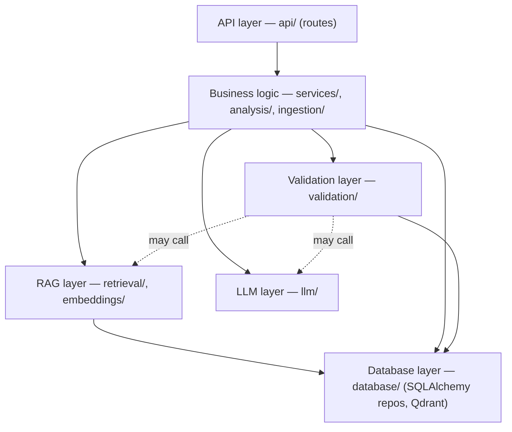

# 08 — Development Guidelines

Engineering standards for the backend (`backend/`) and the thin frontend integration layer. Architecture is defined in `02`/`03`; this file defines *how code is written*. If a rule here conflicts with `CLAUDE.md`, `CLAUDE.md` wins (priority list in `CLAUDE.md` §4).

## 1. Project structure

Authoritative layout: `02 §1.2`. Rules:

- Backend code lives **only** under `backend/`. Frontend files (`src/`, `package.json`, `vite.config.*`, `tailwind.config.js`, …) are never moved or restructured.
- One module = one responsibility. File names follow `02 §1.2`; do not invent parallel structures (`utils.py` dumping grounds are not allowed — name modules by purpose: `core/ids.py`, `core/text_normalize.py`).
- Prompts live only in `llm/prompts.py` and mirror `07`. Schemas live only in `schemas/` and mirror `05`.
- Test layout mirrors source: `tests/unit/<package>/test_<module>.py`, `tests/e2e/`, `tests/fixtures/pdfs/`, `tests/fixtures/llm/`.

## 2. Layering (hard rules)

| Layer | Packages | Responsibilities | May import | **Must not** |
|---|---|---|---|---|
| API | `api/`, `main.py` | Parse/validate HTTP, auth/rate-limit dependencies, call **one** service function, map result → response schema, raise/handle `AppError` | `services`, `schemas`, `core` | Contain business rules, call `retrieval/`, `llm/`, `database/` directly, build prompts, loop over papers/chunks |
| Business logic | `services/`, `analysis/`, `ingestion/` | Pipelines, orchestration, job stages, gap/contradiction/future-work logic | `retrieval`, `llm`, `validation`, `database` (repos only), `schemas`, `core` | Import FastAPI/Starlette; touch `Request`/`Response`; talk to Qdrant client directly |
| RAG | `retrieval/`, `embeddings/` | Dense/BM25/RRF/prior/rerank/selection; embedding and reranker model wrappers | `database` (via `VectorStore`/repos protocols), `schemas`, `core` | Call an LLM for answering (query rewrite excepted via injected `LLMClient`); know about HTTP |
| LLM | `llm/` | Provider adapters, `complete_json`, retries, JSON repair, token accounting, versioned prompts | `schemas`, `core` | Contain pipeline logic; read the DB; know about papers/gaps beyond prompt variables |
| Database | `database/` | SQLAlchemy models/repos, `VectorStore` implementation (`qdrant.py`), session mgmt | `schemas`, `core` | Contain business rules, scoring, prompts |
| Validation | `validation/` | Quote/page/chunk verification, entailment orchestration, citation validation, confidence scoring | `database` (repos), `llm`, `retrieval` (absence checks), `schemas`, `core` | Generate new claims; modify evidence text; trust LLM-provided scores |

Enforcement: add `import-linter` (or a simple pytest that scans imports) with contracts: `api` must not import `database|retrieval|llm|embeddings|analysis|ingestion|validation`; `retrieval` must not import `analysis|api`; `llm` must not import anything but `schemas|core`; `services|analysis` must not import `fastapi`. The pytest import-contract test is part of the P0 test set.

**Routes are thin.** Target ≤ 25 lines per route body: validate → `service.fn(...)` → return. Aliased routes (`/api/papers/upload` vs `/api/projects/{id}/papers/upload`) call the same service function.

## 3. Python standards

- Python **3.11+**, full type hints on all public functions; `from __future__ import annotations` not required.
- Formatter/linter: **ruff** (`ruff format`, `ruff check`, line length 100). Type check: **mypy** (or pyright) on `backend/app` with `disallow_untyped_defs = true` for new modules; start `warn_unused_ignores`.
- Pydantic **v2** for all I/O (§5). Dataclasses/TypedDict only for internal hot-path value objects.
- No wildcard imports; no mutable default args; no global mutable state except model singletons loaded in `lifespan` and accessed via DI (`api/deps.py`).
- Pure functions for scoring/normalization/RRF/chunking so they are trivially unit-testable (`validation/scoring.py` takes plain numbers → returns plain numbers).
- Magic numbers → config (§9) or named module constants with a comment pointing to the doc section (e.g. `# 04 §8`).
- Constants: `NOT_STATED = "Not explicitly stated in the provided paper."` and `INSUFFICIENT_EVIDENCE_MESSAGE` defined once in `core/constants.py`; never retyped.
- Text handling: all quote comparison goes through `core/text_normalize.py` (NFKC, ligature fold, whitespace collapse, case-insensitive, dehyphenation tolerant) — one implementation used by validator and tests.
- Docstrings: public functions state inputs, outputs, raised `AppError` codes, and the doc section they implement.

## 4. TypeScript standards (frontend integration only)

The frontend already exists; these rules apply to what the agent **adds or touches** (see the allowlist in `14 §2`).
- `strict` stays on (`tsconfig.app.json`). **No `any` in new code** (existing `useSearch.ts` uses `any`; replace only the part you touch).
- Backend wire types live in a **new** file `src/types/backend.ts` (snake_case, mirror of `05`/`06`); existing UI types in `src/types/*.ts` are changed only by **adding optional fields / widening unions** (`14 §6`).
- All HTTP in `src/services/realApi.ts` (Axios) + pure mapper functions in a **new** `src/services/mappers.ts`. Components never call Axios and never see snake_case.
- Mapper functions are pure, total (never throw on missing optional fields), and unit-testable. Convert scores 0–1 → 0–100 only in mappers.
- Use existing patterns: React Query hooks in `src/hooks/`, `LoadingState`/`ErrorState`/`EmptyState`, `useToast`. No new UI library. Linting: `npm run lint` (oxlint) and `npx tsc -b` must pass.
- `mockApi` keeps working: every method added to `realApi` gets a matching `mockApi` method with the **same signature** so `VITE_USE_MOCK=true` still runs the whole app.

## 5. Pydantic schemas

- One module per entity in `schemas/` mirroring `05` names exactly (`ResearchGap`, `Evidence`, `Source`, …). Enums = `str, Enum` with UPPERCASE values per `05 §2`.
- Response models set `model_config = ConfigDict(extra="forbid")`. **LLM-output models** also `extra="forbid"` (rejects invented keys; 07 §4.4) with a `field_validator(mode="before")` that upper-cases enum strings.
- Validators encode `05 §7` constraints (quote length, `gap_type` ⇒ evidence rules, caps). Verbatim-quote and page checks are **not** schema validators (they need DB) — they live in `validation/`.
- Separate **DB models** (`database/models.py`) from **API/LLM schemas** (`schemas/`). Convert explicitly; never return ORM objects.
- `ids.py` generates prefixed ids (`new_id("gap")` → `gap_<8hex>`); chunk ids are deterministic (`chk_<paper_id>_<index:04d>`).
- Scores rounded to 2 decimals at the serialization boundary only.

## 6. API conventions

Per `06`. Summary the agent must follow: base `/api`; `snake_case`; list envelope `{items,total,limit,offset}`; errors `{error:{code,message,details,request_id}}`; `202 + job_id` for long work; `X-Request-ID` middleware; no stack traces; `Location` header on 202; idempotent de-dup of analysis jobs; every route has `response_model`, `status_code`, and `responses={…}` documenting error codes (the OpenAPI doc at `/docs` must match `06`). Any endpoint change updates `06` in the same PR.

## 7. Error handling

- One exception root: `core/errors.py::AppError(code: str, http_status: int, message: str, details: dict | None = None, retryable: bool = False)`. Subclasses per family (`NotFoundError`, `ConflictError`, `ValidationFailure`, `LLMError`, `VectorStoreError`, `IngestError`). Codes are the catalog in `06 §1.4` — **add a code to `06` before using it.**
- Services raise `AppError`; `api/errors.py` registers handlers: `AppError` → envelope; `RequestValidationError` → `422 VALIDATION_ERROR` with `details.fields`; any other exception → log full traceback with `request_id`, return `500 INTERNAL_ERROR` with a generic message.
- Jobs: catch per stage, persist `error{code,message}` on the job and paper, roll back partial artifacts (delete Qdrant points + chunk rows by `paper_id`), never leave a paper in a non-terminal status after a crash (startup sweep → `FAILED(INTERRUPTED)`).
- Never `except Exception: pass`. Catch narrowly; when degrading gracefully (e.g. rerank unavailable, table parse failure) log `WARNING` with a stable event name and add to `warnings[]`.
- Never put prompt text, source text, filesystem paths, SQL, or secrets in an error message or `details`.

## 8. Logging

- stdlib `logging` with a JSON formatter (`LOG_FORMAT=json` in production, console in dev) — no extra dependency. `contextvars` carry `request_id`, `job_id`, `run_id`, `project_id`, `paper_id`; a logging filter injects them in every record.
- **Log every pipeline stage** with `event`, `stage`, `duration_ms`, counts. Required events: `ingest.stage.{start,done,fail}`, `retrieval.done` (dense_n, bm25_n, fused_n, rerank_n, gate, timings), `llm.call` (07 §4.1 fields), `validation.summary` (kept/removed/downgraded counts, `fabricated_chunk_id_count`), `analysis.stage.*`, `job.{queued,running,succeeded,failed}`.
- Levels: `INFO` stage summaries; `WARNING` degradations; `ERROR` failures; `DEBUG` only for dev (may include truncated text — never enabled in production).
- Never log API keys, full prompts, or source text at `INFO+`. Redact `Authorization`/`X-API-Key`.

## 9. Configuration & environment variables

`app/config.py` uses `pydantic-settings` (`.env` + process env). Settings object is created once at startup; **startup validation fails fast with a readable message** (listing every problem) and the process exits non-zero.

### 9.1 Variable catalog (single source for `.env.example` in `15 §4`)

| Group | Variable | Default | Notes |
|---|---|---|---|
| App | `ENVIRONMENT` | `development` | `development\|test\|production` |
| | `LOG_LEVEL` / `LOG_FORMAT` | `INFO` / `console` | `json` in production |
| | `DATA_DIR` | `./data` | SQLite, uploads, local Qdrant |
| | `DATABASE_URL` | `sqlite:///./data/rgf.db` | Postgres-ready |
| | `CORS_ORIGINS` | `http://localhost:5173` | comma-separated exact origins; never `*` in production |
| | `CORS_ORIGIN_REGEX` | *(empty)* | optional, e.g. Vercel previews |
| | `FRONTEND_URL` / `BACKEND_URL` | *(empty)* | `FRONTEND_URL` is appended to `CORS_ORIGINS`; `BACKEND_URL` used for absolute links in logs/docs only |
| | `API_KEY` | *(empty)* | optional demo-grade `X-API-Key` (06 §1) |
| | `ALLOW_DEBUG_RESPONSES` | `false` | search `debug=true` in production |
| Limits | `MAX_UPLOAD_MB` / `MAX_PDF_PAGES` / `MAX_PAPERS_PER_PROJECT` / `MIN_CHARS_PER_PAGE` | `25` / `80` / `30` / `200` | |
| | `RATE_LIMIT_ENABLED` | `true` | |
| | `RATE_LIMIT_DEFAULT` / `_UPLOAD` / `_SEARCH` / `_ANALYZE` | `120/minute` / `10/minute` / `20/minute` / `5/minute` | per client IP |
| Jobs | `ANALYSIS_MAX_CONCURRENCY` | `2` | thread pool size (CPU work) |
| | `AUTO_ANALYZE_ON_INGEST` | `true` | chain `ANALYZE_PAPER` after indexing |
| LLM | `LLM_PROVIDER` | `openai_compatible` | `openai_compatible\|anthropic\|fake` |
| | `LLM_API_KEY` / `LLM_MODEL` / `LLM_BASE_URL` | *(required except `fake`)* | no default model: choose deliberately |
| | `LLM_TIMEOUT_S` / `LLM_MAX_RETRIES` / `LLM_MAX_CONCURRENCY` | `60` / `2` / `4` | |
| Embedding | `EMBEDDING_MODEL` / `EMBEDDING_DIM` | `BAAI/bge-m3` / `1024` | change ⇒ re-create collection |
| | `EMBEDDING_BATCH_SIZE` / `EMBEDDING_DEVICE` / `EMBEDDING_LAZY_LOAD` / `EMBEDDING_MAX_TOKENS` | `16` / `auto` / `false` / `1024` | |
| | `HF_HOME` | `./data/hf` | model cache |
| Reranker | `RERANKER_MODEL` / `RERANKER_ENABLED` | `BAAI/bge-reranker-v2-m3` / `true` | |
| | `RERANK_BATCH_SIZE` / `RERANK_MAX_LENGTH` | `16` / `512` | |
| | `RERANK_CANDIDATES` / `RERANK_TOP_K` | `50` / `10` | |
| | `RERANK_MIN_SCORE` | `0.20` | calibrate (09 §4.3) |
| | `RERANK_WEIGHT` / `PRIOR_WEIGHT` | `0.85` / `0.15` | must sum to 1 |
| Retrieval | `RETRIEVAL_DENSE_TOP_K` / `RETRIEVAL_BM25_TOP_K` / `RRF_K` | `40` / `40` / `60` | |
| | `SECTION_BOOST_ENABLED` / `QUERY_REWRITE_MODE` / `BM25_CACHE_PROJECTS` | `true` / `rules` / `8` | `off\|rules\|llm` |
| | `MIN_EVIDENCE_CHUNKS` / `MAX_CHUNKS_PER_PAPER` | `2` / `3` | |
| | `CONTEXT_MAX_TOKENS` / `PAPER_CONTEXT_MAX_TOKENS` | `6000` / `8000` | |
| Chunking | `CHUNK_TARGET_TOKENS` / `CHUNK_MAX_TOKENS` / `CHUNK_MIN_TOKENS` / `CHUNK_OVERLAP_SENTENCES` | `350` / `600` / `60` / `2` | `min < target < max` |
| Qdrant | `QDRANT_URL` / `QDRANT_API_KEY` | *(empty)* | server/cloud mode |
| | `QDRANT_LOCAL_PATH` | *(empty)* | embedded dev mode; **exactly one** of URL/LOCAL_PATH |
| | `QDRANT_COLLECTION` / `QDRANT_UPSERT_BATCH` | `rgf_chunks` / `128` | |
| Analysis | `CONTRADICTION_MAX_PAIRS` / `FUTURE_CLUSTER_DISTANCE` | `8` / `0.25` | |
| | `GAP_MAX_PER_CATEGORY` / `GAP_MAX_TOTAL` | `3` / `15` | |
| | `GAP_W_PAPERS` `GAP_W_ENTAIL` `GAP_W_VERIFIED` `GAP_W_RETRIEVAL` `GAP_W_TYPE` | `0.35 0.25 0.10 0.15 0.15` | must sum to 1 (04 §8) |
| | `GAP_CAP_EXPLICIT` `GAP_CAP_EXPLICIT_SINGLE` `GAP_CAP_SYNTH_PRESENCE` `GAP_CAP_SYNTH_ABSENCE` | `0.90 0.60 0.85 0.65` | 04 §5, §8 |
| | `GAP_TYPE_FACTOR_SYNTH_PRESENCE` / `_SYNTH_ABSENCE` | `0.6` / `0.4` | explicit = 1.0 |
| | `ABSENCE_REFUTE_MIN_SCORE` | `0.5` | 04 §7.3 |

### 9.2 Startup validation rules
Exactly one of `QDRANT_URL`/`QDRANT_LOCAL_PATH`; `LLM_API_KEY`+`LLM_MODEL` present unless `LLM_PROVIDER=fake`; `RERANK_WEIGHT+PRIOR_WEIGHT=1`; `GAP_W_*` sum to 1; `CHUNK_MIN<TARGET<MAX`; `DATA_DIR` writable; in `production`: `CORS_ORIGINS` has no `*`, `LOG_FORMAT=json` recommended (warn), `API_KEY` unset ⇒ warn; Qdrant collection `embedding_model`/`dim` metadata must match settings (fail fast, 03 §5). Secrets are read from env only and masked (`SecretStr`) in logs and `/api/health/ready`.

## 10. Security rules

1. No secrets in code, tests, fixtures, docs, logs or Git history. `.env` is git-ignored; only `.env.example` (placeholders) is committed. Add `backend/.env`, `backend/data/` to `.gitignore`.
2. Uploads: content-type **and** magic bytes, streaming size cap, random server-side filename (`{paper_id}.pdf`), never trust `filename`; no path built from user input; PDF parsing in a worker thread with page/time limits; non-root container user (15).
3. Treat PDF text as **hostile input** (prompt injection): delimited as data (07 §3), no tool calling or URL fetching by the LLM, outputs validated.
4. All Qdrant/BM25/SQL queries are filtered by `project_id`; IDs from clients are validated against the project before use.
5. CORS allow-list (exact origins); no wildcard with credentials. Optional `API_KEY` is demo-grade only.
6. Rate-limit upload/search/analyze (cost control for LLM). Cap `top_k`, `paper_ids`, query length.
7. Errors never reveal internals. Dependencies pinned and scanned (`pip-audit`, `npm audit` in CI when available).
8. Delete = real delete (files, vectors, rows).

## 11. Async programming

- Routes are `async def` only if they `await` something; blocking work (PyMuPDF, embedding, rerank, sklearn clustering, SQLite) runs in a thread: `await run_in_threadpool(...)` or the job pool.
- Model inference is guarded by a `threading.Semaphore(1)` per model (BGE-M3, reranker) — no concurrent inference on the same in-process model.
- LLM calls use an async HTTP client (`httpx.AsyncClient`) bounded by `asyncio.Semaphore(LLM_MAX_CONCURRENCY)`; per-paper analyses run concurrently (`asyncio.gather`) under that semaphore.
- Background jobs get their **own DB session** (never reuse the request session) and update `jobs.stage/progress` at each stage boundary.
- No `asyncio.run` inside request handlers; no `time.sleep` in async code; every outbound call has a timeout.
- Cancellation (P2): check a `cancel_requested` flag between stages.

## 12. Dependency management

- `backend/requirements.txt` pinned (`==`) with a short comment per line group; `requirements-dev.txt` for test/lint tools. Python version pinned in `Dockerfile` and `pyproject`/`.python-version`.
- **Approved MVP dependencies** (anything else needs a justification in the PR and a line here): `fastapi`, `uvicorn[standard]`, `pydantic`, `pydantic-settings`, `python-multipart`, `sqlalchemy`, `PyMuPDF`, `sentence-transformers` (+ `torch` CPU wheel unless GPU), `FlagEmbedding` (only if needed for reranker), `qdrant-client`, `rank-bm25`, `numpy`, `scikit-learn` (agglomerative clustering), `httpx`, `slowapi` (rate limit), `python-json-logger` (optional; stdlib formatter acceptable), `tenacity` (optional; manual retry acceptable), `rapidfuzz` (fuzzy quote match), provider SDK **only** for the chosen provider (or plain `httpx`).
- Dev: `pytest`, `pytest-asyncio`, `pytest-cov`, `ruff`, `mypy`, `import-linter` (optional), `reportlab` or `fpdf2` (generate fixture PDFs).
- **Not allowed in MVP:** LangChain/LlamaIndex (hide retrieval/validation logic), Celery/Redis, Kafka, Neo4j, Kubernetes tooling, any second vector DB, any ORM other than SQLAlchemy, UI libraries on the frontend.
- Frontend: **no new npm dependencies** unless unavoidable and explained (existing: axios, react-query, react-router, recharts, framer-motion, lucide-react).

## 13. Testing

Required coverage per `CLAUDE.md` §10 and `09 §8`. Rules:
- `pytest -q` must pass before any task is marked done. Markers: `@pytest.mark.slow` (loads real BGE-M3/reranker), `@pytest.mark.integration` (needs Qdrant/LLM). Default CI/local run excludes `slow` and `integration`; run them before deployment.
- **No real LLM in unit tests.** Use `FakeProvider` with fixtures in `tests/fixtures/llm/*.json`; include adversarial fixtures (fabricated chunk_id, paraphrased "quote", absolutes, wrong enum case, truncated JSON).
- Embeddings: unit-test shape/dim/normalization with a stub embedder; one `slow` test with the real model.
- Golden fixtures (04 §16): 3–5 synthetic text PDFs with planted explicit limitations, a planted contradiction, a planted absence. Table-driven tests for `scoring.py` and `rrf`.
- E2E (≥ 3): upload→index→search; analyze→gaps; unrelated-query→insufficient evidence — with Qdrant in embedded mode (`QDRANT_LOCAL_PATH` in tmp dir) and `FakeProvider`.
- Bug fix ⇒ regression test first.
- Frontend: `npx tsc -b`, `npm run lint`, `npm run build` plus mapper unit tests if a test runner is added (Vitest is permitted **only** for mapper tests; flag it as a dependency addition).

## 14. Git practices & commit conventions

- Branches: `main` (always deployable), `feat/<scope>-<short>`, `fix/…`, `docs/…`, `chore/…`. Existing remote branch `hrithik` is the author's working branch — don't delete.
- **Conventional Commits:** `feat(retrieval): add RRF fusion`, `fix(chunker): keep page_end for split paragraphs`, `docs(api): add RUN_NOT_COMPLETE`, `test(gap): planted absence fixture`, `chore(deps): pin qdrant-client`. Scope = package name. Imperative mood, ≤ 72 chars subject; body explains *why* and references the doc section.
- Small, focused commits (one task or sub-task). Never mix frontend integration changes with backend feature commits.
- Never commit: `.env`, `data/`, model weights, `node_modules`, large PDFs (fixtures ≤ 200 KB, synthetic only — no copyrighted papers).
- Don't rewrite shared history; no force-push to `main`.

## 15. Code review checklist (self-review before commit; reviewer uses the same list)

- [ ] Matches the doc section it implements (cite it in the PR) and does not contradict `05` schemas / `06` contracts
- [ ] Layering respected (§2); route is thin
- [ ] Inputs validated; errors use cataloged `AppError` codes; no leaked internals
- [ ] Evidence rules intact: provenance (paper/page/section/chunk) preserved; no code path returns unverified evidence; confidence computed in code
- [ ] LLM output parsed through a schema; failure paths tested
- [ ] `project_id` filter present on every vector/BM25/SQL query
- [ ] Logging for the stage added; no sensitive data logged
- [ ] Tests added/updated and passing; `ruff`, `mypy`, `pytest -q` green
- [ ] No new dependency (or justified); no secrets
- [ ] Frontend: only allowlisted files touched; `tsc -b` + lint pass; mock mode still works
- [ ] Docs updated in the same change (§16)

## 16. Documentation requirements

- Update docs **in the same change** when: an endpoint/field/error code changes (`06`, and `05` if a schema changes), a prompt changes (`07` + bump version), a threshold/formula changes (`03`/`04` + `09` calibration note), architecture or a layer rule changes (`02`/`08`), plan scope changes (`10`/`12`), an env var is added (`§9.1` + `15 §4`).
- `docs/01–05` are reviewed baselines: amend them only to apply the **errata/addenda list** (`10` Appendix A) or when a change is explicitly approved; record each amendment as a dated line in the file's own "Changes" footer.
- Every public function docstring cites the doc section it implements. Keep `README.md` (existing, frontend-focused) accurate: add a short "Backend" section pointing to `docs/` and `CLAUDE.md` once the backend exists.

## 17. Definition of Done (per task)

1. Implementation matches the cited doc section. 2. Unit tests written and green (`pytest -q`). 3. The task's **verification** step in `10` passed (with evidence in the PR/log). 4. Lint/type checks green. 5. Docs updated. 6. Checkbox ticked in `10`. 7. No known failing test left behind.
