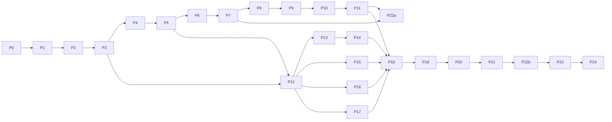

# 10 — Implementation Plan (2-Day MVP)

Exact, ordered plan for building the backend and integrating it with the existing React/Vite frontend. **This file is also the progress tracker** (there is no separate task-tracker file): tick a checkbox only when its **verification** step has passed (`11 §6`, `08 §17`).

Legend — **P0** must ship for the demo · **P1** ship if on schedule · **P2** stretch. Times are focused hours for an agent-assisted developer.

## 0. Reality check

- Two days is **aggressive**: ≈ 24–26 focused hours across 25 phases (0–24). It is achievable only by following the cut line (§3), writing tests as you go, and not gold-plating.
- Heavy-weight prerequisites (model downloads ≈ 2.3 GB each, Docker Qdrant, LLM key) are started **first** (Phase 0) and run in the background.
- Frontend integration is split: **22a** (projects/papers/upload/search) is done on Day 1 evening as soon as Phase 11 lands; **22b** (analysis/gaps/contradictions/report) on Day 2.
- The existing frontend is **not** to be redesigned; the allowlisted edits are in `14 §2`.

## 1. Verified starting facts (Phase 0 resolves every `VERIFY` in docs 02/05)

Verified by cloning `github.com/def-hrithik/AI_Research_Gap_Finder` (branch `main`, latest merge PR #4):

| Topic | Fact | Consequence |
|---|---|---|
| Stack | React **19.2** + Vite + TS (strict) + Tailwind 3 + React Router 7 + TanStack Query 5 + Axios + Recharts + framer-motion; **not Next.js** | Docs say "React/Vite SPA" |
| API layer | `src/services/api.ts` picks `mockApi`/`realApi` via `VITE_USE_MOCK` (`!== 'false'` ⇒ mock) | |
| `realApi.ts` | **7 read-only GET methods** only; `axios.create({ baseURL: '/api/v1' })` (relative, hard-coded); **no env var for the API base URL exists** | Add `VITE_API_BASE_URL`; change baseURL to `${VITE_API_BASE_URL}/api` (Errata E1) |
| Not yet behind the API | Create project (modal uses `setTimeout`), upload (simulated in `UploadPage`), search (`useSearch` returns hard-coded data), reports (`setTimeout`), landscape (hard-coded), auth (mock, `localStorage`) | Frontend work is larger than "realApi only" → allowlist `14 §2` |
| Types | camelCase, scores 0–100, gap `type` is a display string union, `ConfidenceBreakdown` has 4 fixed keys | Mappers in `14 §5` |
| Backend | Does not exist; no `docs/`, no `CLAUDE.md` in the repo yet | Phase 0 adds them |
| Deploy | Vercel production URL `https://ai-research-gap-finder-five.vercel.app` | Must be in `CORS_ORIGINS`; backend must be **HTTPS** (mixed content) |

## 2. Dependency graph (critical path in bold)

## 3. Schedule and cut line

| Block | Phases | Hours | Exit criterion |
|---|---|---|---|
| **Day 1 Morning** | 0, 1, 2, 3, 4 | ≈ 5.5 | A PDF uploads, parses, gets metadata and a section outline |
| **Day 1 Afternoon** | 5, 6, 7, 8 | ≈ 3.5 | Paper reaches `INDEXED`; dense query returns chunks |
| **Day 1 Evening** | 9, 10, 11, 22a | ≈ 4.0 | `/api/search` works with hybrid+rerank+gate; frontend can create project, upload, search |
| **Day 2 Morning** | 12, 13, 14, 15 | ≈ 3.5 | Per-paper analyses verified; matrix, themes, limitation clusters |
| **Day 2 Afternoon** | 16, 17, 18, 19 | ≈ 6.0 | Future-work, contradictions, validated gaps via `/api/research/analyze` |
| **Day 2 Evening** | 20, 21, 22b, 23, 24 | ≈ 6.0 | Cited answers, report, frontend end-to-end, tests, Docker |

**Cut line — drop in this order if behind** (never drop validation or provenance):
1. P2 items: embedding/LLM caches, `landscape` endpoint, job cancel, `deep` depth, `query_rewrite=llm`, evidence-explorer UI, chunk/file endpoints UI.
2. P1 items: `/api/analyze/literature` and `/contradictions` stage endpoints (keep `/gaps`, `/report`, `/research/analyze`), `POSSIBLE_DUPLICATE`, future-work UNDEREXPLORED flag, `DELETE` endpoints, project `status` derivation polish.
3. Reduce gap categories actively searched to METHODOLOGICAL, DATASET, EVALUATION, GENERALIZATION (P12 groups A+B) — the schema still supports all 10.
4. `quick` depth as the demo default (skips entailment and contradiction LLM pass) — **only** with the `DOWNGRADED` caps from 04 §15.

## 4. Top risks

| Risk | Mitigation |
|---|---|
| Host RAM < 8 GB (BGE-M3 + reranker, 02 §8) | `RERANKER_ENABLED=false` for dev; hosted/lighter embedder behind the `Embedder` interface; deploy to a ≥ 8 GB VM |
| LLM latency/quota/invalid JSON | `FakeProvider` for all unit tests; retries + 1 repair (07 §4.4); cache per paper; `quick` depth fallback |
| PDF layout variance (2-column, odd headings) | `section_detection_quality=low` fallback; test on ≥ 3 real PDFs by end of Phase 4 |
| Quote verification failing on real PDFs (ligatures, hyphenation) | One shared normalizer (`core/text_normalize.py`) used by parser tests and validator; fuzzy fallback (≥ 0.92) |
| Frontend scope creep | Allowlist in `14 §2`; no redesign |
| Vercel → HTTP backend blocked (mixed content) | HTTPS backend (Render/Railway/VM + TLS) |
| Time overrun | Cut line §3 |

---

## Phase 0 — Preflight & repo inspection (Task 0) · P0 · 0.5 h
**Objective:** confirm the facts in §1, prepare the environment, start long downloads.
**Files:** `docs/*`, `CLAUDE.md` (copy into repo root), `.gitignore` additions.
**Dependencies:** none.
**Steps:**
1. Read `CLAUDE.md` and every file in `docs/`. 2. `git status`; confirm `main` is clean; create branch `feat/backend-mvp`. 3. Re-verify §1 by opening `src/services/{api,realApi,mockApi}.ts`, `src/types/*`, `src/hooks/*`; note any drift in the PR. 4. Start background downloads: `huggingface-cli download BAAI/bge-m3` and `BAAI/bge-reranker-v2-m3` (`HF_HOME=./backend/data/hf`). 5. `docker run -d -p 6333:6333 -v $PWD/backend/data/qdrant:/qdrant/storage qdrant/qdrant` (or plan `QDRANT_LOCAL_PATH`). 6. Obtain an LLM API key; choose `LLM_PROVIDER` + `LLM_MODEL`; put in local `backend/.env` only. 7. Check Python ≥ 3.11, RAM, GPU availability; record in PR. 8. Add `backend/.env`, `backend/data/` to `.gitignore`.
**Expected output:** docs + CLAUDE.md committed; Qdrant running; models caching; env decisions recorded.
**Verification:** `curl localhost:6333/healthz` → ok; `python --version`; `ls backend/data/hf` growing; `git diff` shows only docs + `.gitignore`.
**Failure points:** slow/blocked HF download (use mirror/cached copy); Docker unavailable (use `QDRANT_LOCAL_PATH`); < 8 GB RAM (plan §4).
- [ ] Phase 0 done

## Phase 1 — Backend setup · P0 · 1.0 h
**Objective:** runnable FastAPI skeleton with config validation, errors, logging, request IDs, DB schema, job runner, projects CRUD.
**Files:** `backend/app/{main.py,config.py}`, `core/{logging,ids,errors,constants,text_normalize}.py`, `api/{deps,errors,health,projects,jobs}.py`, `services/{jobs,project_service}.py`, `database/{models,session,repos}.py`, `schemas/{common,project,job}.py`, `requirements*.txt`, `.env.example`, `pytest.ini`, `tests/unit/core/*`.
**Dependencies:** Phase 0.
**Steps:** (1) settings per `08 §9` with startup validation; (2) app factory: CORS, request-id middleware, error handlers, rate-limit hook (disabled in test); (3) SQLAlchemy models for **all** tables in `05 §4` (create-all on start); (4) `Job` repo + `JobRunner` (thread pool, stage/progress updates, startup sweep `RUNNING→FAILED(INTERRUPTED)`); (5) `GET /api/health`, `/health/ready` (DB only for now); (6) `POST/GET /api/projects`, `GET /api/projects/{id}`, `GET /api/jobs/{id}`; (7) `NOT_STATED`/`INSUFFICIENT_EVIDENCE_MESSAGE` constants; (8) import-contract test (`08 §2`).
**Expected output:** `uvicorn app.main:app` serves `/docs`; projects CRUD works; errors use the envelope.
**Verification:** `pytest -q` green; `curl /api/health`; unknown id → `404 PROJECT_NOT_FOUND` envelope with `request_id`; invalid body → `422 VALIDATION_ERROR`; remove `LLM_API_KEY` with `LLM_PROVIDER=openai_compatible` → process exits with readable list of problems; response carries `X-Request-ID`.
**Failure points:** SQLite thread/session misuse in background jobs (own session per job); pydantic-settings list parsing for `CORS_ORIGINS`.
- [ ] Phase 1 done

## Phase 2 — PDF ingestion (upload + extraction) · P0 · 1.5 h
**Objective:** upload endpoint + async ingest job through text extraction (`03 §2`).
**Files:** `api/papers.py`, `services/ingest_service.py`, `ingestion/pdf_parser.py`, `core/files.py`, `schemas/paper.py`, `tests/unit/ingestion/test_pdf_parser.py`, `tests/fixtures/make_pdfs.py` + generated PDFs.
**Dependencies:** Phase 1.
**Steps:** (1) streaming upload with size cap, content-type + `%PDF-` check, `sha256`, duplicate check, project paper cap; (2) store `DATA_DIR/uploads/{paper_id}.pdf`; create `Paper(PARSING)` + `Job`; return `202`; (3) parser: `get_text("dict")` blocks/fonts, 2-column ordering, header/footer removal, dehyphenation, NFKC/ligatures, tables best-effort (non-fatal), caption retention, references cut; (4) failure mapping `CORRUPTED_PDF|EMPTY_PDF|SCANNED_PDF_NO_TEXT|PDF_TOO_LONG` → job + paper `FAILED`; (5) alias `POST /api/papers/upload`; `GET /api/projects/{id}/papers`, `GET /api/papers`, `GET /api/papers/{id}`.
**Expected output:** uploaded PDF yields `PageText[]` with page numbers (1-indexed) and cleaned text.
**Verification:** unit tests for each failure fixture (corrupt, empty, image-only, too long, too large, wrong type, duplicate); `curl -F file=@x.pdf …` → 202 → poll job → `PARSING` stage completes; dump text of one real 2-column paper and check column order + no running headers.
**Failure points:** PyMuPDF `find_tables` availability/version; column detection thresholds; memory on large PDFs; blocking the event loop (use threadpool).
- [ ] Phase 2 done

## Phase 3 — Metadata extraction (+ LLM client) · P0 · 1.0 h
**Objective:** structured metadata; **introduce the provider-agnostic LLM layer** (needed from here on).
**Files:** `llm/{client,prompts,schemas_json}.py`, `llm/providers/{openai_compatible,fake,anthropic}.py` (anthropic = P2), `ingestion/metadata_extractor.py`, `schemas/llm_out.py`, tests `tests/unit/llm/*`, `tests/unit/ingestion/test_metadata.py`.
**Dependencies:** Phase 2.
**Steps:** (1) `LLMClient.complete_json` with retries/backoff, JSON parse + 1 repair, token accounting, concurrency semaphore, `PromptSpec` registry (P01 first); (2) `FakeProvider` with failure injectors; (3) metadata: PyMuPDF doc metadata + DOI regex + P01 on pages 1–2; verify abstract substring/year/DOI; set `metadata_confidence`; fallback to filename title; warnings `METADATA_MALFORMED`; (4) P1: `POSSIBLE_DUPLICATE` warning (same DOI or normalized-title similarity ≥ 0.9 within project).
**Expected output:** `Paper` has title/authors/year/venue/doi/abstract/domain or nulls with warnings.
**Verification:** tests: fenced JSON, truncated JSON → repair path, invalid enum, timeout → `LLM_TIMEOUT`; real run on 2 PDFs — fields correct against the PDF by eye; nulls (not "") for missing DOI.
**Failure points:** provider JSON-mode differences; model invents DOI (verification must catch); non-English papers.
- [ ] Phase 3 done

## Phase 4 — Section detection · P0 · 1.5 h
**Objective:** canonical sections with page ranges (`03 §3`).
**Files:** `ingestion/section_detector.py`, `tests/unit/ingestion/test_section_detector.py` (+ heading table tests).
**Dependencies:** Phase 2.
**Steps:** body font size; heading candidates (size/bold/length/no period/not caption); numbering strip; synonym map → `ChunkType` (Experimental Setup → METHODOLOGY); combined headings + cue flags (`has_future_cue`, `has_limitation_cue`); sub-heading inheritance; fallback `section_detection_quality=low`; references boundary; output `Section[]`.
**Expected output:** per-paper section outline with `chunk_type`, `page_start/end`.
**Verification:** table-driven heading → type tests (≥ 40 headings incl. numbered/ALL CAPS/"Conclusion and Future Work"); run on ≥ 3 real PDFs and print the outline — core sections found; low-quality fallback triggered on a headingless fixture.
**Failure points:** headings same size as body; false positives on list items/figure captions; two-line headings.
- [ ] Phase 4 done

## Phase 5 — Structure-aware chunking · P0 · 1.0 h
**Objective:** section-bounded, page-preserving chunks (`03 §4`).
**Files:** `ingestion/chunker.py`, `schemas/chunk.py`, `database/repos.py` (chunk repo), `tests/unit/ingestion/test_chunker.py`.
**Dependencies:** Phase 4.
**Steps:** target/max/min tokens; sentence splitter safe for `et al.`, `Fig.`, `e.g.`, decimals; overlap within section only; `page`=first paragraph's page, `page_end`=last; abstract = one chunk; table chunks (`is_table`, header repeated); deterministic ids `chk_<paper>_<idx:04d>`; persist to SQLite; embedding-text header builder.
**Expected output:** `Chunk[]` rows for a paper.
**Verification:** invariant tests — no chunk spans two sections; `page ≤ page_end ≤ page_count`; no chunk > `CHUNK_MAX_TOKENS` (abstract ≤ 900); tail merge; ids stable on re-run; eyeball 10 chunks from a real paper.
**Failure points:** paragraphs spanning pages; very long tables; token counting without tokenizer.
- [ ] Phase 5 done

## Phase 6 — Embeddings (BGE-M3) · P0 · 0.75 h
**Objective:** configurable embedder (`03 §5`).
**Files:** `embeddings/embedder.py` (`Embedder` protocol, `SentenceTransformerEmbedder`, `StubEmbedder`), lifespan warm-up in `main.py`, tests.
**Dependencies:** Phase 5, models downloaded.
**Steps:** load once; `EMBEDDING_DEVICE=auto`; batch size from config; L2-normalize; `embed_documents`/`embed_query`; dim check against `EMBEDDING_DIM`; lock/semaphore; lazy-load option; P2: sqlite embedding cache.
**Expected output:** `np.ndarray[n, 1024]` float32.
**Verification:** test shape/dtype/unit norm with stub; `slow` test with real model: related sentence pair similarity > unrelated; time a 64-chunk batch and record in PR.
**Failure points:** OOM on CPU with big batch; first-request latency (warm in lifespan).
- [ ] Phase 6 done

## Phase 7 — Qdrant (vector store) · P0 · 1.0 h
**Objective:** `VectorStore` implementation, collection management, ingest completion (`03 §6`).
**Files:** `database/qdrant.py`, `services/ingest_service.py` (embed → upsert → `INDEXED`), tests (embedded Qdrant in tmp dir).
**Dependencies:** Phase 6.
**Steps:** server vs local mode (exactly one); create collection (cosine, size) with `embedding_model`/`dim` metadata; payload indexes; `uuid5(chunk_id)` ids; batch upsert; `delete_by_paper`; `count`; **mandatory `project_id` filter helper**; rollback on failure (delete points + chunk rows); BM25 invalidation hook; status transitions `CHUNKING→EMBEDDING→INDEXED`.
**Expected output:** an uploaded PDF becomes `INDEXED` with points in Qdrant.
**Verification:** e2e test upload→`INDEXED`, `count == #chunks`; delete paper → 0 points; dimension-mismatch start → fail-fast; **cross-project isolation test** (same text in two projects never leaks); failure injection (Qdrant down) → paper `FAILED(VECTOR_STORE_UNAVAILABLE)` and no orphan rows.
**Failure points:** qdrant-client/server version mismatch; payload size; non-atomic rollback.
- [ ] Phase 7 done

## Phase 8 — Dense retrieval · P0 · 0.5 h
**Objective:** filtered dense search returning scored chunks.
**Files:** `retrieval/vector_search.py`, `schemas/retrieval.py` (`RetrievalRequest/Result/ScoredChunk`), tests.
**Dependencies:** Phase 7.
**Steps:** embed query (LRU 256); Qdrant search with `project_id` + optional `paper_ids`/`chunk_types`; map payload → `ScoredChunk`.
**Expected output:** top-40 dense candidates with rank/score.
**Verification:** test returns only requested project/papers; known sentence from a fixture paper ranks #1 for its paraphrase.
**Failure points:** cosine vs distance semantics; filter syntax.
- [ ] Phase 8 done

## Phase 9 — BM25 · P0 · 0.75 h
**Objective:** per-project lexical index (`03 §7`).
**Files:** `retrieval/bm25.py`, tests.
**Dependencies:** Phase 5 (chunks in SQLite).
**Steps:** tokenizer (keeps `BERT-base`, `F1`, `3.5`; stopwords; no stemming); lazy per-project `BM25Okapi` (k1=1.5,b=0.75) excluding `REFERENCES`; LRU cache `BM25_CACHE_PROJECTS`; invalidation on add/delete; filter mask; top-40 with score > 0.
**Expected output:** lexical candidates with rank/score.
**Verification:** tokenizer table tests; exact-term query ("ChestX-ray14") finds the chunk dense might miss; cache invalidates after upload/delete; filters respected.
**Failure points:** rebuild latency for big projects; tokenizer dropping hyphenated terms.
- [ ] Phase 9 done

## Phase 10 — RRF, intent & section prior · P0 · 0.75 h
**Objective:** hybrid fusion and research-intent awareness (`03 §8–9`); first useful `/api/search`.
**Files:** `retrieval/{hybrid,intent}.py`, `services/search_service.py`, `api/search.py`, tests.
**Dependencies:** Phases 8–9.
**Steps:** rule-based intent + prior table; `rrf(k=60)` normalized by max; apply boost (+cue-flag bonus); soft prior only; rules rewrite (BM25 variants); `POST /api/search` with `generate_answer=false` returning sources + intent + debug scores.
**Expected output:** fused, prior-adjusted candidate list.
**Verification:** table-driven RRF test (hand-computed); intent tests for the 3 brief queries; "limitations" query → LIMITATION/DISCUSSION chunks first on a real project; a relevant chunk in an unexpected section can still win (test); ablation toggle works via env.
**Failure points:** over-boosting; empty BM25 for stop-word-only queries.
- [ ] Phase 10 done

## Phase 11 — Reranking, gate & evidence selection · P0 · 1.0 h
**Objective:** cross-encoder rerank, sufficiency gate, diversity selection (`03 §10–11`).
**Files:** `retrieval/{reranker,evidence_selector}.py`, wiring in `hybrid.py`, tests.
**Dependencies:** Phase 10, reranker downloaded.
**Steps:** load once, batch 16, sigmoid; blend `0.85·rerank + 0.15·prior`; gate (`RERANK_MIN_SCORE`, `MIN_EVIDENCE_CHUNKS`); dedupe (cos > 0.95 / Jaccard > 0.85); `MAX_CHUNKS_PER_PAPER`; `CONTEXT_MAX_TOKENS` budget; `RERANKER_ENABLED=false` path + warning; timings in `stats`.
**Expected output:** `RetrievalResult{candidates, insufficient_evidence, timings_ms}`; `/api/search` returns the exact insufficient-evidence message when gated.
**Verification:** off-topic query → `insufficient_evidence=true`, no sources; on-topic query passes; 5 sample queries logged with scores to seed calibration (`09 §4.3`); latency recorded; `RERANKER_ENABLED=false` still returns results with warning.
**Failure points:** reranker RAM; score scale surprises → threshold needs calibration; thread contention.
- [ ] Phase 11 done

## Phase 22a — Frontend integration, part 1 · P0 · 1.0 h (Day 1 evening)
**Objective:** real backend for projects, papers, upload, jobs, search (see `14` for mappers and allowlist).
**Files (allowlist `14 §2`):** `src/services/{realApi,mockApi,mappers}.ts`, `src/types/backend.ts` (new), `src/hooks/{useJob,useSearch}.ts`, `src/pages/UploadPage.tsx`, `src/components/projects/CreateProjectModal.tsx`, root `.env.example`, `README.md` (env section).
**Steps:** add `VITE_API_BASE_URL`; `baseURL = ${VITE_API_BASE_URL}/api`; implement `createProject`, `uploadPaper`, `getJob`, `search` in both APIs; mappers (paper status, project status, search result); wire the three UI call sites without changing layout.
**Verification:** `VITE_USE_MOCK=false` + backend running: create project → upload 2 PDFs → statuses progress to Processed → search shows sources with page/section; `VITE_USE_MOCK=true` still works; `npx tsc -b` + `npm run lint` pass; CORS preflight succeeds from `http://localhost:5173`.
**Failure points:** CORS; `/api/v1` leftovers; camelCase/snake_case mismatch.
- [ ] Phase 22a done

---

## Phase 12 — Paper analysis · P0 · 1.5 h (Day 2 morning)
**Objective:** per-paper structured analysis with verified evidence (`04`, `07 P02–P07`, `05 §5.7`).
**Files:** `analysis/paper_analyzer.py`, `validation/evidence_validator.py` (**deterministic core only**: chunk exists, page valid, quote verbatim/fuzzy), `services/analysis_service.py`, `api/analysis.py` (`POST /api/papers/{id}/analyze`), `database/repos.py` (analysis, evidence), tests.
**Dependencies:** Phases 3, 5; `core/text_normalize.py`.
**Steps:** deterministic context selection by `chunk_type` within `PAPER_CONTEXT_MAX_TOKENS` (`03 §16`); P02 call; schema validation; build `Evidence` rows from `quotes`; verify each; drop failed statements; apply `NOT_STATED` forms; fallback modules P06/P07 when cues exist but fields empty; persist with cache key; chain after ingest when `AUTO_ANALYZE_ON_INGEST`; `GET /api/papers/{id}` returns analysis.
**Expected output:** `PaperAnalysis` per paper with only verified evidence.
**Verification:** FakeProvider tests: fabricated `chunk_id` removed, paraphrased quote removed, enum case fixed, missing field → `NOT_STATED`; real run on 2 papers — every `stated` item has a verified quote at a real page; second run is a cache hit (`llm_calls=0`); log shows removed-statement counts.
**Failure points:** quote mismatch from hyphenation/ligatures; context overflow; models padding fields with guesses (tighten prompt, not validator).
- [ ] Phase 12 done

## Phase 13 — Cross-paper synthesis · P0 · 1.0 h
**Objective:** evidence matrix + facet index (`04 §3`).
**Files:** `analysis/synthesizer.py`, `schemas/analysis.py`, tests.
**Dependencies:** Phase 12.
**Steps:** build matrix rows deterministically (exclude `NOT_STATED` from counts); collect facet mentions; P09 normalization call; apply alias clusters (drop invalid clusters); derive `methodologies`, `datasets` landscape lists; signals: concentration ≥ 60 %, absence candidates, year distribution (≥ 5 papers).
**Expected output:** `EvidenceMatrix`, `FacetIndex`, landscape lists with evidence ids.
**Verification:** unit tests with planted analyses (CNN/Transformer/Hybrid example from the brief): counts correct, `NOT_STATED` excluded, alias merge only when valid; matrix cells all carry `evidence_ids`.
**Failure points:** over-merging aliases; sparse cells.
- [ ] Phase 13 done

## Phase 14 — Theme extraction · P0 · 0.5 h
**Files:** `analysis/synthesizer.py` (`detect_themes`), tests. **Dependencies:** Phase 13.
**Steps:** P10 call; validate `evidence_ids ⊆ matrix evidence`; order multi-paper themes first; cap 8; `single_paper` flag.
**Verification:** test: themes citing unknown evidence ids are dropped; every kept theme has ≥ 1 verified evidence.
**Failure points:** generic themes; query steering adding themes not in matrix (prompt forbids).
- [ ] Phase 14 done

## Phase 15 — Limitation analysis · P0 · 0.5 h
**Files:** `analysis/clustering.py` (shared), `analysis/limitations.py`, tests. **Dependencies:** Phases 12, 6.
**Steps:** harvest verified `limitations`; embed; agglomerative clustering (`FUTURE_CLUSTER_DISTANCE` reused as distance); P18 naming + `limitation_type`; rank by distinct papers then mean entailment; `rank` field.
**Verification:** membership is code-determined (test that naming output cannot move members); ranking order test; landscape-ready JSON matches `05 §5.12`.
**Failure points:** threshold too loose/tight → calibrate on real papers.
- [ ] Phase 15 done

## Phase 16 — Future-work aggregation · P1 (core P0) · 1.0 h
**Files:** `analysis/future_work.py`, tests. **Dependencies:** Phase 15 (clustering util).
**Steps:** harvest `future_work` + `has_future_cue` chunks in FUTURE_WORK/CONCLUSION (dedupe); cluster; P18 naming; `REPEATED`/`UNIQUE`/`frequency`; **P1:** `underexplored` flag via similarity ≥ 0.6 against methodology/finding statements + P13 entailment; persist `FutureDirection`.
**Verification:** planted statements A/B/C from the brief cluster as expected; repeated vs unique correct; `underexplored_basis` text scoped "within the analyzed papers".
**Failure points:** statement dedupe vs analysis duplicates.
- [ ] Phase 16 done

## Phase 17 — Contradiction detection · P0 · 1.0 h
**Files:** `analysis/contradiction.py`, tests. **Dependencies:** Phase 12–13.
**Steps:** candidate pairing (same normalized method/topic; opposite polarity or numeric Δ > 10 % on same metric/dataset); fetch chunks by id; P11 (≤ `CONTRADICTION_MAX_PAIRS`); verify both sides; set `label=POTENTIAL_CONTRADICTION`, `verdict=null`; suppress `comparable=false`; persist.
**Verification:** planted contradiction found (with `DIFFERENT_DATASET` reason flagged by basis); planted non-comparable pair not emitted; any `verdict` ≠ null rejected by schema.
**Failure points:** polarity labeled wrong upstream; numeric extraction.
- [ ] Phase 17 done

## Phase 18 — Research-gap detection · P0 · 1.5 h
**Files:** `analysis/gap_detector.py`, `schemas/gap.py`, tests. **Dependencies:** Phases 13–17.
**Steps:** build the allowed chunk pool; harvest explicit candidates from limitation/future clusters; P12 per category group; parse to `GapCandidate` (store `llm_confidence_raw`); handoff to validation (Phase 19); dedupe/merge (cos > 0.85); caps; `scope` object.
**Verification:** with FakeProvider: unknown `chunk_id` → removed + counted; absolute wording flagged; SYNTHESIZED gap without ≥ 2 papers or absence scope dropped; real run proposes plausible candidates on the benchmark corpus.
**Failure points:** model emitting too many weak gaps; pool too large.
- [ ] Phase 18 done

## Phase 19 — Evidence validation, scoring & orchestration · P0 · 2.0 h
**Objective:** complete the trust layer and run the pipeline end-to-end (`04 §6–§8`, `13`).
**Files:** `validation/{evidence_validator,scoring}.py`, `services/research_service.py`, `api/research.py` (`/api/research/analyze`, `/api/analyze/{literature,contradictions,gaps}`), result GET endpoints (`runs`, `gaps`, `contradictions`, `future-directions`), repos, tests.
**Dependencies:** Phases 12–18.
**Steps:** in-pool check; P13 entailment batch (skip in `quick` → cap MODERATE + `DOWNGRADED`); optional P08 quote repair; absence refutation (targeted retrieval, `ABSENCE_REFUTE_MIN_SCORE`); minimum-evidence rules; `scoring.py` formula, caps, labels, strength, **`confidence_breakdown`** (`06 §14`); overclaim regex; orchestrator with job stages/progress, relevance gate on `query`, paper-set hash cache, `warnings`, `stats`; persist run/gaps/contradictions/directions; `source_id` numbering hook for Phase 20.
**Expected output:** `POST /api/research/analyze` → job → `ResearchAnalysisResult` with validated gaps.
**Verification:** table-driven `scoring.py` tests (all caps/types); planted corpus: planted explicit/synthesized gaps found, planted non-gap absent, refuted absence dropped; unrelated query → `insufficient_evidence` with zero LLM stages; <2 papers → warning + explicit only; **no returned evidence with `verified=false`** (property test).
**Failure points:** orchestration state/restart handling; LLM budget blow-up (check `stats.llm_calls ≈ N+11`).
- [ ] Phase 19 done

## Phase 20 — Citation system · P0 · 0.75 h
**Files:** `validation/citation_validator.py`, `services/search_service.py` (answer path), `schemas/evidence.py` (`Source`), tests. **Dependencies:** Phases 11, 19.
**Steps:** build `sources[]` from selected evidence (union across run, numbered by first appearance); attach `source_id` to every evidence item; P17 grounded answer; validate `[n]` ∈ sources, ∈ selected set, page valid; P14 entailment; remove/flag segments; renumber; exact insufficient-evidence message; graceful degradation when LLM fails.
**Verification:** tests — citation to an unretrieved chunk removed, wrong page removed, all-segments-removed ⇒ `insufficient_evidence`, renumbering contiguous; e2e `/api/search` returns cited answer; `/api/research/analyze` result: every `evidence[].source_id` resolves.
**Failure points:** segment splitting; paraphrase vs entailment strictness.
- [ ] Phase 20 done

## Phase 21 — Final report generation · P0 · 1.0 h
**Files:** `services/report_service.py`, `api/reports.py` (`/api/analyze/report`, `/api/reports/{id}`), tests. **Dependencies:** Phase 20.
**Steps:** assemble validated objects + sources; P15; citation/number/absolute checks; append system-authored method note; markdown assembly with Sources appendix; `validation_summary`; persist `research_reports`; `?format=md`.
**Verification:** every `[n]` resolves; every number in text exists in inputs; no forbidden words; report regenerates from a stored run without re-running analysis; open the Markdown and spot-check 5 claims against pages.
**Failure points:** model adding facts (strip uncited sentences); long-report truncation.
- [ ] Phase 21 done

## Phase 22b — Frontend integration, part 2 · P0 · 1.5 h
**Files (allowlist `14 §2`):** `src/services/{realApi,mockApi,mappers}.ts`, `src/types/{gap,contradiction,paper,project}.ts` (optional fields only), `src/hooks/{useAnalysis}.ts`, `src/pages/{GapsPage,ReportsPage,PaperDetailsPage}.tsx` (small edits), optional gap-type label tweak in `GapCard`/`GapDetailsPage`.
**Steps:** map gaps/contradictions/paper analysis/project status (`14 §5`); `startAnalysis` + polling hook; EmptyState action "Run analysis" on `GapsPage`; real report download (client-side Markdown/HTML from `GET /api/reports/{id}?format=md`); optional evidence "open at page" link using `GET /api/papers/{id}/file#page=N` (P1).
**Verification:** with `VITE_USE_MOCK=false`: run analysis → progress → gaps list with confidence %, type label, evidence with page/section; gap details show breakdown; contradictions page populated; report downloads; mock mode regression-free; `tsc -b`/lint/build pass; screenshots saved to PR.
**Failure points:** 0–1 vs 0–100 scales; empty-state flicker while job running; `gapCount` on project card.
- [ ] Phase 22b done

## Phase 23 — Testing & evaluation · P0 · 1.0 h
**Objective:** close coverage gaps; run the benchmark once (`09`).
**Files:** `tests/e2e/*`, `tests/unit/*` gaps, `eval/{benchmark.jsonl,corpus.md}`, `scripts/{evaluate.py,validate_benchmark.py}`.
**Steps:** ensure every item in `CLAUDE.md §10` has tests; ≥ 3 e2e (upload→index→search; analyze→gaps; unrelated→insufficient); import-contract test; planted-fixture goldens; build a minimal benchmark (≥ 15 questions if time-boxed; target 28) and run `evaluate.py` for retrieval + gate; calibrate `RERANK_MIN_SCORE` (`09 §4.3`).
**Verification:** `cd backend && pytest -q` green; `python scripts/evaluate.py …` writes `report.md`; hard gates: post-validation leaks = 0, gap evidence-support = 1.0; numbers copied into the demo notes.
**Failure points:** flaky slow tests (mark `slow`); benchmark labeling time.
- [ ] Phase 23 done

## Phase 24 — Deployment preparation · P0 · 1.0 h
**Files:** `backend/{Dockerfile,.dockerignore,.env.example}`, `docker-compose.yml` (backend + qdrant), `scripts/smoke.sh`, `README.md` backend section; Vercel env settings.
**Steps (details in `15`):** multi-stage Dockerfile (CPU torch, non-root, model cache volume); compose with Qdrant + volumes; health checks; finalize `.env.example`; set `CORS_ORIGINS` incl. the Vercel URL; choose host with ≥ 8 GB RAM and HTTPS; set Vercel `VITE_USE_MOCK=false`, `VITE_API_BASE_URL`; smoke script (upload → search → analyze → gaps); readiness checklist (`15 §13`).
**Verification:** `docker compose up` → `/api/health/ready` all ok; smoke script passes locally; deployed frontend (preview) completes the demo flow against the deployed backend; no secrets in image/layers (`docker history`).
**Failure points:** image size/time; model download at cold start; mixed content; CORS preflight on Vercel preview domains (`CORS_ORIGIN_REGEX`).
- [ ] Phase 24 done

---

## Appendix A — Errata & addenda to apply to docs 01–05 (and CLAUDE.md)

Docs 01–05 are reviewed baselines and were **not edited** while generating 06–15. Resolve these when starting Phase 0, as dated one-line amendments in each file's "Changes" footer. **Decisions already taken are marked ✔; none silently changes the architecture.**

| # | Doc | Item | Resolution |
|---|---|---|---|
| E1 | 02 §2, 06 | Existing `realApi.ts` uses `baseURL: '/api/v1'` (relative); docs use `/api` | ✔ Backend serves `/api`; change one line in `realApi.ts` to `${VITE_API_BASE_URL}/api` (least destructive: no working behavior depends on it; avoids rewriting four reviewed docs) |
| E2 | 02, old CLAUDE.md | "React 18" | Repo uses **React 19.2**; corrected in new CLAUDE.md; amend 02 diagram label |
| E3 | 02 §2 | "**VERIFY** base-URL env var name" | Resolved: none exists → add `VITE_API_BASE_URL` |
| E4 | 02 ADR-8, old CLAUDE.md §5 | "Integrate **only** through realApi.ts + types" | Insufficient: upload, create-project, search, reports are simulated inside pages/hooks. Allowlist of minimal edits in `14 §2` (✔ no redesign) |
| E5 | 01 §6 | Refers to `13_ROADMAP.md` | Now `12_ROADMAP.md` |
| E6 | old CLAUDE.md §3, §9 | Referenced `11_TASK_TRACKER.md`, `12_ANTIGRAVITY_RULES.md`, `13_ROADMAP.md` | Superseded by the new root `CLAUDE.md`: progress = checkboxes in this file; rules = `11`; roadmap = `12` |
| E7 | 02 §5 | LLM budget "≈ N + 10" | ≈ **N + 11** because `cross_paper_synthesis` (P09) is a separate small call (07 §2) |
| E8 | 02 sequence diagram | body `{project_id, query, paper_ids, depth}` | Field is `analysis_depth`; `query` optional (06 §8) |
| E9 | 05 §5.1 | Project lacks `status`, `gap_count`, `topic_count` | Add derived fields (06 §14.1) |
| E10 | 05 §4 | `research_runs` lacks `target` | Add column (06 §14.2) |
| E11 | 05 §5.9 | No `confidence_breakdown`; "VERIFY frontend naming" | Add breakdown (06 §14.3); frontend fields mapped in `14 §5` (✔ resolved: frontend `confidence` is 0–100, breakdown has 4 fixed keys) |
| E12 | 03 §13 vs 05 §5.5 | Source `section` shown as "Methodology" vs enum | 05 wins: enum + `section_heading` (06 §14.4) |
| E13 | 03 §2 | `MAX_PDF_PAGES` default unspecified | 80 (`08 §9.1`) |
| E14 | brief | `gap_type` lowercase in TS example | API/05 use UPPERCASE; frontend mapper lowercases only if UI needs it (`14 §4`) |
| E15 | repo | Both `vite.config.js` and `.ts` exist | Do not touch |
| E16 | repo | Auth is a mock (`localStorage`); no backend users | MVP backend is single-tenant, no auth (06 §1) |
| E17 | repo | `useSearch` ignores the `SearchResult` type and returns `{answer, sources[{id,paperTitle,section,page,text,relevance}]}` | Mapper targets the hook's shape (14 §5.5) |
